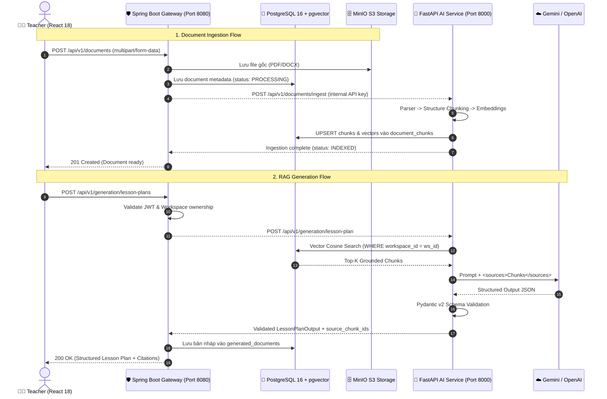

# 📚 AI Teacher Copilot — REST API Documentation

<p align="center">
  
  
  
  
  
</p>

Tài liệu đặc tả toàn bộ **RESTful API Contracts** của hệ thống **AI Teacher Copilot for K-12 Teachers**. 

- **Public Gateway**: Spring Boot 3 (`http://localhost:8080/api/v1`) — Điểm tiếp nhận duy nhất cho React Frontend.
- **Internal AI Service**: FastAPI (`http://localhost:8000/api/v1`) — Dịch vụ RAG & LLM nội bộ (yêu cầu `X-API-Key`).
- **Xác thực**: JWT Bearer Token gửi trong request header:
  ```http
  Authorization: Bearer <access_token>
  ```

---

## 📑 Mục lục điều hướng

1. [Sơ đồ Luồng Gọi API](#-sơ-đồ-luồng-gọi-api)
2. [1. Xác thực & Người dùng (Authentication & Users)](#1-xác-thực--người-dùng-authentication--users)
3. [2. Quản lý Workspace (Teacher Workspace)](#2-quản-lý-workspace-teacher-workspace)
4. [3. Quản lý Tài liệu & MinIO (Documents & Knowledge Base)](#3-quản-lý-tài-liệu--minio-documents--knowledge-base)
5. [4. RAG Semantic Retrieval](#4-rag-semantic-retrieval)
6. [5. AI Lesson Planner (Soạn Giáo án)](#5-ai-lesson-planner-soạn-giáo-án)
7. [6. AI Quiz Generator (Tạo Đề kiểm tra & Bloom Taxonomy)](#6-ai-quiz-generator-tạo-đề-kiểm-tra--bloom-taxonomy)
8. [7. Review, Edit & Document History](#7-review-edit--document-history)
9. [8. Citation & Truy vết Nguồn gốc (Provenance)](#8-citation--truy-vết-nguồn-gốc-provenance)
10. [9. Xuất bản Tài liệu Word & PDF (Export)](#9-xuất-bản-tài-liệu-word--pdf-export)
11. [10. Internal AI Service Contracts (Spring Boot ↔ FastAPI)](#10-internal-ai-service-contracts-spring-boot--fastapi)
12. [11. Chuẩn Mã lỗi & Error Responses](#11-chuẩn-mã-lỗi--error-responses)

---

## 🏗️ Sơ đồ Luồng Gọi API



---

## 1. Xác thực & Người dùng (Authentication & Users)

### 1.1 Đăng ký tài khoản (`POST /api/v1/auth/register`)
- **Quyền**: Public
- **Request Body**:
```json
{
  "email": "teacher@school.edu.vn",
  "password": "SecurePassword123!",
  "fullName": "Nguyễn Hoàng Nam",
  "schoolName": "THPT Chuyên Lê Quý Đôn"
}
```
- **Response `201 Created`**:
```json
{
  "success": true,
  "data": {
    "userId": "usr_7f8a9b1c",
    "email": "teacher@school.edu.vn",
    "fullName": "Nguyễn Hoàng Nam",
    "createdAt": "2026-08-27T10:00:00Z"
  }
}
```

### 1.2 Đăng nhập (`POST /api/v1/auth/login`)
- **Quyền**: Public
- **Request Body**:
```json
{
  "email": "teacher@school.edu.vn",
  "password": "SecurePassword123!"
}
```
- **Response `200 OK`**:
```json
{
  "success": true,
  "data": {
    "accessToken": "eyJhbGciOiJIUzI1NiIsIn...",
    "refreshToken": "eyJhbGciOiJIUzI1NiIsIn...",
    "tokenType": "Bearer",
    "expiresIn": 86400000,
    "user": {
      "id": "usr_7f8a9b1c",
      "email": "teacher@school.edu.vn",
      "fullName": "Nguyễn Hoàng Nam",
      "roles": ["TEACHER"]
    }
  }
}
```

### 1.3 Làm mới Access Token (`POST /api/v1/auth/refresh`)
- **Request Body**: `{ "refreshToken": "eyJhbG..." }`
- **Response `200 OK`**: Trả về `accessToken` mới.

---

## 2. Quản lý Workspace (Teacher Workspace)

Mọi tài liệu, giáo án và đề thi đều được cô lập trong **Workspace** của từng giáo viên.

| Method | Endpoint | Mô tả |
|---|---|---|
| `GET` | `/api/v1/workspaces` | Lấy danh sách workspace của giáo viên |
| `POST` | `/api/v1/workspaces` | Tạo workspace mới (Môn học, Khối lớp) |
| `GET` | `/api/v1/workspaces/{id}` | Lấy chi tiết workspace |
| `PUT` | `/api/v1/workspaces/{id}` | Cập nhật thông tin workspace |
| `DELETE` | `/api/v1/workspaces/{id}` | Xóa workspace (Cascade xóa metadata liên quan) |

**Sample Create Workspace Request (`POST /api/v1/workspaces`):**
```json
{
  "name": "Toán Học 10 - Học Kỳ 1",
  "subject": "Toán",
  "gradeLevel": "Lớp 10",
  "description": "Kho tài liệu và giáo án chương Hàm số bậc hai"
}
```

---

## 3. Quản lý Tài liệu & MinIO (Documents & Knowledge Base)

### 3.1 Upload Tài liệu (`POST /api/v1/documents`)
- **Content-Type**: `multipart/form-data`
- **Params / Form Data**:
  - `file`: File upload (`.pdf` hoặc `.docx`, tối đa 50MB)
  - `workspaceId`: UUID của Workspace
  - `subject`: Môn học (VD: `Toán`)
  - `gradeLevel`: Khối lớp (VD: `10`)
- **Response `202 Accepted`**:
```json
{
  "success": true,
  "data": {
    "documentId": "doc_9a8b7c6d",
    "filename": "SGK_Toan_10_CanhDieu.pdf",
    "sizeBytes": 14582900,
    "mimeType": "application/pdf",
    "status": "PROCESSING",
    "uploadedAt": "2026-08-27T10:15:00Z"
  }
}
```

### 3.2 Kiểm tra trạng thái xử lý (`GET /api/v1/documents/{id}/status`)
- **Response `200 OK`**:
```json
{
  "success": true,
  "data": {
    "documentId": "doc_9a8b7c6d",
    "status": "INDEXED",
    "totalPages": 45,
    "totalChunks": 128,
    "indexedAt": "2026-08-27T10:15:24Z",
    "errorMessage": null
  }
}
```

---

## 4. RAG Semantic Retrieval

Endpoint kiểm tra và truy xuất ngữ nghĩa các đoạn trích dẫn trước khi sinh nội dung.

### `POST /api/v1/rag/retrieve`
- **Request Body**:
```json
{
  "workspaceId": "ws_12345",
  "query": "Định lý Vi-ét và các dạng bài tập tìm tham số m",
  "topK": 5,
  "documentIds": ["doc_9a8b7c6d"]
}
```
- **Response `200 OK`**:
```json
{
  "success": true,
  "data": {
    "chunks": [
      {
        "chunkId": "chk_001",
        "documentId": "doc_9a8b7c6d",
        "documentName": "SGK_Toan_10_CanhDieu.pdf",
        "pageNumber": 42,
        "content": "Định lý Vi-ét: Nếu phương trình ax^2 + bx + c = 0 có hai nghiệm x1, x2 thì x1 + x2 = -b/a, x1 * x2 = c/a...",
        "similarityScore": 0.895
      }
    ],
    "isSufficient": true
  }
}
```

---

## 5. AI Lesson Planner (Soạn Giáo án)

Sinh giáo án chuẩn cấu trúc sư phạm K-12, grounded 100% từ tài liệu đính kèm.

### `POST /api/v1/generation/lesson-plans`
- **Request Body**:
```json
{
  "workspaceId": "ws_12345",
  "topic": "Phương trình bậc hai một ẩn và Định lý Vi-ét",
  "subject": "Toán",
  "gradeLevel": "Lớp 10",
  "durationMinutes": 45,
  "documentIds": ["doc_9a8b7c6d"],
  "specialInstructions": "Tập trung vào phần luyện tập vận dụng giải bài toán thực tế."
}
```
- **Response `200 OK` (Thành công & có trích dẫn)**:
```json
{
  "success": true,
  "data": {
    "generationId": "gen_lp_9918",
    "topic": "Phương trình bậc hai một ẩn và Định lý Vi-ét",
    "durationMinutes": 45,
    "objectives": [
      {
        "category": "Knowledge",
        "description": "Học sinh phát biểu và ghi nhớ được công thức Định lý Vi-ét."
      },
      {
        "category": "Skill",
        "description": "Áp dụng định lý Vi-ét để tính nhẩm nghiệm và tìm tham số m."
      }
    ],
    "activities": [
      {
        "activityName": "Khởi động & Hình thành kiến thức",
        "durationMinutes": 15,
        "teacherAction": "Nêu bài toán mở đầu trang 40 và dẫn dắt công thức Vi-ét.",
        "studentAction": "Làm việc nhóm và tìm mối quan hệ giữa x1, x2.",
        "sourceChunkIds": ["chk_001", "chk_002"]
      }
    ],
    "assessmentPlan": "Đánh giá qua phiếu bài tập nhóm 5 câu cuối giờ.",
    "status": "COMPLETED"
  }
}
```

- **Response khi tài liệu không đủ thông tin (`INSUFFICIENT_EVIDENCE`)**:
```json
{
  "success": false,
  "status": "insufficient_evidence",
  "error": {
    "code": "INSUFFICIENT_EVIDENCE",
    "message": "Tài liệu trong Knowledge Base không đủ thông tin về chủ đề này để lập giáo án chính xác."
  }
}
```

---

## 6. AI Quiz Generator (Tạo Đề kiểm tra & Bloom Taxonomy)

Tạo đề thi trắc nghiệm và tự luận kèm phân loại theo 6 cấp độ Bloom Taxonomy.

### `POST /api/v1/generation/quizzes`
- **Request Body**:
```json
{
  "workspaceId": "ws_12345",
  "title": "Kiểm tra 15 phút - Chương Hàm số bậc hai",
  "subject": "Toán",
  "gradeLevel": "Lớp 10",
  "totalQuestions": 4,
  "bloomDistribution": {
    "Remember": 1,
    "Understand": 1,
    "Apply": 1,
    "Analyze": 1
  },
  "documentIds": ["doc_9a8b7c6d"]
}
```
- **Response `200 OK`**:
```json
{
  "success": true,
  "data": {
    "quizId": "quiz_8821",
    "title": "Kiểm tra 15 phút - Chương Hàm số bậc hai",
    "totalQuestions": 4,
    "questions": [
      {
        "questionNumber": 1,
        "questionType": "MCQ",
        "bloomLevel": "Remember",
        "questionText": "Cho phương trình x^2 - 5x + 6 = 0. Tổng hai nghiệm x1 + x2 bằng bao nhiêu?",
        "options": ["A. 5", "B. -5", "C. 6", "D. -6"],
        "correctAnswer": "A. 5",
        "explanation": "Theo định lý Vi-ét: x1 + x2 = -b/a = -(-5)/1 = 5.",
        "sourceChunkIds": ["chk_001"]
      }
    ]
  }
}
```

---

## 7. Review, Edit & Document History

### 7.1 Cập nhật nội dung giáo án / đề thi (`PUT /api/v1/generation/{id}`)
- Giáo viên chỉnh sửa câu hỏi hoặc hoạt động trực tiếp trên giao diện:
```json
{
  "updatedContent": { ... },
  "changeSummary": "Sửa câu hỏi 1 thành dạng liên hệ thực tế"
}
```

### 7.2 Lịch sử phiên bản (`GET /api/v1/history?documentId={docId}`)
- **Response `200 OK`**:
```json
{
  "success": true,
  "data": [
    {
      "versionId": "ver_v2",
      "versionNumber": 2,
      "editedBy": "Nguyễn Hoàng Nam",
      "changeSummary": "Sửa câu hỏi 1 thành dạng liên hệ thực tế",
      "createdAt": "2026-08-27T10:45:00Z"
    },
    {
      "versionId": "ver_v1",
      "versionNumber": 1,
      "editedBy": "AI Teacher Copilot (Generated)",
      "changeSummary": "Bản nháp AI ban đầu",
      "createdAt": "2026-08-27T10:30:00Z"
    }
  ]
}
```

---

## 8. Citation & Truy vết Nguồn gốc (Provenance)

### `GET /api/v1/citations/{chunkId}`
Lấy chi tiết trích dẫn gốc phục vụ **Citation Drawer** khi giáo viên bấm vào badge `[1]`, `[2]`:
- **Response `200 OK`**:
```json
{
  "success": true,
  "data": {
    "chunkId": "chk_001",
    "documentTitle": "SGK_Toan_10_CanhDieu.pdf",
    "pageNumber": 42,
    "highlightedText": "Định lý Vi-ét: Nếu phương trình ax^2 + bx + c = 0 có hai nghiệm...",
    "similarity": 0.895
  }
}
```

---

## 9. Xuất bản Tài liệu Word & PDF (Export)

| Method | Endpoint | Mô tả |
|---|---|---|
| `POST` | `/api/v1/exports/word` | Xuất giáo án / đề thi sang file Microsoft Word (`.docx`) |
| `POST` | `/api/v1/exports/pdf` | Xuất giáo án / đề thi sang file Adobe PDF (`.pdf`) |
| `GET` | `/api/v1/exports/{id}/download` | Tải file xuất bản trực tiếp về máy |

**Sample Export Request:**
```json
{
  "generationId": "gen_lp_9918",
  "format": "DOCX",
  "includeCitationsFooter": true,
  "schoolHeader": "SỞ GD&ĐT ĐÀ NẴNG - TRƯỜNG THPT CHUYÊN LÊ QUÝ ĐÔN"
}
```

---

## 10. Internal AI Service Contracts (Spring Boot ↔ FastAPI)

> **Bảo mật**: Các endpoint này chỉ mở trong mạng nội bộ Docker (`ai-service:8000`), yêu cầu Header:
> `X-API-Key: ${AI_SERVICE_API_KEY}`

| Method | Endpoint | Vai trò |
|---|---|---|
| `POST` | `/api/v1/documents/parse` | Trích xuất văn bản từ PDF/DOCX |
| `POST` | `/api/v1/documents/chunk` | Chia đoạn cấu trúc (Structure-aware Chunking) |
| `POST` | `/api/v1/embeddings` | Sinh vector nhúng (Gemini / OpenAI) |
| `POST` | `/api/v1/retrieval/search` | Thực thi truy vấn cosine pgvector theo `workspace_id` |
| `POST` | `/api/v1/generation/lesson-plan` | Prompt LLM + Validate Schema `LessonPlanOutput` |
| `POST` | `/api/v1/generation/quiz` | Prompt LLM + Validate Schema `QuizOutput` |
| `POST` | `/api/v1/evaluation/log` | Ghi log chỉ số Groundedness & Retrieval Score |

---

## 11. Chuẩn Mã lỗi & Error Responses

Mọi lỗi trả về từ hệ thống đều tuân thủ cấu trúc chuẩn:

```json
{
  "success": false,
  "error": {
    "code": "WORKSPACE_NOT_FOUND",
    "message": "Không tìm thấy workspace với ID đã cung cấp.",
    "timestamp": "2026-08-27T10:50:00Z"
  }
}
```

| HTTP Status | Error Code | Mô tả |
|:---:|---|---|
| `400` | `VALIDATION_ERROR` | Dữ liệu đầu vào không hợp lệ |
| `401` | `UNAUTHORIZED` | Token hết hạn hoặc không hợp lệ |
| `403` | `FORBIDDEN` | Cố gắng truy cập tài liệu thuộc workspace khác |
| `404` | `RESOURCE_NOT_FOUND` | Không tìm thấy Document / Workspace / Generation |
| `422` | `INSUFFICIENT_EVIDENCE` | RAG không tìm đủ bằng chứng đáng tin cậy |
| `502` | `AI_SERVICE_UNAVAILABLE` | Lỗi kết nối FastAPI hoặc LLM Provider |
| `500` | `INTERNAL_SERVER_ERROR` | Lỗi hệ thống chưa được phân loại |

---

*AI Teacher Copilot for K-12 Teachers · REST API Specification v1.0.0*
