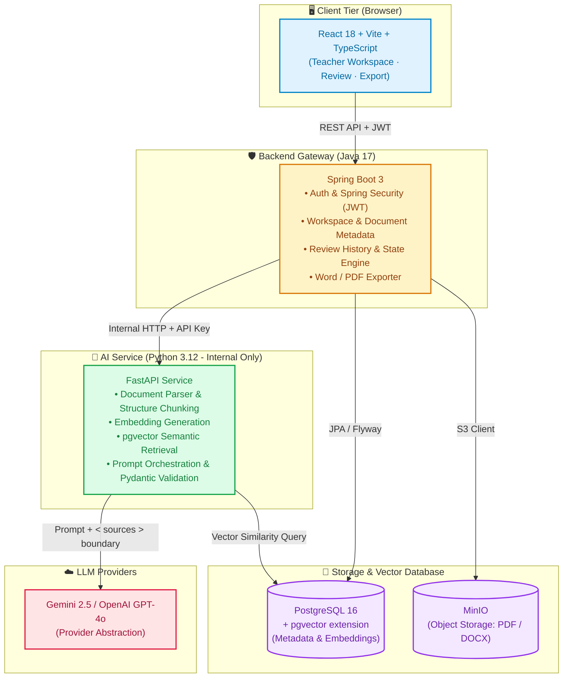
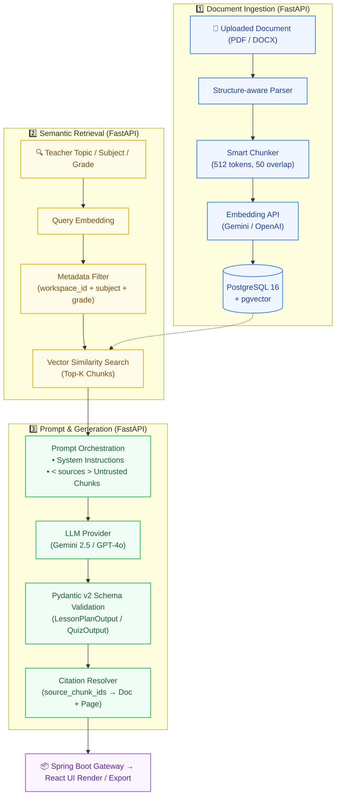

<p align="center">
  <h1 align="center">🎓 AI Teacher Copilot</h1>
  <p align="center">
    <strong>Hệ thống AI hỗ trợ giáo viên K-12 tạo học liệu từ tài liệu giảng dạy</strong>
  </p>
  <p align="center">
    Lesson Planner · Quiz Generator · RAG & Citation · Word/PDF Export
  </p>
</p>

<p align="center">
  
  
  
  
  
  
</p>

<p align="center">
  <a href="#-giới-thiệu">Giới thiệu</a> ·
  <a href="#-chức-năng-mvp">Chức năng</a> ·
  <a href="#️-kiến-trúc-hệ-thống">Kiến trúc</a> ·
  <a href="#-tech-stack">Tech Stack</a> ·
  <a href="#-hướng-dẫn-khởi-chạy">Khởi chạy</a> ·
  <a href="#-rag-pipeline">RAG Pipeline</a> ·
  <a href="#-mvp-status">MVP Status</a> ·
  <a href="#-license">License</a>
</p>

---

## 📖 Giới thiệu

**AI Teacher Copilot for K-12 Teachers** là hệ thống AI hỗ trợ giáo viên tạo học liệu (giáo án, đề kiểm tra) tự động từ tài liệu giảng dạy do giáo viên cung cấp, có trích dẫn nguồn minh bạch và hỗ trợ phân loại theo Bloom Taxonomy.

Hệ thống áp dụng kiến trúc **RAG (Retrieval-Augmented Generation)** kết hợp với **Structured Output** và cơ chế **Citation Traceability** để đảm bảo toàn bộ nội dung AI được grounded trực tiếp từ tài liệu của giáo viên — không hallucinate.

> ⚠️ AI output là **bản nháp/đề xuất**. Giáo viên là người quyết định cuối cùng.

---

## ✨ Chức năng MVP

| # | Chức năng | Mô tả |
| :---: | :--- | :--- |
| 1 | 🔐 **Authentication** | Đăng ký, đăng nhập, JWT, Spring Security |
| 2 | 🗂️ **Teacher Workspace** | Workspace cá nhân quản lý toàn bộ tài liệu và học liệu |
| 3 | 📁 **Document Upload & KB** | Upload PDF/DOCX, lưu MinIO, quản lý Knowledge Base |
| 4 | ⚙️ **Document Processing** | Parse → Chunk → Embedding → pgvector index |
| 5 | 🔍 **RAG Retrieval** | Metadata-filtered vector search, insufficient evidence handling |
| 6 | 📝 **AI Lesson Planner** | Sinh giáo án có cấu trúc, trích dẫn nguồn chunk |
| 7 | 📊 **Quiz Generator** | MCQ + Short Answer + Bloom Taxonomy tagging |
| 8 | ✏️ **Review / Edit / Regenerate** | Chỉnh sửa inline, tạo lại theo hướng dẫn, lịch sử phiên bản |
| 9 | 🔗 **Citation Traceability** | Truy vết từ output → chunk → tài liệu gốc + số trang |
| 10 | 📤 **Word / PDF Export** | Xuất DOCX và PDF chuyên nghiệp kèm citation footer |

---

## 🏗️ Kiến trúc Hệ thống



**Nguyên tắc kiến trúc:**
- Frontend chỉ giao tiếp với Spring Boot qua REST API — **không gọi FastAPI trực tiếp**
- FastAPI là **internal service** — không expose ra Internet
- Document content là **Untrusted Data** — bắt buộc wrap trong `<sources>...</sources>` boundary trước khi đưa vào LLM prompt

---

## 🛠 Tech Stack

| Layer | Công nghệ | Vai trò |
| :--- | :--- | :--- |
| **Frontend** | React 18, Vite, TypeScript, Zustand, Axios | Teacher UI, Workspace, Review |
| **Backend** | Spring Boot 3, Java 17, Maven, Flyway | Auth, Business Logic, REST API Gateway |
| **AI Service** | FastAPI, Python 3.12, Pydantic v2 | Document Processing, RAG, LLM |
| **Vector Store** | PostgreSQL 16 + pgvector | Embedding storage & semantic retrieval |
| **Object Storage** | MinIO | PDF/DOCX file storage |
| **LLM Provider** | Gemini / OpenAI (Provider Abstraction) | Text generation & embedding |
| **Database Migration** | Flyway | Schema versioning |
| **Infrastructure** | Docker, Docker Compose | Local dev environment |
| **CI/CD** | GitHub Actions | Automated testing pipeline |

---

## 🚀 Hướng dẫn Khởi chạy

### Yêu cầu hệ thống

| Công cụ | Phiên bản |
| :--- | :--- |
| Java JDK | 17+ |
| Python | 3.12+ |
| Node.js | 20+ |
| Docker & Docker Compose | Latest |

### Bước 0: Cấu hình Environment Variables

```bash
# Sao chép file env mẫu và điền thông tin thực tế
cp .env.example .env
```

Các biến quan trọng cần điền:

```env
# Database
DB_HOST=localhost
DB_PORT=5432
DB_NAME=ai_teacher_copilot
DB_USERNAME=postgres
DB_PASSWORD=your_password

# MinIO
MINIO_ENDPOINT=localhost:9000
MINIO_ACCESS_KEY=your_access_key
MINIO_SECRET_KEY=your_secret_key

# LLM Provider (chọn 1 trong 2)
OPENAI_API_KEY=sk-...
GEMINI_API_KEY=AI...

# JWT
JWT_SECRET=your_jwt_secret_key
```

> ⚠️ **Tuyệt đối không** commit file `.env` chứa credentials thực lên Git.

### Lựa chọn khởi chạy

Bạn có thể chọn 1 trong 2 cách khởi chạy (Xem chi tiết tại [`docs/RUN_GUIDE.md`](./docs/RUN_GUIDE.md)):

* **🌟 Cách 1: Khởi chạy Trọn Gói 1 Lệnh (All-In-One Docker — Khuyên dùng khi Demo / Nộp bài):**
  ```bash
  docker compose -f docker-compose.full.yml up --build -d
  ```
  Truy cập Web Client tại: `http://localhost:3000`

* **🛠️ Cách 2: Khởi chạy Chế độ Lập trình (Dev Mode — Hot Reload khi đang code):**

---

### Bước 1: Khởi chạy Infrastructure (Terminal 1)

```bash
# Tại thư mục gốc của project
docker compose up -d
```

```bash
# Kiểm tra trạng thái
docker compose ps
```

Đợi PostgreSQL và MinIO **healthy** trước khi chạy các service tiếp theo.

---

### Bước 2: Khởi chạy AI Service — FastAPI (Terminal 2)

```bash
cd ai-service
```

**Windows:**
```bash
python -m venv venv
venv\Scripts\activate
pip install -r requirements.txt
uvicorn app.main:app --reload --port 8001
```

**Mac/Linux:**
```bash
python3 -m venv venv
source venv/bin/activate
pip install -r requirements.txt
uvicorn app.main:app --reload --port 8001
```

FastAPI chạy tại: `http://localhost:8001` (internal only — không truy cập từ browser)

---

### Bước 3: Khởi chạy Backend — Spring Boot (Terminal 3)

```bash
cd backend
```

**Windows:**
```bash
mvnw.cmd spring-boot:run
```

**Mac/Linux:**
```bash
./mvnw spring-boot:run
```

Spring Boot chạy tại: `http://localhost:8080`

---

### Bước 4: Khởi chạy Frontend — React (Terminal 4)

```bash
cd frontend
npm install
npm run dev
```

Mở trình duyệt tại URL hiển thị trong Terminal (thường là `http://localhost:5173`).

---

## 🔄 Quy trình sử dụng

```
Đăng nhập
    ↓
Teacher Workspace
    ↓
Upload tài liệu (PDF / DOCX)
    ↓
Document Processing (Parse → Chunk → Embed → pgvector)
    ↓
Knowledge Base sẵn sàng
    ↓
Chọn: Môn · Lớp · Chủ đề · Tài liệu nguồn
    ↓
RAG Retrieval (metadata filter + vector similarity)
    ↓
AI Generation (Lesson Plan / Quiz)
    ↓
Citation (nguồn chunk + số trang)
    ↓
Review / Edit / Regenerate
    ↓
Document History
    ↓
Word / PDF Export
```

---

## 🧠 RAG Pipeline



**Prompt Security:** Retrieved content được wrap trong `<sources>...</sources>` — nghiêm cấm inject vào system instructions để phòng chống Prompt Injection.

---

## 📊 AI Quality Evaluation

Chất lượng AI được đánh giá trên ~20–30 mẫu output với các chỉ số:

| Chỉ số | Mô tả |
| :--- | :--- |
| **Groundedness** | Nội dung có bám sát tài liệu nguồn không? |
| **Citation Coverage** | Tỷ lệ câu hỏi/mục giáo án có trích dẫn nguồn |
| **Citation Relevance** | Citation có thực sự liên quan đến nội dung không? |
| **Acceptance Rate** | Tỷ lệ giáo viên chấp nhận output không chỉnh sửa |
| **Edit Rate** | Mức độ giáo viên cần chỉnh sửa output |
| **Retrieval Quality** | Cosine similarity score của các chunks được retrieve |

---

## 📋 MVP Status

| Tính năng | Trạng thái | Module |
| :--- | :---: | :--- |
| Authentication & JWT | 🚧 In Progress | `backend/auth` |
| Teacher Workspace | 🚧 In Progress | `backend/workspace` |
| Document Upload & MinIO | 🔲 Planned | `backend/document` |
| Document Processing | 🔲 Planned | `ai-service/ingestion` |
| RAG Retrieval | 🔲 Planned | `ai-service/retrieval` |
| AI Lesson Planner | 🔲 Planned | `ai-service/generation` |
| Quiz Generator + Bloom | 🔲 Planned | `ai-service/generation` |
| Review / Edit / Regenerate | 🔲 Planned | `backend/generation` |
| Citation Traceability | 🔲 Planned | `ai-service/generation` |
| Word / PDF Export | 🔲 Planned | `backend/generation` |

**Trạng thái:** 🚧 In Development &nbsp;|&nbsp; **Model:** Solo Developer &nbsp;|&nbsp; **Timeline:** 6 tháng MVP

---

## ⚠️ Lưu ý

- AI output chỉ là **bản nháp / đề xuất** — giáo viên là người quyết định cuối cùng
- Hệ thống **không tự gửi** nội dung cho học sinh, không tự đánh giá học sinh
- Tài liệu upload được xử lý là **Untrusted Data** — không thể override system instructions
- **Student PII** (tên, điểm, mã học sinh) nằm ngoài phạm vi MVP — nghiêm cấm xử lý
- **Không commit** API key hoặc credentials lên Git

---

## 📂 Cấu trúc Repository

```
ai-teacher-copilot/
├── backend/                    ← Spring Boot 3 (Java 17)
│   └── src/main/java/com/aiteacher/
│       ├── auth/               ← JWT, Spring Security
│       ├── workspace/          ← Teacher Workspace
│       ├── document/           ← Document metadata
│       ├── generation/         ← Review, History, Export
│       └── user/               ← User management
├── ai-service/                 ← FastAPI (Python 3.12)
│   └── app/
│       ├── ingestion/          ← Parse, Chunk, Embed
│       ├── retrieval/          ← pgvector search
│       ├── generation/         ← Prompt, LLM, Output
│       ├── providers/          ← Gemini / OpenAI abstraction
│       └── core/               ← Config, Security
├── frontend/                   ← React 18 + Vite + TypeScript
│   └── src/
│       ├── components/         ← UI Components
│       ├── pages/              ← Route pages
│       ├── services/           ← API clients
│       ├── stores/             ← Zustand state
│       └── lib/                ← Axios client, utils
├── docs/                       ← Tài liệu thiết kế
├── infrastructure/             ← Docker, configs
├── scripts/                    ← Dev automation scripts
└── .github/workflows/          ← CI/CD Pipelines
```

---

## 📚 Tài liệu liên quan

| Tài liệu | Mô tả |
| :--- | :--- |
| [`AI_TEACHER_COPILOT_BLUEPRINT.md`](./docs/AI_TEACHER_COPILOT_BLUEPRINT.md) | Thiết kế kiến trúc hệ thống đầy đủ |
| [`ENGINEERING_KNOWLEDGE.md`](./docs/ENGINEERING_KNOWLEDGE.md) | Bộ tri thức kỹ thuật RAG, Provider Abstraction & Security |
| [`UI_UX_KNOWLEDGE.md`](./docs/UI_UX_KNOWLEDGE.md) | Bộ tri thức thiết kế UI/UX, Design System & Interactions |
| [`API_DOCS.md`](./API_DOCS.md) | REST API documentation |
| [`CONTRIBUTING.md`](./CONTRIBUTING.md) | Quy chuẩn phát triển & đóng góp |
| [`CHANGELOG.md`](./CHANGELOG.md) | Lịch sử thay đổi theo phiên bản |
| [`FUTURE_GOAL.md`](./FUTURE_GOAL.md) | Lộ trình mở rộng sau MVP |
| [`SECURITY.md`](./SECURITY.md) | Chính sách bảo mật & báo cáo lỗ hổng |

---

## 📄 License

Dự án này được cấp phép theo **MIT License**.

```
MIT License — Copyright (c) 2026 Nguyen Hoang Nam
```

Xem file [`LICENSE`](./LICENSE) để biết đầy đủ nội dung.

---

## 📋 Notice

Thông tin về các thư viện và công nghệ mã nguồn mở được sử dụng trong dự án xem tại [`NOTICE`](./NOTICE).

---

<p align="center">
  <strong>AI Teacher Copilot for K-12 Teachers</strong><br>
  Đồ án tốt nghiệp · Nguyen Hoang Nam · 2026–2027
</p>
