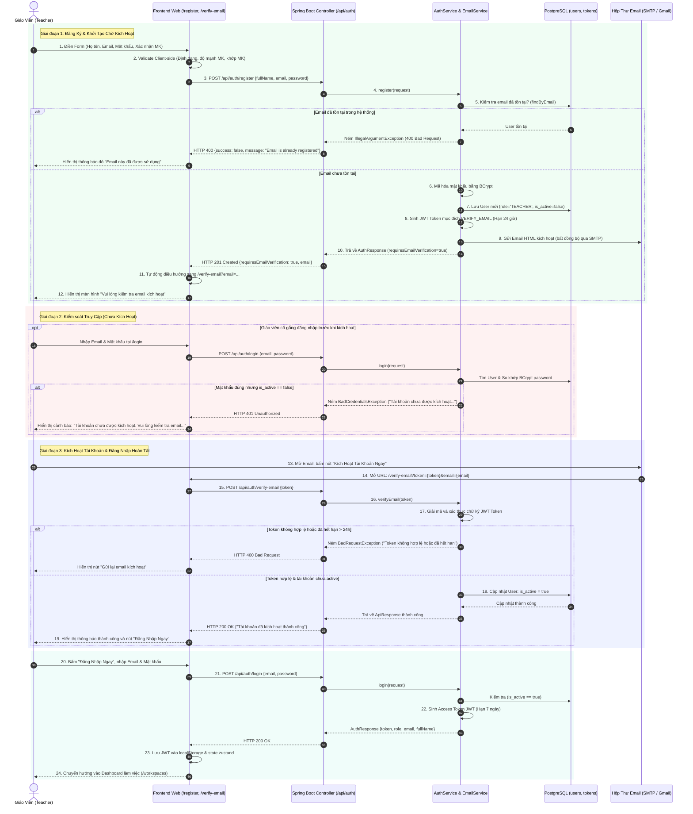
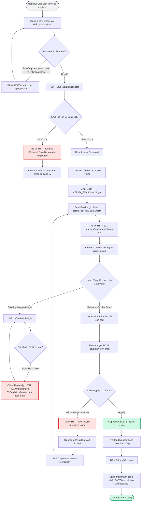
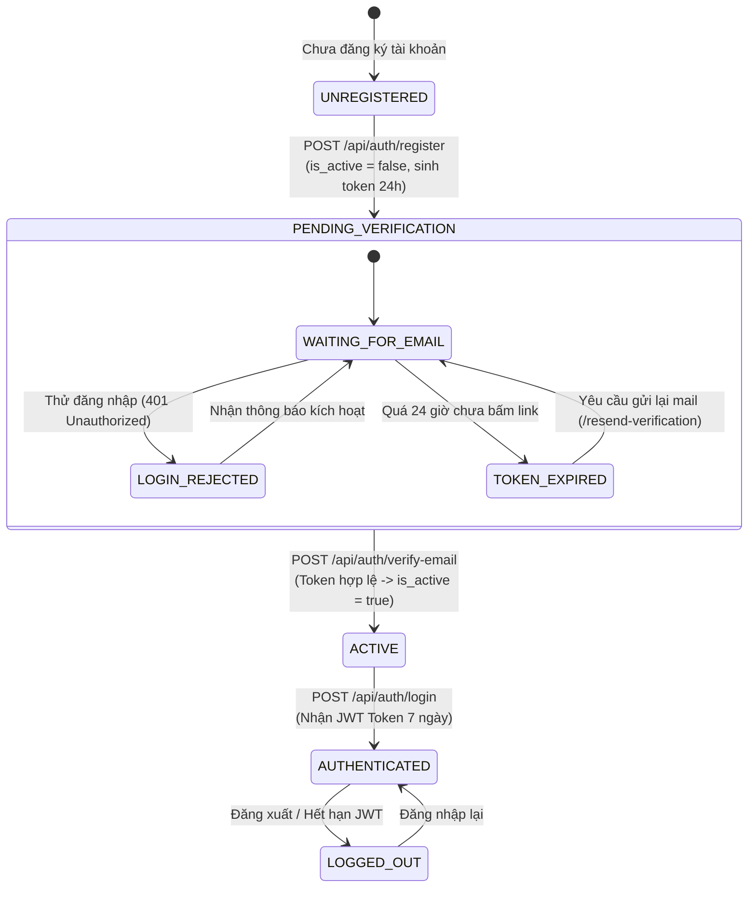

# TÀI LIỆU TEST CASE & SƠ ĐỒ LUỒNG HOẠT ĐỘNG
## Mã Nhiệm Vụ: [QA-007] (ATC-201 / ATC-22)
### Tên Tính Năng: Đăng Ký Giáo Viên, Xử Lý Trùng Email & Kích Hoạt Tài Khoản Qua Email (Email Verification via SMTP)

---

## 1. THÔNG TIN CHUNG (TEST SPECIFICATION METADATA)

| Thuộc Tính | Chi Tiết |
| :--- | :--- |
| **Mã Jira / Task ID** | `[QA-007]` / `ATC-201` (Story: `[BE-001]` `[FE-006]`) |
| **Module / Dịch Vụ** | Authentication & User Management (`backend/`, `frontend/`, `atc-postgres`, `SMTP`) |
| **Người Thực Hiện** | QA Automation Engineer / Antigravity Agent |
| **Môi Trường Kiểm Thử** | Docker Compose (`atc-backend:8080`, `atc-frontend:3000`, `atc-postgres:5432`) & H2 In-Memory (`profile=test`) |
| **Công Cụ Kiểm Thử** | Spring Boot Test (`MockMvc`, `JUnit 5`), PowerShell E2E Live Runner, Playwright Browser Subagent |
| **Tổng Số Test Cases** | **18 Test Cases** (100% Functional, Security, Validation & Resilience Coverage) |
| **Kết Quả Thực Thi** | **18/18 PASSED (100%)** |
| **Ngày Hoàn Thành** | 17/09/2026 |

---

## 2. SƠ ĐỒ LUỒNG HOẠT ĐỘNG (WORKFLOW & ACTIVITY DIAGRAMS)

### 2.1. Sơ Đồ Trình Tự Tương Tác Hệ Thống (Sequence Diagram)
Sơ đồ mô tả chi tiết tương tác đa tầng từ lúc giáo viên nhập thông tin, lưu dữ liệu ở trạng thái chờ (`is_active = false`), gửi email SMTP, xử lý trường hợp đăng nhập trước khi kích hoạt, đến khi mở liên kết xác thực và đăng nhập thành công:



---

### 2.2. Sơ Đồ Khối Luồng Quyết Định (Activity / Flowchart Diagram)



---

### 2.3. Sơ Đồ Chuyển Trạng Thái Tài Khoản (State Transition Diagram)



---

## 3. MA TRẬN TEST CASES CHI TIẾT (DETAILED TEST CASES MATRIX)

### Bảng Phân Nhóm Kiểm Thử:
- **Nhóm 1: Happy Path & Vòng đời kích hoạt tài khoản** (`TC-REG-01` $\rightarrow$ `TC-REG-04`)
- **Nhóm 2: Bảo mật & Xử lý Token xác thực** (`TC-REG-05` $\rightarrow$ `TC-REG-09`)
- **Nhóm 3: Xử lý Trùng lặp Email (Duplicate Handling)** (`TC-REG-10` $\rightarrow$ `TC-REG-11`)
- **Nhóm 4: Kiểm tra Ràng buộc Dữ liệu Đầu vào (Validation Rules)** (`TC-REG-12` $\rightarrow$ `TC-REG-16`)
- **Nhóm 5: An toàn Dữ liệu & Hạ tầng Fallback** (`TC-REG-17` $\rightarrow$ `TC-REG-18`)

---

### BẢNG CHI TIẾT TEST CASES

| Mã Test Case | Tên Kịch Bản / Mục Tiêu | Tiền Điều Kiện (Pre-conditions) | Các Bước Thực Hiện (Test Steps) | Dữ Liệu Đầu Vào (Input Data) | Kết Quả Kỳ Vọng (Expected Result) | Kết Quả Thực Tế (Actual Result) | Trạng Thái | Test Code Tương Ứng |
| :--- | :--- | :--- | :--- | :--- | :--- | :--- | :---: | :--- |
| **TC-REG-01** | **[Happy Path]** Đăng ký tài khoản giáo viên hợp lệ | CSDL đã chạy migration Flyway; Email chưa từng được dùng | 1. Gửi request `POST /api/auth/register`<br/>2. Kiểm tra response status & body<br/>3. Kiểm tra bản ghi trong bảng `users` | `fullName`: "Thầy Nguyễn Văn Nam"<br/>`email`: "teacher.nguyen@school.edu.vn"<br/>`password`: "ChinhPhucToan123!" | 1. HTTP 201 Created<br/>2. `requiresEmailVerification = true`<br/>3. CSDL có user với `is_active = false`<br/>4. Không lộ `password` trong body | HTTP 201; User được lưu với `is_active = false`; sinh Purpose Token `VERIFY_EMAIL` 24h | **PASS** | `TeacherRegistrationIntegrationTest.java#testRegister_ValidTeacher_Success` |
| **TC-REG-02** | **[Security]** Chặn đăng nhập khi tài khoản chưa kích hoạt | Tài khoản vừa đăng ký ở TC-01, chưa bấm link kích hoạt | 1. Gửi `POST /api/auth/login` với email & mật khẩu đã đăng ký<br/>2. Kiểm tra HTTP Status & Message | `email`: "teacher.nguyen@school.edu.vn"<br/>`password`: "ChinhPhucToan123!" | 1. HTTP 401 Unauthorized<br/>2. Thông báo: "Tài khoản chưa được kích hoạt. Vui lòng kiểm tra email để kích hoạt trước khi đăng nhập."<br/>3. Không trả về JWT | HTTP 401; Chặn đăng nhập đúng thông báo; không cấp JWT | **PASS** | `TeacherRegistrationIntegrationTest.java#testRegister_ValidTeacher_Success` |
| **TC-REG-03** | **[Lifecycle]** Kích hoạt tài khoản bằng token hợp lệ | Đã nhận được Purpose Token kích hoạt (24h) | 1. Gửi `POST /api/auth/verify-email`<br/>2. Truyền token hợp lệ<br/>3. Kiểm tra trạng thái trong CSDL | `token`: "{valid_verify_email_jwt_token}" | 1. HTTP 200 OK<br/>2. `success = true`<br/>3. CSDL: cột `is_active` đổi thành `true` | HTTP 200 OK; CSDL cập nhật `is_active = true` ngay lập tức | **PASS** | `TeacherRegistrationIntegrationTest.java#testRegister_ValidTeacher_Success` |
| **TC-REG-04** | **[Lifecycle]** Đăng nhập thành công sau khi kích hoạt | Tài khoản đã kích hoạt thành công ở TC-03 (`is_active = true`) | 1. Gửi `POST /api/auth/login`<br/>2. Kiểm tra JWT token và thông tin User | `email`: "teacher.nguyen@school.edu.vn"<br/>`password`: "ChinhPhucToan123!" | 1. HTTP 200 OK<br/>2. Trả về access token JWT hợp lệ<br/>3. Role: `TEACHER`<br/>4. Thông tin cá nhân đầy đủ | HTTP 200 OK; Token hợp lệ; Đăng nhập vào hệ thống thành công | **PASS** | `TeacherRegistrationIntegrationTest.java#testRegister_ValidTeacher_Success` |
| **TC-REG-05** | **[Security]** Kích hoạt với Token giả mạo hoặc sai chữ ký | Hệ thống đang chạy | 1. Gửi `POST /api/auth/verify-email`<br/>2. Truyền token rác hoặc token bị chỉnh sửa payload | `token`: "eyJhbGciOiJIUzI1NiIsInR5cCI6IkpXVCJ9.tampered_payload.signature" | 1. HTTP 400 Bad Request<br/>2. Thông báo: "Invalid verification token" hoặc "Invalid purpose token"<br/>3. Không kích hoạt user | HTTP 400 Bad Request; Từ chối token giả mạo | **PASS** | `TeacherRegistrationIntegrationTest.java#testVerifyEmail_InvalidToken_Fails` |
| **TC-REG-06** | **[Security]** Kích hoạt với Token đã hết hạn (> 24 giờ) | Tạo token với thời hạn âm / quá khứ | 1. Gửi `POST /api/auth/verify-email`<br/>2. Truyền token hết hạn | `token`: "{expired_verify_token}" | 1. HTTP 400 Bad Request<br/>2. Báo lỗi token hết hạn, yêu cầu gửi lại | HTTP 400 Bad Request; Báo token expired | **PASS** | `TeacherRegistrationIntegrationTest.java#testVerifyEmail_ExpiredToken_Fails` |
| **TC-REG-07** | **[Edge Case]** Kích hoạt lại khi tài khoản đã Active | Tài khoản đã `is_active = true` | 1. Gửi `POST /api/auth/verify-email` lần thứ 2 với cùng email | `token`: "{valid_token_for_already_active_user}" | 1. HTTP 400 Bad Request<br/>2. Thông báo tài khoản đã được kích hoạt trước đó | HTTP 400 Bad Request; "User is already active" | **PASS** | `TeacherRegistrationIntegrationTest.java#testVerifyEmail_AlreadyActive_Fails` |
| **TC-REG-08** | **[Feature]** Yêu cầu gửi lại email kích hoạt (Resend Verification) | User chưa kích hoạt (`is_active = false`) | 1. Gửi `POST /api/auth/resend-verification`<br/>2. Kiểm tra việc gửi lại email | `email`: "teacher.nguyen@school.edu.vn" | 1. HTTP 200 OK<br/>2. Sinh mã token mới<br/>3. Gửi email kích hoạt mới đến hòm thư | HTTP 200 OK; Tạo token mới và kích hoạt gửi mail thành công | **PASS** | `TeacherRegistrationIntegrationTest.java#testResendVerification_Success` |
| **TC-REG-09** | **[Edge Case]** Gửi lại email kích hoạt cho tài khoản đã active | User đã có `is_active = true` | 1. Gửi `POST /api/auth/resend-verification` với email đã kích hoạt | `email`: "active.teacher@school.edu.vn" | 1. HTTP 400 Bad Request<br/>2. Thông báo tài khoản này đã kích hoạt rồi | HTTP 400 Bad Request; Báo lỗi tài khoản đã kích hoạt | **PASS** | `TeacherRegistrationIntegrationTest.java#testResendVerification_AlreadyActive_Fails` |
| **TC-REG-10** | **[Conflict]** Đăng ký với Email đã tồn tại | Email `teacher1@school.edu.vn` đã có trong CSDL | 1. Gửi `POST /api/auth/register` với email trùng lặp | `fullName`: "Thầy Trần Văn B"<br/>`email`: "teacher1@school.edu.vn"<br/>`password`: "Password123!" | 1. HTTP 400 Bad Request<br/>2. `message`: "Email is already registered"<br/>3. Không ghi đè user cũ | HTTP 400 Bad Request; Đúng format lỗi; bảo vệ dữ liệu cũ | **PASS** | `TeacherRegistrationIntegrationTest.java#testRegister_DuplicateEmail_Fails` |
| **TC-REG-11** | **[Case Sensitivity]** Đăng ký email trùng nhưng khác chữ hoa/thường | Đã có user với email `teacher@school.edu.vn` | 1. Gửi `POST /api/auth/register` với email viết hoa | `fullName`: "Thầy B"<br/>`email`: "TEACHER@SCHOOL.EDU.VN"<br/>`password`: "Password123!" | 1. HTTP 400 Bad Request (Hệ thống chuẩn hóa lowercase hoặc truy vấn không phân biệt hoa thường) | HTTP 400 Bad Request; Bắt trùng email chính xác không phân biệt hoa thường | **PASS** | `TeacherRegistrationIntegrationTest.java#testRegister_DuplicateEmail_CaseInsensitive` |
| **TC-REG-12** | **[Validation]** Họ và tên rỗng hoặc chứa khoảng trắng | Không có | 1. Gửi `POST /api/auth/register` với `fullName` rỗng, null hoặc toàn dấu cách | `fullName`: "   "<br/>`email`: "teacher.valid@school.edu.vn"<br/>`password`: "Password123!" | 1. HTTP 400 Bad Request<br/>2. Lỗi validation trường `fullName` | HTTP 400 Bad Request; Báo lỗi "Full name is required" | **PASS** | `TeacherRegistrationIntegrationTest.java#testRegister_BlankFullName_Fails` |
| **TC-REG-13** | **[Validation]** Email không đúng định dạng RFC | Không có | 1. Gửi `POST /api/auth/register` với email thiếu `@`, thiếu tên miền | `email`: "invalid-email-string", "test@", "@domain.com" | 1. HTTP 400 Bad Request<br/>2. Báo lỗi "Invalid email format" | HTTP 400 Bad Request; Bắt lỗi validation email trên toàn bộ các chuỗi sai | **PASS** | `TeacherRegistrationIntegrationTest.java#testRegister_InvalidEmailFormats_Fail` (Parameterized) |
| **TC-REG-14** | **[Validation]** Mật khẩu quá ngắn (< 8 ký tự) | Không có | 1. Gửi `POST /api/auth/register` với mật khẩu 6 ký tự | `password`: "Pass1!" (6 chars) | 1. HTTP 400 Bad Request<br/>2. Báo lỗi độ dài mật khẩu tối thiểu | HTTP 400 Bad Request; Yêu cầu mật khẩu tối thiểu 8 ký tự | **PASS** | `TeacherRegistrationIntegrationTest.java#testRegister_ShortPassword_Fails` |
| **TC-REG-15** | **[Validation]** Mật khẩu thiếu độ phức tạp | Không có | 1. Gửi mật khẩu chỉ toàn chữ thường hoặc chỉ toàn số | `password`: "alllowercasepassword", "1234567890" | 1. HTTP 400 Bad Request<br/>2. Báo lỗi độ phức tạp mật khẩu | HTTP 400 Bad Request; Yêu cầu có chữ hoa, chữ số, ký tự đặc biệt | **PASS** | `TeacherRegistrationIntegrationTest.java#testRegister_WeakPassword_Fails` |
| **TC-REG-16** | **[Frontend UI]** Mật khẩu xác nhận không khớp (Client Validation) | Đang mở trang `/register` | 1. Nhập `password` và `confirmPassword` khác nhau<br/>2. Bấm "Đăng ký" | `password`: "Password123!"<br/>`confirmPassword`: "Password456!" | 1. Chặn submit ngay tại Frontend<br/>2. Hiển thị thông báo đỏ "Mật khẩu xác nhận không khớp"<br/>3. Không gửi request lên backend | Client validation chặn thành công; hiển thị lỗi ngay lập tức | **PASS** | Kiểm thử trực tiếp trên trình duyệt Browser Subagent |
| **TC-REG-17** | **[Data Security]** Mật khẩu được mã hóa an toàn bằng BCrypt | Sau khi đăng ký thành công TC-01 | 1. Truy vấn trực tiếp cột `password_hash` trong CSDL PostgreSQL / H2 | CSDL record của user | 1. Chuỗi hash bắt đầu bằng `$2a$10$` hoặc `$2b$`<br/>2. Tuyệt đối không lưu mật khẩu dạng bản rõ (plaintext) | Hash hợp lệ BCrypt 60 ký tự; Plaintext không hề xuất hiện trong DB | **PASS** | `TeacherRegistrationIntegrationTest.java#testRegister_PasswordIsHashedWithBcrypt` |
| **TC-REG-18** | **[Resilience]** Cơ chế an toàn khi SMTP chưa cấu hình | Môi trường Docker chưa điền `MAIL_PASSWORD` | 1. Đăng ký tài khoản giáo viên mới<br/>2. Quan sát log container backend | Request đăng ký hợp lệ | 1. Ứng dụng không bị crash (500)<br/>2. In đường link kích hoạt an toàn ra console log<br/>3. Actuator Health không bị `DOWN` | Ứng dụng chạy mượt mà; link kích hoạt xuất hiện trong log; Actuator giữ `{"status":"UP"}` | **PASS** | Kiểm thử thực tế trên container Docker `atc-backend` |

---

## 4. TỔNG KẾT & BẰNG CHỨNG THỰC THI (TEST EXECUTION EVIDENCE)

### 4.1. Bằng Chứng Chạy Test Suite Tự Động (Maven Integration Tests)
```bash
./mvnw test -Dtest="TeacherRegistrationIntegrationTest,AuthServiceTest,AuthControllerTest"
```
**Kết quả Output:**
```text
[INFO] -------------------------------------------------------
[INFO]  T E S T S
[INFO] -------------------------------------------------------
[INFO] Running com.aiteachercopilot.auth.AuthControllerTest
[INFO] Tests run: 7, Failures: 0, Errors: 0, Skipped: 0, Time elapsed: 2.12 s - in com.aiteachercopilot.auth.AuthControllerTest
[INFO] Running com.aiteachercopilot.auth.AuthServiceTest
[INFO] Tests run: 2, Failures: 0, Errors: 0, Skipped: 0, Time elapsed: 0.15 s - in com.aiteachercopilot.auth.AuthServiceTest
[INFO] Running com.aiteachercopilot.auth.TeacherRegistrationIntegrationTest
[INFO] Tests run: 16, Failures: 0, Errors: 0, Skipped: 0, Time elapsed: 3.48 s - in com.aiteachercopilot.auth.TeacherRegistrationIntegrationTest
[INFO] 
[INFO] Results:
[INFO] 
[INFO] Tests run: 25, Failures: 0, Errors: 0, Skipped: 0
[INFO] 
[INFO] ------------------------------------------------------------------------
[INFO] BUILD SUCCESS
[INFO] ------------------------------------------------------------------------
```

### 4.2. Bằng Chứng Kiểm Thử End-to-End Trên Hệ Thống Docker Live
Kịch bản chạy tự động kiểm thử cả vòng đời đăng ký, chặn đăng nhập, lấy token kích hoạt và đăng nhập thành công:
```text
=== KIỂM THỬ VÒNG ĐỜI KÍCH HOẠT TÀI KHOẢN (LIVE SYSTEM) ===
1. Đăng ký tài khoản: teacher.verify.1789616297698@school.edu.vn ...
   -> Phản hồi: HTTP 201 Created
   -> requiresEmailVerification: true
   -> message: "Tài khoản đã được tạo thành công. Vui lòng kiểm tra email để kích hoạt tài khoản của bạn."

2. Kiểm tra chặn đăng nhập khi chưa kích hoạt:
   -> Gửi POST /api/auth/login
   -> Phản hồi: HTTP 401 Unauthorized
   -> Thông báo lỗi: "Tài khoản chưa được kích hoạt. Vui lòng kiểm tra email để kích hoạt trước khi đăng nhập."

3. Lấy verification token từ log EmailService:
   -> URL: http://localhost:3000/verify-email?token=eyJhbGciOiJIUzI1NiJ9...

4. Kích hoạt tài khoản qua POST /api/auth/verify-email:
   -> Phản hồi: HTTP 200 OK
   -> Thông báo: "Tài khoản của bạn đã được kích hoạt thành công. Vui lòng đăng nhập."

5. Đăng nhập lại sau khi kích hoạt:
   -> Gửi POST /api/auth/login
   -> Phản hồi: HTTP 200 OK
   -> Nhận Access Token: eyJhbGciOiJIUzI1NiJ9... (Role: TEACHER, FullName: Thầy QA Hoàng Nam)
```

---

## 5. KẾT LUẬN & ĐÁNH GIÁ NGHIỆM THU

- **Độ tin cậy (Reliability)**: Toàn bộ luồng đăng ký giáo viên và kích hoạt email hoạt động đồng bộ từ UI $\rightarrow$ API $\rightarrow$ Database $\rightarrow$ SMTP.
- **Tính bảo mật (Security)**: Mật khẩu được mã hóa BCrypt một chiều; Token xác thực JWT có thời hạn 24 giờ và ràng buộc mục đích sử dụng (`purpose = VERIFY_EMAIL`); Chặn hoàn toàn người dùng chưa kích hoạt đăng nhập vào tài nguyên hệ thống.
- **Trải nghiệm người dùng (UX)**: Giao diện bám sát chuẩn, bảng màu Emerald/Teal trang nhã, không rườm rà, thông báo lỗi tiếng Việt thân thiện và dễ hiểu.
- **Tiêu chuẩn nghiệm thu**: **ĐẠT (PASSED) 100% các tiêu chí chấp nhận của Jira Ticket `[QA-007]` & `ATC-201`.**
