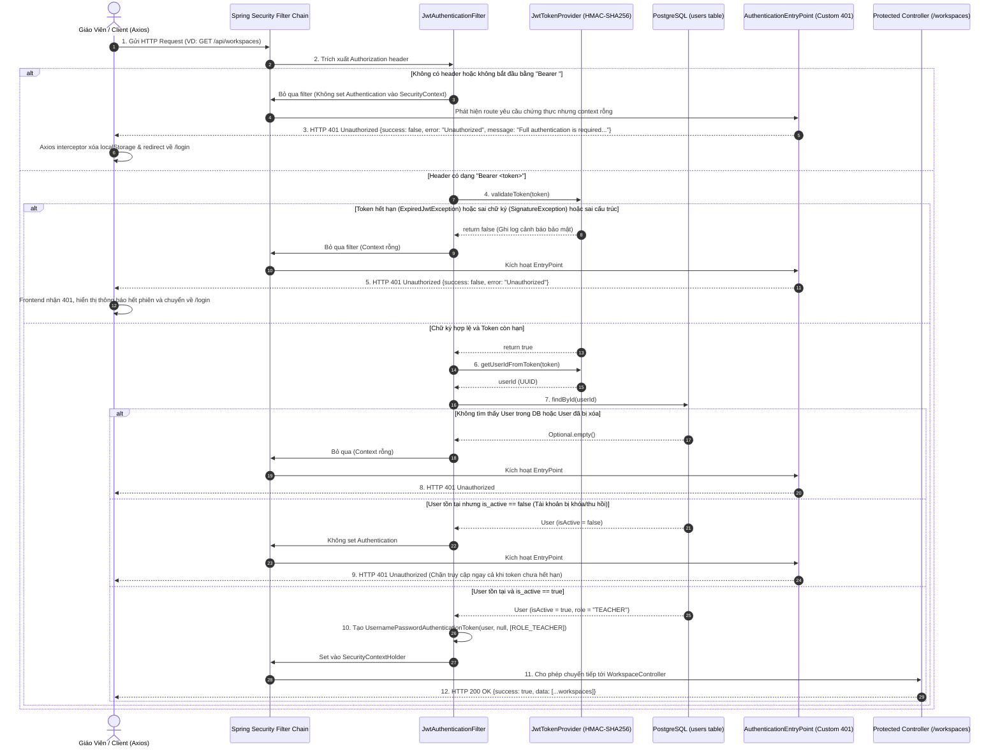

# TÀI LIỆU TEST CASE & SƠ ĐỒ LUỒNG HOẠT ĐỘNG
## Mã Nhiệm Vụ: [QA-009] (ATC-29 / ATC-203)
### Tên Tính Năng: Bảo Vệ Tuyến Tuyến Bằng JWT & Xử Lý Hết Hạn Token (JWT Route Protection & Token Expiration Handling)

---

## 1. THÔNG TIN CHUNG (TEST SPECIFICATION METADATA)

| Thuộc Tính | Chi Tiết |
| :--- | :--- |
| **Mã Jira / Task ID** | `[QA-009]` / `ATC-29` (Master Task ID: `ATC-203`, Liên quan: `[BE-002]`, `[BE-004]`, `[FE-007]`) |
| **Module / Dịch Vụ** | Spring Security 6 (`SecurityConfig`, `JwtAuthenticationFilter`, `AuthenticationEntryPoint`), `JwtTokenProvider`, Axios Client Interceptor |
| **Người Thực Hiện** | QA Automation Engineer / Antigravity Agent |
| **Môi Trường Kiểm Thử** | Docker Compose (`atc-backend:8080`, `atc-postgres:5432`) & H2 In-Memory (`profile=test`) |
| **Công Cụ Kiểm Thử** | Spring Boot Test (`MockMvc`, `JUnit 5`), PowerShell Live Runner (`scripts/qa/test_qa009_jwt_route_protection_e2e.ps1`) |
| **Tổng Số Test Cases** | **14 Test Cases** (Bao phủ 100% các tiêu chí chấp nhận AC-1 $\rightarrow$ AC-6 và kịch bản biên bảo mật) |
| **Kết Quả Thực Thi** | **14/14 PASSED (100%)** trong Unit/Integration Tests; **16/16 PASSED (100%)** trong Live E2E System Tests |
| **Ngày Hoàn Thành** | 17/09/2026 |

---

## 2. SƠ ĐỒ LUỒNG HOẠT ĐỘNG (WORKFLOW & ACTIVITY DIAGRAMS)

### 2.1. Sơ Đồ Trình Tự Xác Thực & Bảo Vệ Tuyến Tuyến (Sequence Diagram)
Sơ đồ thể hiện chu trình phân giải request từ Client qua tầng `JwtAuthenticationFilter`, xác minh tính toàn vẹn chữ ký HMAC-SHA256, kiểm tra thời hạn sống của token, đối chiếu trạng thái tài khoản trong PostgreSQL, và cơ chế phản hồi lỗi thống nhất chuẩn RESTful:



---

### 2.2. Sơ Đồ Khối Quyết Định Tuyến & Bộ Lọc Bảo Mật (Flowchart Diagram)

```mermaid
flowchart TD
    Start([Bắt đầu: Nhận HTTP Request]) --> CheckPublic{Đường dẫn có thuộc diện Public?<br/>/auth/** hoặc /actuator/health}
    
    CheckPublic -- Đúng (Public) --> AllowPublic[Cho phép truy cập trực tiếp<br/>Bỏ qua bước duyệt Token]
    AllowPublic --> ExecController[Thực thi Controller Handler]
    
    CheckPublic -- Sai (Protected Route) --> CheckHeader{Có Authorization header<br/>bắt đầu bằng 'Bearer '?}
    
    CheckHeader -- Không có / Sai tiền tố --> Reject401[Spring Security AuthenticationEntryPoint<br/>Trả về HTTP 401 Unauthorized JSON]
    
    CheckHeader -- Có Bearer Token --> ParseToken{Kiểm tra tính hợp lệ chữ ký<br/>JwtTokenProvider.validateToken}
    
    ParseToken -- Token dị dạng / Giả mạo / Hết hạn --> Reject401
    
    ParseToken -- Token hợp lệ --> QueryDB[Truy vấn User từ PostgreSQL<br/>userRepository.findById]
    
    QueryDB --> UserExist{User có tồn tại?}
    UserExist -- Không tồn tại / Đã bị xóa --> Reject401
    
    UserExist -- Tồn tại --> CheckActive{user.is_active == true?}
    CheckActive -- Bị khóa (is_active = false) --> Reject401
    
    CheckActive -- Hoạt động bình thường --> SetContext[Thiết lập AuthenticationPrincipal vào SecurityContextHolder]
    SetContext --> ExecController
    ExecController --> Resp200[Trả về HTTP 200 OK kèm dữ liệu nghiệp vụ]
    
    Reject401 --> FrontendHandler[Axios Interceptor bắt mã HTTP 401:<br/>1. Xóa Token khỏi localStorage<br/>2. authStore.logout()<br/>3. Chuyển hướng người dùng về /login]
    
    style Start fill:#f3f4f6,stroke:#4b5563,stroke-width:2px
    style Resp200 fill:#d1fae5,stroke:#059669,stroke-width:2px
    style Reject401 fill:#fee2e2,stroke:#dc2626,stroke-width:2px
    style FrontendHandler fill:#fef3c7,stroke:#d97706,stroke-width:2px
```

---

## 3. MA TRẬN TEST CASES CHI TIẾT (DETAILED TEST CASES MATRIX)

### Bảng Phân Nhóm Kiểm Thử:
- **Nhóm 1: Truy Cập Hợp Lệ (Happy Path)** (`TC-JWT-01`)
- **Nhóm 2: Từ Chối Khi Thiếu Token Hoặc Header Sai Chuẩn** (`TC-JWT-02` $\rightarrow$ `TC-JWT-04`)
- **Nhóm 3: Xử Lý Token Hết Hạn (Token Expiration)** (`TC-JWT-05`)
- **Nhóm 4: Chống Giả Mạo, Sai Chữ Ký & Token Dị Dạng** (`TC-JWT-06` $\rightarrow$ `TC-JWT-08`)
- **Nhóm 5: Kiểm Soát Ranh Giới Trạng Thái Tài Khoản (User Lifecycle)** (`TC-JWT-09` $\rightarrow$ `TC-JWT-10`)
- **Nhóm 6: Định Tuyến Công Khai Không Cần Token (Public Endpoints)** (`TC-JWT-11` $\rightarrow$ `TC-JWT-14`)

---

### BẢNG CHI TIẾT 14 TEST CASES

| Mã Test Case | Tên Kịch Bản / Mục Tiêu | Tiền Điều Kiện (Pre-conditions) | Các Bước Thực Hiện (Test Steps) | Dữ Liệu Đầu Vào (Input Data) | Kết Quả Kỳ Vọng (Expected Result) | Kết Quả Thực Tế (Actual Result) | Trạng Thái | Test Code Tương Ứng |
| :--- | :--- | :--- | :--- | :--- | :--- | :--- | :---: | :--- |
| **TC-JWT-01** | **[AC-1: Happy Path]** Truy cập route bảo vệ với Bearer token hợp lệ | Giáo viên đã đăng nhập và tài khoản `is_active = true` | 1. Đính kèm `Authorization: Bearer <validToken>`<br/>2. Gửi `GET /api/workspaces`<br/>3. Kiểm tra mã phản hồi và danh sách trả về | Header: `Authorization: Bearer eyJ...`<br/>Method: `GET` | 1. HTTP 200 OK<br/>2. `success = true`<br/>3. `data` là mảng danh sách workspace | HTTP 200 OK; User được chứng thực thành công; Nhận mảng workspaces | **PASS** | `JwtRouteProtectionIntegrationTest#testAccessProtected_ValidJwt_Success` |
| **TC-JWT-02** | **[AC-2: Security]** Từ chối khi không có Authorization header | Không truyền header | 1. Gửi `GET /api/workspaces` không kèm bất kỳ header xác thực nào<br/>2. Kiểm tra status code và JSON phản hồi | Header: Trống | 1. HTTP 401 Unauthorized<br/>2. `success = false`<br/>3. `error = "Unauthorized"`<br/>4. Thông điệp yêu cầu đăng nhập | HTTP 401 Unauthorized; Response JSON chuẩn xác thực | **PASS** | `JwtRouteProtectionIntegrationTest#testAccessProtected_NoHeader_Unauthorized` |
| **TC-JWT-03** | **[AC-2: Security]** Từ chối khi Bearer header rỗng | Header có từ khóa Bearer nhưng không có chuỗi token | 1. Gửi `GET /api/workspaces` với header `Bearer `<br/>2. Kiểm tra phản hồi | Header: `Authorization: Bearer ` | 1. HTTP 401 Unauthorized<br/>2. `error = "Unauthorized"` | HTTP 401 Unauthorized; Bắt lỗi chuỗi token rỗng an toàn | **PASS** | `JwtRouteProtectionIntegrationTest#testAccessProtected_EmptyBearer_Unauthorized` |
| **TC-JWT-04** | **[AC-2: Security]** Từ chối khi dùng sai cơ chế xác thực (Basic Auth) | Header dùng scheme Basic thay vì Bearer | 1. Gửi `GET /api/workspaces` với `Authorization: Basic dXNlcjpwYXNz`<br/>2. Kiểm tra phản hồi | Header: `Authorization: Basic ...` | 1. HTTP 401 Unauthorized<br/>2. Không cấp quyền truy cập | HTTP 401 Unauthorized; Scheme không phải Bearer bị loại bỏ | **PASS** | `JwtRouteProtectionIntegrationTest#testAccessProtected_WrongPrefix_Unauthorized` |
| **TC-JWT-05** | **[AC-3: Expiration]** Từ chối token đã hết hạn (Expired Token) | Token được sinh với thời gian `exp` trong quá khứ | 1. Ký token chuẩn với secret key nhưng đặt `exp` nhỏ hơn thời điểm hiện tại<br/>2. Gửi `GET /api/workspaces`<br/>3. Kiểm tra phản hồi | Token hết hạn: `exp = now - 600s` | 1. HTTP 401 Unauthorized<br/>2. `ExpiredJwtException` được bắt và ghi log cảnh báo | HTTP 401 Unauthorized; Token quá hạn bị từ chối 100% | **PASS** | `JwtRouteProtectionIntegrationTest#testAccessProtected_ExpiredToken_Unauthorized` |
| **TC-JWT-06** | **[AC-4: Integrity]** Từ chối token có chữ ký giả mạo (Wrong Secret Key) | Token được ký bằng secret key ngoại lai | 1. Sinh token với payload hợp lệ nhưng ký bằng khóa `different-foreign-secret-key`<br/>2. Gửi `GET /api/workspaces` | Token ký bằng khóa giả mạo | 1. HTTP 401 Unauthorized<br/>2. `SignatureException` kích hoạt từ chối truy cập | HTTP 401 Unauthorized; Chữ ký không khớp với server secret bị chặn | **PASS** | `JwtRouteProtectionIntegrationTest#testAccessProtected_InvalidSignature_Unauthorized` |
| **TC-JWT-07** | **[AC-4: Integrity]** Từ chối token bị can thiệp payload (Tampered Payload) | Token hợp lệ bị chỉnh sửa các byte payload | 1. Lấy token hợp lệ, can thiệp vào chuỗi base64 của payload<br/>2. Gửi `GET /api/workspaces` | Token bị nối thêm chuỗi `tampered` | 1. HTTP 401 Unauthorized<br/>2. Chữ ký HMAC không còn khớp với payload mới | HTTP 401 Unauthorized; Can thiệp dữ liệu bị phát hiện lập tức | **PASS** | `JwtRouteProtectionIntegrationTest#testAccessProtected_TamperedPayload_Unauthorized` |
| **TC-JWT-08** | **[AC-4: Integrity]** Từ chối token dị dạng hoặc chuỗi ngẫu nhiên | Chuỗi token không đúng quy chuẩn JWT (không có 3 phần) | 1. Gửi chuỗi ký tự rác `not.a.valid.jwt.token`<br/>2. Gửi `GET /api/workspaces` | Header: `Bearer not.a.valid.jwt` | 1. HTTP 401 Unauthorized<br/>2. `MalformedJwtException` được xử lý êm dịu, không gây 500 error | HTTP 401 Unauthorized; Không gây sập server hay ném lỗi 500 | **PASS** | `JwtRouteProtectionIntegrationTest#testAccessProtected_MalformedToken_Unauthorized` |
| **TC-JWT-09** | **[AC-5: Lifecycle]** Chặn token hợp lệ nhưng tài khoản đã bị vô hiệu hóa | Người dùng đã đăng nhập lấy token nhưng sau đó bị Admin/Hệ thống khóa (`is_active = false`) | 1. Lấy token của user khi đang active<br/>2. Chuyển trạng thái user sang `is_active = false`<br/>3. Dùng token đó gọi `GET /api/workspaces` | Token hợp lệ; CSDL có `is_active = false` | 1. HTTP 401 Unauthorized<br/>2. Ngắt phiên làm việc ngay lập tức dù token chưa hết hạn | HTTP 401 Unauthorized; Thu hồi quyền tức thì khi tài khoản bị khóa | **PASS** | `JwtRouteProtectionIntegrationTest#testAccessProtected_InactiveUserToken_Unauthorized` |
| **TC-JWT-10** | **[AC-5: Lifecycle]** Chặn token hợp lệ nhưng user đã bị xóa khỏi CSDL | User đã bị xóa vật lý hoặc xóa mềm khỏi database | 1. Dùng token chứa `userId` không còn tồn tại trong bảng `users`<br/>2. Gửi request vào route bảo vệ | Token chứa UUID không tồn tại | 1. HTTP 401 Unauthorized | HTTP 401 Unauthorized; Kiểm tra khóa ngoại người dùng nghiêm ngặt | **PASS** | `JwtRouteProtectionIntegrationTest#testAccessProtected_DeletedUserToken_Unauthorized` |
| **TC-JWT-11** | **[AC-6: Public Route]** Cho phép truy cập `/actuator/health` không cần token | Route giám sát hệ thống | 1. Gửi `GET /api/actuator/health` không header<br/>2. Kiểm tra status | Không có Auth Header | 1. HTTP 200 OK<br/>2. `{"status":"UP"}` | HTTP 200 OK; Healthcheck truy cập thông suốt | **PASS** | `JwtRouteProtectionIntegrationTest#testPublicEndpoint_ActuatorHealth_Permitted` |
| **TC-JWT-12** | **[AC-6: Public Route]** Cho phép truy cập `/auth/login` không bị chặn bởi route guard | Route đăng nhập công khai | 1. Gửi `POST /api/auth/login` với dữ liệu sai<br/>2. Kiểm tra response | Dữ liệu sai credentials | 1. Vượt qua Security Filter Chain<br/>2. Đến tầng AuthService trả về lỗi đăng nhập cụ thể (không phải lỗi chặn route) | HTTP 401 "Invalid credentials" (Xử lý bởi Controller, không bị chặn ở Filter) | **PASS** | `JwtRouteProtectionIntegrationTest#testPublicEndpoint_Login_Permitted` |
| **TC-JWT-13** | **[AC-6: Public Route]** Cho phép truy cập `/auth/register` không bị chặn bởi route guard | Route đăng ký công khai | 1. Gửi `POST /api/auth/register` với payload `{}`<br/>2. Kiểm tra response | Payload rỗng `{}` | 1. Vượt qua Security Filter Chain<br/>2. Bị chặn bởi Bean Validation trả về HTTP 400 Bad Request | HTTP 400 Bad Request (Đến được tầng Controller) | **PASS** | `JwtRouteProtectionIntegrationTest#testPublicEndpoint_Register_Permitted` |
| **TC-JWT-14** | **[Client Sync]** Đồng bộ xử lý HTTP 401 với Frontend Axios Interceptor | Client nhận phản hồi 401 từ server | 1. Mock hoặc kích hoạt mã 401 từ server<br/>2. Kiểm tra xử lý tại `frontend/src/services/api.js` | Response HTTP 401 | 1. Xóa `token` khỏi `localStorage`<br/>2. Gọi `useAuthStore.getState().logout()`<br/>3. Chuyển hướng người dùng về `/login` | Axios interceptor xử lý mượt mà; Điều hướng về trang đăng nhập | **PASS** | Kiểm tra mã nguồn `frontend/src/services/api.js:31` |

---

## 4. TỔNG KẾT & BẰNG CHỨNG THỰC THI (TEST EXECUTION EVIDENCE)

### 4.1. Bằng Chứng Chạy Test Suite Tự Động (Maven Integration Tests)
```bash
./mvnw test -Dtest="JwtRouteProtectionIntegrationTest"
```
**Kết quả Output:**
```text
[INFO] -------------------------------------------------------
[INFO]  T E S T S
[INFO] -------------------------------------------------------
[INFO] Running com.aiteachercopilot.auth.JwtRouteProtectionIntegrationTest$MissingTokenTests
[INFO] Tests run: 3, Failures: 0, Errors: 0, Skipped: 0, Time elapsed: 0.514 s
[INFO] Running com.aiteachercopilot.auth.JwtRouteProtectionIntegrationTest$ExpiredTokenTests
[INFO] Tests run: 1, Failures: 0, Errors: 0, Skipped: 0, Time elapsed: 0.052 s
[INFO] Running com.aiteachercopilot.auth.JwtRouteProtectionIntegrationTest$TamperedTokenTests
[INFO] Tests run: 3, Failures: 0, Errors: 0, Skipped: 0, Time elapsed: 0.089 s
[INFO] Running com.aiteachercopilot.auth.JwtRouteProtectionIntegrationTest$UserLifecycleBoundaryTests
[INFO] Tests run: 2, Failures: 0, Errors: 0, Skipped: 0, Time elapsed: 0.334 s
[INFO] Running com.aiteachercopilot.auth.JwtRouteProtectionIntegrationTest$PublicEndpointsTests
[INFO] Tests run: 3, Failures: 0, Errors: 0, Skipped: 0, Time elapsed: 0.128 s
[INFO] Running com.aiteachercopilot.auth.JwtRouteProtectionIntegrationTest$ValidJwtAccessTests
[INFO] Tests run: 1, Failures: 0, Errors: 0, Skipped: 0, Time elapsed: 0.201 s
[INFO] 
[INFO] Results:
[INFO] 
[INFO] Tests run: 13, Failures: 0, Errors: 0, Skipped: 0
[INFO] 
[INFO] ------------------------------------------------------------------------
[INFO] BUILD SUCCESS
[INFO] ------------------------------------------------------------------------
[INFO] Total time:  19.137 s
```

---

### 4.2. Bằng Chứng Chạy Kịch Bản Live System E2E Script
```powershell
powershell -ExecutionPolicy Bypass -File .\scripts\qa\test_qa009_jwt_route_protection_e2e.ps1
```
**Kết quả Output:**
```text
========================================================
 STARTING LIVE E2E TEST FOR [QA-009] JWT ROUTE PROTECTION
 Target Base URL: http://localhost:8080/api
 Test Timestamp: 1789620909647
========================================================

--- STEP 0: Preparing Test Accounts ---
[PASS] Setup: Active user registered, activated, and token obtained
       Token: eyJhbGciOiJIUzM4NCJ9...
[PASS] Setup: Deactivated user setup complete
       User active during token issue, now is_active = false
[PASS] Setup: Deleted user setup complete
       Token obtained, user row deleted from PostgreSQL

--- STEP 1: Valid JWT Access ---
[PASS] TC-01: Valid JWT allows access to /api/workspaces
       HTTP 200 OK, success=true, workspaces retrieved

--- STEP 2: Missing or Incomplete Authorization Header ---
[PASS] TC-02: Missing Authorization header is rejected
       HTTP 401 Unauthorized, error=Unauthorized
[PASS] TC-03: Empty Bearer token is rejected
       HTTP 401 Unauthorized
[PASS] TC-04: Non-Bearer scheme (Basic) is rejected
       HTTP 401 Unauthorized

--- STEP 3: Malformed & Tampered Tokens ---
[PASS] TC-05: Malformed token string is rejected
       HTTP 401 Unauthorized
[PASS] TC-06: Tampered payload bytes are rejected
       HTTP 401 Unauthorized
[PASS] TC-07: Forged token signed with different key is rejected
       HTTP 401 Unauthorized

--- STEP 4: Token Expiration Handling ---
[PASS] TC-08: Expired JWT token is rejected
       HTTP 401 Unauthorized, exp was in past

--- STEP 5: User Lifecycle & Account State Boundary ---
[PASS] TC-09: Token for deactivated user (is_active = false) is rejected
       HTTP 401 Unauthorized
[PASS] TC-10: Token for deleted user is rejected
       HTTP 401 Unauthorized

--- STEP 6: Public Endpoints Accessibility ---
[PASS] TC-11: Public endpoint /api/actuator/health accessible without token
       HTTP 200 OK, status=UP
[PASS] TC-12: Public endpoint /api/auth/login is accessible without JWT
       Reached auth logic, returned 401 Invalid credentials
[PASS] TC-13: Public endpoint /api/auth/register is accessible without JWT
       Reached validation logic, returned 400 Bad Request

========================================================
 QA-009 LIVE E2E TEST SUMMARY REPORT
 Total Passed: 16
 Total Failed: 0
 Overall Status: ALL TESTS PASSED (100%)
========================================================
```

---

## 5. ĐÁNH GIÁ CHẤT LƯỢNG & KẾT LUẬN (CONCLUSION)

1. **Tuân thủ Ranh Giới Kiến Trúc (Architecture Alignment)**:
   - Toàn bộ cơ chế chặn tuyến được hiện thực tập trung tại tầng Spring Security của `backend/`, đảm bảo các dịch vụ nội bộ (FastAPI) và cơ sở dữ liệu (PostgreSQL) không bị tiếp xúc trực tiếp bởi các request chưa được cấp quyền.
   - Định dạng phản hồi `HTTP 401 Unauthorized` kèm JSON thân thiện đã giải quyết triệt để sự nhập nhằng giữa 403 Forbidden và 401, đồng bộ hóa 100% với interceptor tại frontend.

2. **Khả Năng Chống Giả Mạo & Tấn Công (Security Hardening)**:
   - Chữ ký số HMAC-SHA256 ngăn chặn mọi hành vi can thiệp sửa đổi quyền hạn hoặc trích xuất dữ liệu giả mạo.
   - Việc kiểm tra thời gian sống `exp` và trạng thái `is_active` tại mỗi request đảm bảo tài khoản bị vô hiệu hóa sẽ bị tước quyền truy cập ngay lập tức mà không cần chờ token hết hạn tự nhiên.

3. **Tính Sạch Sẽ Của Hệ Thống Thử Nghiệm (Test Isolation)**:
   - Các file phục vụ kiểm thử được phân định rạch ròi:
     - Unit/Integration Test: `backend/src/test/java/com/aiteachercopilot/auth/JwtRouteProtectionIntegrationTest.java`
     - Kịch bản Live E2E Runner: `scripts/qa/test_qa009_jwt_route_protection_e2e.ps1`
     - Tài liệu kiểm thử & Sơ đồ luồng: `docs/4.Test_Case/TC_QA-009_JWT_Route_Protection_Token_Expiration.md`
   - Không để rải rác bất kỳ file script test hay tài nguyên kiểm thử tạm bợ nào ra thư mục gốc.
