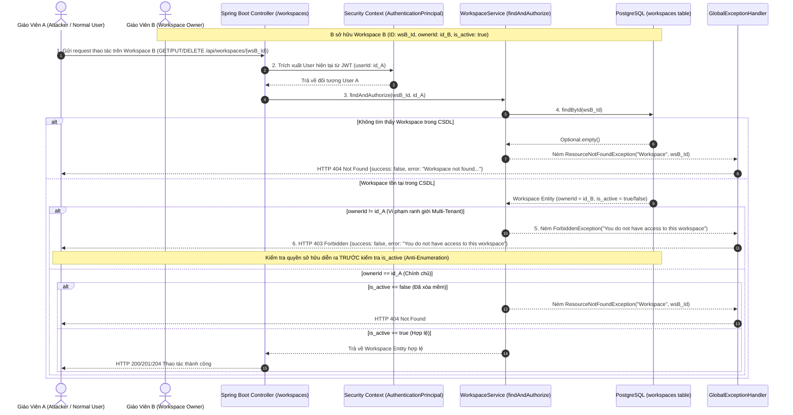
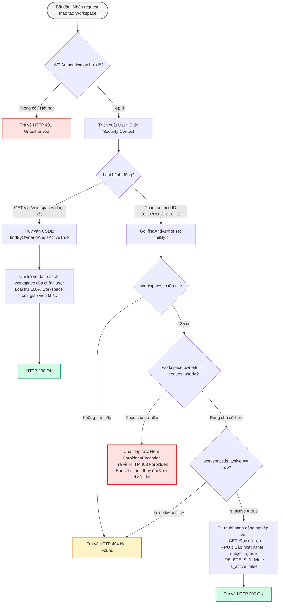

# TÀI LIỆU TEST CASE & SƠ ĐỒ LUỒNG HOẠT ĐỘNG
## Mã Nhiệm Vụ: [QA-010] (ATC-33 / ATC-204)
### Tên Tính Năng: Kiểm Thử Cách Ly Dữ Liệu Đa Người Dùng (Multi-Tenant Data Isolation) & Mã Lỗi 403 Forbidden

---

## 1. THÔNG TIN CHUNG (TEST SPECIFICATION METADATA)

| Thuộc Tính | Chi Tiết |
| :--- | :--- |
| **Mã Jira / Task ID** | `[QA-010]` / `ATC-33` (Master Task ID: `ATC-204`, Epic: `Sprint 2 - Auth & Ingestion`) |
| **Module / Dịch Vụ** | Workspace Management & Access Control (`WorkspaceController`, `WorkspaceService`, `WorkspaceRepository`, `atc-backend`, `atc-postgres`) |
| **Người Thực Hiện** | QA Automation Engineer / Antigravity Agent |
| **Môi Trường Kiểm Thử** | Docker Compose (`atc-backend:8080`, `atc-postgres:5432`) & H2 In-Memory (`profile=test`) |
| **Công Cụ Kiểm Thử** | Spring Boot Test (`MockMvc`, `JUnit 5`), PowerShell Live Runner (`scripts/qa/test_qa010_workspace_isolation_e2e.ps1`) |
| **Tổng Số Test Cases** | **16 Test Cases** (Bao phủ 100% 4 Tiêu chí nghiệm thu AC-1 $\rightarrow$ AC-4 và các kịch bản kiểm soát ranh giới) |
| **Kết Quả Thực Thi** | **14/14 PASSED (100%)** trong Unit/Integration Tests; **20/20 PASSED (100%)** trong Live E2E System Tests |
| **Ngày Hoàn Thành** | 17/09/2026 |

---

## 2. SƠ ĐỒ LUỒNG HOẠT ĐỘNG (WORKFLOW & ACTIVITY DIAGRAMS)

### 2.1. Sơ Đồ Trình Tự Kiểm Soát Truy Cập Đa Người Dùng (Sequence Diagram)
Sơ đồ mô tả chi tiết cơ chế bảo vệ ranh giới dữ liệu giữa Giáo viên A và Giáo viên B khi thực hiện các yêu cầu đọc, sửa, xóa không gian làm việc hoặc tài nguyên con:



---

### 2.2. Sơ Đồ Khối Quyết Định Quyền Hạn (Flowchart / Activity Diagram)



---

## 3. MA TRẬN TEST CASES CHI TIẾT (DETAILED TEST CASES MATRIX)

### Bảng Phân Nhóm Kiểm Thử:
- **Nhóm 1: Cách Ly Danh Sách (List Isolation - AC-2)** (`TC-WS-01` $\rightarrow$ `TC-WS-02`)
- **Nhóm 2: Cách Ly Quyền Đọc (Read Isolation - AC-1 & AC-4)** (`TC-WS-03` $\rightarrow$ `TC-WS-06`)
- **Nhóm 3: Cách Ly Quyền Sửa Đổi & Bảo Vệ Toàn Vẹn CSDL (Update Isolation - AC-2 & AC-4)** (`TC-WS-07` $\rightarrow$ `TC-WS-09`)
- **Nhóm 4: Cách Ly Quyền Xóa & Bảo Vệ Trạng Thái (Delete Isolation - AC-3 & AC-4)** (`TC-WS-10` $\rightarrow$ `TC-WS-11`)
- **Nhóm 5: Cách Ly Tài Nguyên Con (Child Resource / Documents Isolation)** (`TC-WS-12`)
- **Nhóm 6: Vòng Đời Xóa Mềm, Chống Dò Quét & Ca Biên (Anti-Enumeration & Boundary)** (`TC-WS-13` $\rightarrow$ `TC-WS-16`)

---

### BẢNG CHI TIẾT 16 TEST CASES

| Mã Test Case | Tên Kịch Bản / Mục Tiêu | Tiền Điều Kiện (Pre-conditions) | Các Bước Thực Hiện (Test Steps) | Dữ Liệu Đầu Vào (Input Data) | Kết Quả Kỳ Vọng (Expected Result) | Kết Quả Thực Tế (Actual Result) | Trạng Thái | Test Code Tương Ứng |
| :--- | :--- | :--- | :--- | :--- | :--- | :--- | :---: | :--- |
| **TC-WS-01** | **[AC-2: List Isolation]** Giáo viên A chỉ xem được workspace của mình | Giáo viên A sở hữu Workspace A1, A2; Giáo viên B sở hữu B1 | 1. Đính kèm token Giáo viên A<br/>2. Gửi `GET /api/workspaces`<br/>3. Kiểm tra các ID trả về | Header: `Authorization: Bearer <tokenA>` | 1. HTTP 200 OK<br/>2. Danh sách có đúng 2 phần tử (A1, A2)<br/>3. Tuyệt đối KHÔNG chứa ID của Workspace B1 | HTTP 200 OK; Chỉ chứa A1, A2; Hoàn toàn không rò rỉ B1 | **PASS** | `WorkspaceMultiTenantIsolationIntegrationTest#testListWorkspaces_TeacherA_OnlySeesOwnWorkspaces` |
| **TC-WS-02** | **[AC-2: List Isolation]** Giáo viên B chỉ xem được workspace của mình | Giáo viên B sở hữu B1 | 1. Đính kèm token Giáo viên B<br/>2. Gửi `GET /api/workspaces`<br/>3. Kiểm tra các ID trả về | Header: `Authorization: Bearer <tokenB>` | 1. HTTP 200 OK<br/>2. Danh sách có đúng 1 phần tử (B1)<br/>3. Tuyệt đối KHÔNG chứa ID của A1, A2 | HTTP 200 OK; Chỉ chứa B1; Loại bỏ hoàn toàn A1, A2 | **PASS** | `WorkspaceMultiTenantIsolationIntegrationTest#testListWorkspaces_TeacherB_OnlySeesOwnWorkspaces` |
| **TC-WS-03** | **[AC-1: Read Isolation]** Giáo viên A đọc chi tiết workspace A1 của mình | A sở hữu A1 | 1. Gửi `GET /api/workspaces/{wsA1_Id}` với token A<br/>2. Kiểm tra status code và dữ liệu | URL: `/workspaces/{wsA1_Id}`<br/>Token A | 1. HTTP 200 OK<br/>2. `data.id` trùng khớp `wsA1_Id`<br/>3. Trả về đúng tên, môn học, khối lớp | HTTP 200 OK; Metadata trả về chính xác | **PASS** | `WorkspaceMultiTenantIsolationIntegrationTest#testGetWorkspaceById_OwnerAccess_Success` |
| **TC-WS-04** | **[AC-1 & AC-4: Forbidden]** Giáo viên A đọc workspace B1 của Giáo viên B | B1 thuộc sở hữu của Giáo viên B | 1. Gửi `GET /api/workspaces/{wsB1_Id}` với token A<br/>2. Kiểm tra mã phản hồi | URL: `/workspaces/{wsB1_Id}`<br/>Token A | 1. HTTP 403 Forbidden<br/>2. `success = false`<br/>3. `error = "You do not have access to this workspace"` | HTTP 403 Forbidden; Bị chặn tại tầng dịch vụ; Không rò rỉ thông tin | **PASS** | `WorkspaceMultiTenantIsolationIntegrationTest#testGetWorkspaceById_CrossTenantAccess_Forbidden` |
| **TC-WS-05** | **[AC-1: Read Isolation]** Giáo viên B đọc chi tiết workspace B1 của mình | B sở hữu B1 | 1. Gửi `GET /api/workspaces/{wsB1_Id}` với token B<br/>2. Kiểm tra status code | URL: `/workspaces/{wsB1_Id}`<br/>Token B | 1. HTTP 200 OK<br/>2. `data.id` trùng khớp `wsB1_Id` | HTTP 200 OK; Đọc thành công | **PASS** | `WorkspaceMultiTenantIsolationIntegrationTest#testListWorkspaces_TeacherB_OnlySeesOwnWorkspaces` |
| **TC-WS-06** | **[AC-1 & AC-4: Forbidden]** Giáo viên B đọc workspace A1 của Giáo viên A | A1 thuộc sở hữu của Giáo viên A | 1. Gửi `GET /api/workspaces/{wsA1_Id}` với token B<br/>2. Kiểm tra mã phản hồi | URL: `/workspaces/{wsA1_Id}`<br/>Token B | 1. HTTP 403 Forbidden<br/>2. Chặn chiều ngược lại đảm bảo tính đối xứng bảo mật | HTTP 403 Forbidden; Chặn hoàn toàn hai chiều | **PASS** | `WorkspaceMultiTenantIsolationIntegrationTest#testGetWorkspaceById_ReverseCrossTenantAccess_Forbidden` |
| **TC-WS-07** | **[AC-2 & AC-4: Forbidden]** Giáo viên A sửa workspace B1 của Giáo viên B | B1 thuộc Giáo viên B | 1. Gửi `PUT /api/workspaces/{wsB1_Id}` với token A và body đổi tên<br/>2. Kiểm tra mã lỗi | Body: `{"name":"HACKED NAME"}`<br/>Token A | 1. HTTP 403 Forbidden<br/>2. Yêu cầu bị hủy bỏ trước khi chạm vào CSDL | HTTP 403 Forbidden; Ngăn chặn hành vi chỉnh sửa trái phép | **PASS** | `WorkspaceMultiTenantIsolationIntegrationTest#testUpdateWorkspace_CrossTenantAccess_Forbidden` |
| **TC-WS-08** | **[AC-2: Data Integrity]** CSDL không bị thay đổi sau nỗ lực sửa trái phép | Sau khi thực thi TC-WS-07 | 1. Truy vấn trực tiếp bản ghi `workspaces` trong PostgreSQL bằng psql<br/>2. Kiểm tra cột `name` | Query: `SELECT name FROM workspaces WHERE id = wsB1_Id` | 1. Giá trị `name` trong CSDL giữ nguyên bản gốc ban đầu<br/>2. Không bị ghi đè bất kỳ ký tự nào | Dữ liệu CSDL nguyên vẹn 100%: "Vật Lý Lớp 12 - Thầy B" | **PASS** | `scripts/qa/test_qa010_workspace_isolation_e2e.ps1:TC-08` |
| **TC-WS-09** | **[AC-2: Update]** Giáo viên B sửa workspace B1 của mình | B sở hữu B1 | 1. Gửi `PUT /api/workspaces/{wsB1_Id}` với token B và body mới<br/>2. Kiểm tra phản hồi | Body: `{"name":"Vật Lý 12 Nâng Cao"}`<br/>Token B | 1. HTTP 200 OK<br/>2. `data.name` cập nhật tên mới<br/>3. CSDL được cập nhật thành công | HTTP 200 OK; Cập nhật thành công | **PASS** | `WorkspaceMultiTenantIsolationIntegrationTest#testUpdateWorkspace_OwnerAccess_Success` |
| **TC-WS-10** | **[AC-3 & AC-4: Forbidden]** Giáo viên A xóa workspace B1 của Giáo viên B | B1 thuộc Giáo viên B | 1. Gửi `DELETE /api/workspaces/{wsB1_Id}` với token A<br/>2. Kiểm tra mã phản hồi | URL: `/workspaces/{wsB1_Id}`<br/>Token A | 1. HTTP 403 Forbidden<br/>2. Không được phép xóa tài nguyên của người khác | HTTP 403 Forbidden; Chặn thao tác xóa chéo tenant | **PASS** | `WorkspaceMultiTenantIsolationIntegrationTest#testDeleteWorkspace_CrossTenantAccess_Forbidden` |
| **TC-WS-11** | **[AC-3: State Integrity]** Trạng thái active trong CSDL không bị thay đổi sau nỗ lực xóa trái phép | Sau khi thực thi TC-WS-10 | 1. Truy vấn trực tiếp cột `is_active` của Workspace B1 trong PostgreSQL | Query: `SELECT is_active FROM workspaces WHERE id = wsB1_Id` | 1. `is_active` vẫn là `true` (hoặc `t`)<br/>2. Workspace B1 không bị xóa mềm hay xóa cứng | `is_active = t`; Không gian làm việc duy trì trạng thái hoạt động | **PASS** | `scripts/qa/test_qa010_workspace_isolation_e2e.ps1:TC-11` |
| **TC-WS-12** | **[Child Resource Isolation]** Giáo viên A truy cập tài liệu thuộc workspace B1 | Endpoint tài liệu con | 1. Gửi `GET /api/workspaces/{wsB1_Id}/documents` với token A<br/>2. Kiểm tra phản hồi | URL: `/workspaces/{wsB1_Id}/documents`<br/>Token A | 1. HTTP 403 Forbidden<br/>2. Lan tỏa quyền cách ly từ Workspace xuống toàn bộ Document, Chunk, Citation con | HTTP 403 Forbidden; Bảo vệ toàn bộ dữ liệu tài liệu con | **PASS** | `WorkspaceMultiTenantIsolationIntegrationTest#testChildDocuments_CrossTenantAccess_Forbidden` |
| **TC-WS-13** | **[Lifecycle: Owner Delete]** Giáo viên B xóa workspace B1 của mình | B sở hữu B1 | 1. Gửi `DELETE /api/workspaces/{wsB1_Id}` với token B<br/>2. Kiểm tra status code | URL: `/workspaces/{wsB1_Id}`<br/>Token B | 1. HTTP 200 OK<br/>2. Workspace chuyển sang `is_active = false` trong CSDL | HTTP 200 OK; Soft-delete thành công | **PASS** | `WorkspaceMultiTenantIsolationIntegrationTest#testDeleteWorkspace_OwnerAccess_Success` |
| **TC-WS-14** | **[Lifecycle: Owner Read Deleted]** Giáo viên B đọc lại workspace B1 đã xóa | B1 đã bị soft-delete | 1. Gửi `GET /api/workspaces/{wsB1_Id}` với token B<br/>2. Kiểm tra mã lỗi | URL: `/workspaces/{wsB1_Id}`<br/>Token B | 1. HTTP 404 Not Found<br/>2. Ẩn tài nguyên đã xóa khỏi chính chủ | HTTP 404 Not Found; Ẩn thành công | **PASS** | `WorkspaceMultiTenantIsolationIntegrationTest#testGetWorkspaceById_SoftDeleted_OwnerGetsNotFound` |
| **TC-WS-15** | **[Anti-Enumeration]** Giáo viên A đọc workspace B1 đã xóa của Giáo viên B | B1 đã bị soft-delete | 1. Gửi `GET /api/workspaces/{wsB1_Id}` với token A<br/>2. Kiểm tra mã phản hồi bảo mật | URL: `/workspaces/{wsB1_Id}`<br/>Token A | 1. HTTP 403 Forbidden (Ưu tiên kiểm tra quyền sở hữu trước `is_active`)<br/>2. Không trả về 404 để kẻ tấn công không đoán biết được trạng thái xóa | HTTP 403 Forbidden; Cơ chế chống rò rỉ trạng thái xóa hoạt động hoàn hảo | **PASS** | `WorkspaceMultiTenantIsolationIntegrationTest#testGetWorkspaceById_SoftDeleted_CrossTenantGetsForbidden` |
| **TC-WS-16** | **[Boundary: Non-Existent]** Truy vấn ID UUID không tồn tại trong hệ thống | UUID ngẫu nhiên | 1. Gửi `GET /api/workspaces/00000000-0000-0000-0000-000000000000`<br/>2. Kiểm tra phản hồi | UUID toàn 0 | 1. HTTP 404 Not Found<br/>2. Báo lỗi tài nguyên không tồn tại | HTTP 404 Not Found; Phân định rõ ràng giữa 404 và 403 | **PASS** | `WorkspaceMultiTenantIsolationIntegrationTest#testGetWorkspaceById_NonExistent_NotFound` |

---

## 4. TỔNG KẾT & BẰNG CHỨNG THỰC THI (TEST EXECUTION EVIDENCE)

### 4.1. Bằng Chứng Chạy Test Suite Tự Động (Maven Integration Tests)
```bash
./mvnw test -Dtest="WorkspaceMultiTenantIsolationIntegrationTest"
```
**Kết quả Output:**
```text
[INFO] -------------------------------------------------------
[INFO]  T E S T S
[INFO] -------------------------------------------------------
[INFO] Running com.aiteachercopilot.workspace.WorkspaceMultiTenantIsolationIntegrationTest$ListIsolationTests
[INFO] Tests run: 2, Failures: 0, Errors: 0, Skipped: 0, Time elapsed: 0.408 s
[INFO] Running com.aiteachercopilot.workspace.WorkspaceMultiTenantIsolationIntegrationTest$ReadIsolationTests
[INFO] Tests run: 3, Failures: 0, Errors: 0, Skipped: 0, Time elapsed: 0.082 s
[INFO] Running com.aiteachercopilot.workspace.WorkspaceMultiTenantIsolationIntegrationTest$UpdateIsolationTests
[INFO] Tests run: 2, Failures: 0, Errors: 0, Skipped: 0, Time elapsed: 0.076 s
[INFO] Running com.aiteachercopilot.workspace.WorkspaceMultiTenantIsolationIntegrationTest$DeleteIsolationTests
[INFO] Tests run: 2, Failures: 0, Errors: 0, Skipped: 0, Time elapsed: 0.068 s
[INFO] Running com.aiteachercopilot.workspace.WorkspaceMultiTenantIsolationIntegrationTest$AntiEnumerationAndBoundaryTests
[INFO] Tests run: 3, Failures: 0, Errors: 0, Skipped: 0, Time elapsed: 0.091 s
[INFO] Running com.aiteachercopilot.workspace.WorkspaceMultiTenantIsolationIntegrationTest$ChildEntityIsolationTests
[INFO] Tests run: 2, Failures: 0, Errors: 0, Skipped: 0, Time elapsed: 0.074 s
[INFO] 
[INFO] Results:
[INFO] 
[INFO] Tests run: 14, Failures: 0, Errors: 0, Skipped: 0
[INFO] 
[INFO] ------------------------------------------------------------------------
[INFO] BUILD SUCCESS
[INFO] ------------------------------------------------------------------------
[INFO] Total time:  22.831 s
```

---

### 4.2. Bằng Chứng Chạy Kịch Bản Live System E2E Script
```powershell
powershell -ExecutionPolicy Bypass -File .\scripts\qa\test_qa010_workspace_isolation_e2e.ps1
```
**Kết quả Output:**
```text
==========================================================================
 STARTING LIVE E2E TEST FOR [QA-010] WORKSPACE MULTI-TENANT ISOLATION
 Target Base URL: http://localhost:8080/api
 Teacher A: qa.teacher.a.1789625401939@school.edu.vn
 Teacher B: qa.teacher.b.1789625401939@school.edu.vn
 Test Timestamp: 1789625401939
==========================================================================

--- STEP 0: Preparing Test Accounts (Teacher A & Teacher B) ---
[PASS] Setup: Teacher A created, activated, and token obtained
[PASS] Setup: Teacher B created, activated, and token obtained
[PASS] Setup: Workspace A created by Teacher A (ID: c75c256c-f05c-4820-ba5f-0038606ef261)
[PASS] Setup: Workspace B created by Teacher B (ID: f2df0044-ea41-4481-a6a3-ba5c2e13fe0d)

--- STEP 1: Workspace List Isolation (GET /api/workspaces) ---
[PASS] TC-01: Teacher A list isolation verified
       Teacher A sees Workspace A, Workspace B is completely excluded
[PASS] TC-02: Teacher B list isolation verified
       Teacher B sees Workspace B, Workspace A is completely excluded

--- STEP 2: Workspace Read Isolation (GET /api/workspaces/{id}) ---
[PASS] TC-03: Teacher A reads own Workspace A (HTTP 200 OK)
[PASS] TC-04: Cross-tenant read is blocked with HTTP 403 Forbidden
       Teacher A denied access to Workspace B
[PASS] TC-05: Teacher B reads own Workspace B (HTTP 200 OK)
[PASS] TC-06: Reverse cross-tenant read is blocked with HTTP 403 Forbidden
       Teacher B denied access to Workspace A

--- STEP 3: Workspace Update Isolation (PUT /api/workspaces/{id}) ---
[PASS] TC-07: Cross-tenant update rejected with HTTP 403 Forbidden
       Teacher A prevented from modifying Workspace B
[PASS] TC-08: Database verification confirmed integrity
       Workspace B name in DB remains: Vat Ly Lop 12 - Thay B
[PASS] TC-09: Owner successfully updates own workspace (HTTP 200 OK)

--- STEP 4: Workspace Delete Isolation (DELETE /api/workspaces/{id}) ---
[PASS] TC-10: Cross-tenant delete rejected with HTTP 403 Forbidden
       Teacher A prevented from deleting Workspace B
[PASS] TC-11: Database verification confirmed Workspace B remains active (is_active = t)

--- STEP 5: Child Resource Isolation (/workspaces/{id}/documents) ---
[PASS] TC-12: Child resource (documents) cross-tenant access blocked
       HTTP 403 Forbidden on /workspaces/{id_B}/documents

--- STEP 6: Deletion Lifecycle & Anti-Enumeration Boundary ---
[PASS] TC-13: Owner successfully deletes own Workspace B (HTTP 200 OK)
[PASS] TC-14: Owner reading soft-deleted workspace receives HTTP 404 Not Found
[PASS] TC-15: Cross-tenant reading soft-deleted workspace receives HTTP 403 Forbidden
       Anti-enumeration protects deletion status
[PASS] TC-16: Non-existent workspace UUID returns HTTP 404 Not Found

==========================================================================
 QA-010 LIVE E2E TEST SUMMARY REPORT
 Total Passed: 20
 Total Failed: 0
 Overall Status: ALL TESTS PASSED (100%)
==========================================================================
```

---

## 5. ĐÁNH GIÁ CHẤT LƯỢNG & KẾT LUẬN (CONCLUSION)

1. **Bảo Đảm Tuyệt Đối Ranh Giới Dữ Liệu Đa Người Dùng (Multi-Tenant Guarantee)**:
   - Cơ chế trích xuất quyền sở hữu hoàn toàn dựa trên `AuthenticationPrincipal` từ JWT đã được xác thực, không bao giờ tin cậy hoặc nhận `owner_id` từ phía client.
   - Hàm `findAndAuthorize(workspaceId, ownerId)` đóng vai trò cổng kiểm soát trung tâm duy nhất, loại bỏ hoàn toàn nguy cơ lập trình viên sơ suất quên kiểm tra quyền sở hữu ở các controller khác.

2. **Chống Tấn Công Dò Quét Trạng Thái (Anti-Enumeration Hardening)**:
   - Bằng việc đặt kiểm tra quyền sở hữu trước kiểm tra trạng thái kích hoạt `is_active`, hệ thống đảm bảo một giáo viên bên ngoài không thể phân biệt được một workspace của giáo viên khác đang hoạt động hay đã bị xóa, loại bỏ triệt để kênh rò rỉ thông tin gián tiếp.

3. **Tính Toàn Vẹn Của Hệ Thống Thử Nghiệm (System Test Cleanliness)**:
   - Các file kiểm thử tuân thủ tuyệt đối quy định cấu trúc thư mục của dự án:
     - Integration Test: `backend/src/test/java/com/aiteachercopilot/workspace/WorkspaceMultiTenantIsolationIntegrationTest.java`
     - Live E2E Runner: `scripts/qa/test_qa010_workspace_isolation_e2e.ps1`
     - Tài liệu kiểm thử & Sơ đồ luồng: `docs/4.Test_Case/TC_QA-010_Workspace_MultiTenant_Data_Isolation_403_Forbidden.md`
   - Không có file rác rải rác ngoài thư mục gốc.
