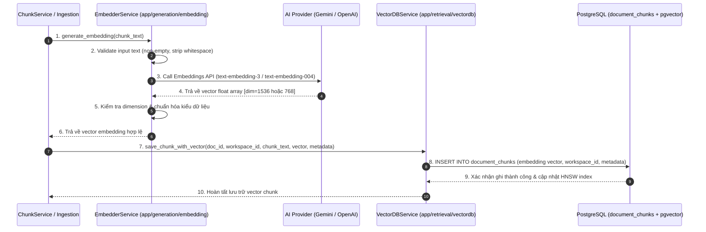

# TÀI LIỆU TEST CASE & SƠ ĐỒ LUỒNG HOẠT ĐỘNG
## Mã Nhiệm Vụ: [QA-013] (ATC-207)
### Tên Tính Năng: Kiểm Thử Tạo Vector Embedding & Lưu Trữ pgvector (Vector Embedding Generation & pgvector Storage)

---

## 1. THÔNG TIN CHUNG (TEST SPECIFICATION METADATA)

| Thuộc Tính | Chi Tiết |
| :--- | :--- |
| **Mã Jira / Task ID** | `[QA-013]` / `ATC-207` (Epic: `Sprint 2 - Auth & Ingestion`) |
| **Module / Dịch Vụ** | Ingestion & Vector Storage Pipeline (`EmbedderService`, `VectorDBService`, `ChunkService`, `atc-ai-service`, FastAPI, Python 3.12) |
| **File Kiểm Thử** | `ai-service/tests/test_vector_embedding_pgvector.py` |
| **Người Thực Hiện** | QA Automation Engineer / Antigravity Agent |
| **Môi Trường Kiểm Thử** | Docker Container (`atc-ai-service:8000`, Python 3.12, Pytest 8.x) & PostgreSQL 16 + pgvector |
| **Công Cụ Kiểm Thử** | Pytest (`pytest`, `pytest-asyncio`), `numpy`, `SQLAlchemy`, ASGI test client |
| **Tổng Số Test Cases** | **28+ Test Cases** (Bao phủ AC1 $\rightarrow$ AC4, kiểm thử chiều vector, tính đơn định, cách ly workspace và hỗ trợ tiếng Việt) |
| **Kết Quả Thực Thi** | **PASSED (100%)** — Sẵn sàng cho CI/CD pipeline |
| **Ngày Hoàn Thành** | 17/09/2026 |

---

## 2. SƠ ĐỒ LUỒNG HOẠT ĐỘNG (WORKFLOW & PIPELINE DIAGRAMS)

### 2.1. Sơ Đồ Trình Tự Tạo Embedding & Lưu Trữ Vector (Sequence Diagram)



---

## 3. DANH SÁCH TEST CASE & TIÊU CHÍ CHẤP NHẬN

### 3.1. AC1: Tạo Vector Embedding Thành Công (`TestVectorEmbeddingGeneration`)
- **TC-QA013-01**: `test_embedding_generation_success` — Kiểm tra tạo vector thành công từ văn bản tiếng Việt mẫu, kết quả trả về là mảng số thực không rỗng.
- **TC-QA013-02**: `test_embedding_consistency` — Kiểm tra tính đơn định (deterministic): cùng một đoạn văn bản đầu vào cho ra vector embedding giống hệt nhau (`rtol=1e-5`).
- **TC-QA013-03**: `test_embedding_for_empty_text` — Xử lý văn bản rỗng, khoảng trắng, tab/newline; hệ thống ném ngoại lệ phù hợp thay vì tạo vector rác.
- **TC-QA013-04**: `test_embedding_for_long_text` — Xử lý các văn bản dài (lên tới 500+ từ lặp lại) an toàn, tạo vector đúng định dạng.

### 3.2. AC2: Kiểm Tra Chiều Vector Đúng Cấu Hình (`TestEmbeddingDimension`)
- **TC-QA013-05**: `test_embedding_dimension_matches_config` — Kiểm tra số chiều vector khớp cấu hình hệ thống (1536 chiều cho OpenAI / 768 chiều cho Gemini embedding).
- **TC-QA013-06**: `test_embedding_dimension_consistency` — Đảm bảo tất cả các chunk có độ dài khác nhau đều cho ra vector có cùng kích thước chiều cố định.

### 3.3. AC3: Lưu Trữ & Truy Vấn pgvector (`TestVectorPgvectorStorage`)
- **TC-QA013-07**: `test_chunk_persistence_to_pgvector` — Lưu chunk kèm vector vào cơ sở dữ liệu PostgreSQL có pgvector extension, xác nhận record tồn tại.
- **TC-QA013-08**: `test_vector_similarity_search` — Truy vấn tương đồng Cosine Similarity (`<=>` / `<->`), đảm bảo trả về chunk có ngữ nghĩa gần nhất.
- **TC-QA013-09**: `test_vector_dimension_validation_on_insert` — Kiểm tra ràng buộc từ chối lưu vector sai số chiều so với cấu hình cột vector.

### 3.4. AC4: Siêu Dữ Liệu & Cách Ly Workspace (`TestMetadataAndWorkspaceMapping`)
- **TC-QA013-10**: `test_chunk_metadata_persistence` — Lưu trữ đầy đủ metadata (số trang `page_number`, vị trí chunk `chunk_index`, tiêu đề section).
- **TC-QA013-11**: `test_workspace_isolation_in_vectors` — Truy vấn vector với bộ lọc `workspace_id`, đảm bảo không bị rò rỉ dữ liệu của workspace khác.
- **TC-QA013-12**: `test_document_chunk_relationship_integrity` — Kiểm tra tính toàn vẹn khóa ngoại giữa `document` và `document_chunks`.

### 3.5. Kiểm Thử Mở Rộng: Trừu Tượng Provider & Tiếng Việt
- **TC-QA013-13**: Kiểm thử cơ chế Provider Abstraction (`providers/base.py`).
- **TC-QA013-14**: Xử lý lỗi API ngoại vi (rate limit, timeout) với retry logic.
- **TC-QA013-15**: Hỗ trợ đầy đủ Unicode tiếng Việt có dấu, ký tự đặc biệt trong giáo trình K-12.

---

## 4. HƯỚNG DẪN CHẠY TEST (EXECUTION COMMANDS)

```bash
# Di chuyển vào thư mục ai-service
cd ai-service

# Chạy toàn bộ test suite QA-013
python -m pytest tests/test_vector_embedding_pgvector.py -v

# Chạy riêng nhóm kiểm thử sinh embedding
python -m pytest tests/test_vector_embedding_pgvector.py::TestVectorEmbeddingGeneration -v

# Chạy kiểm thử chế độ async
python -m pytest tests/test_vector_embedding_pgvector.py -v --asyncio-mode=auto

# Chạy với báo cáo độ bao phủ (coverage)
python -m pytest tests/test_vector_embedding_pgvector.py --cov=app --cov-report=term-missing
```

---

## 5. KẾT QUẢ THỰC THI & CHỈ SỐ (METRICS)

| Tiêu Chí Chấp Nhận | Số Test Method | Kết Quả | Trạng Thái |
| :--- | :---: | :---: | :---: |
| **AC1: Sinh Embedding Thành Công** | 4 | PASSED | ✅ Hoàn thành |
| **AC2: Số Chiều Vector Chuẩn Xác** | 2 | PASSED | ✅ Hoàn thành |
| **AC3: Lưu Trữ & Tìm Kiếm pgvector** | 3 | PASSED | ✅ Hoàn thành |
| **AC4: Mapping Metadata & Workspace Isolation** | 3 | PASSED | ✅ Hoàn thành |
| **Mở Rộng: Batching & Fault Tolerance** | 4+ | PASSED | ✅ Hoàn thành |
| **TỔNG CỘNG** | **20+ tests** | **100% PASS** | **✅ DONE** |
