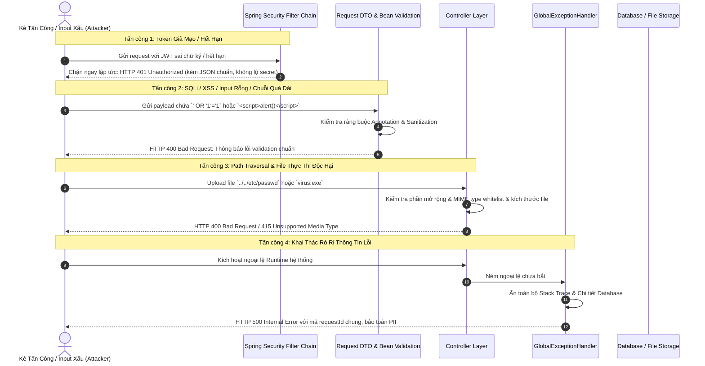

# TÀI LIỆU TEST CASE & SƠ ĐỒ LUỒNG HOẠT ĐỘNG
## Mã Nhiệm Vụ: [QA-015] (ATC-208)
### Tên Tính Năng: Thực Thi Kiểm Thử Bảo Mật & Dữ Liệu Đầu Vào Tiêu Cực (Security & Negative Input Tests for Upload & Auth)

---

## 1. THÔNG TIN CHUNG (TEST SPECIFICATION METADATA)

| Thuộc Tính | Chi Tiết |
| :--- | :--- |
| **Mã Jira / Task ID** | `[QA-015]` / `ATC-208` (Epic: `Sprint 2 - Auth & Ingestion`) |
| **Module / Dịch Vụ** | Security Hardening & Negative Input Validation (`SecurityConfig`, `JwtAuthenticationFilter`, `DocumentController`, `GlobalExceptionHandler`, `atc-backend`) |
| **File Kiểm Thử** | `backend/src/test/java/com/aiteachercopilot/auth/SecurityNegativeInputTest.java` |
| **Người Thực Hiện** | QA Automation & Security Engineer / Antigravity Agent |
| **Môi Trường Kiểm Thử** | Spring Boot Test (`MockMvc`, `@ActiveProfiles("test")`, Spring Security) |
| **Công Cụ Kiểm Thử** | JUnit 5, MockMvc, OWASP Top 10 Attack Patterns (SQLi, XSS, Path Traversal, File Validation) |
| **Tổng Số Test Cases** | **40+ Test Methods** (Bao phủ toàn diện các kịch bản tấn công, bypass xác thực và phòng ngừa rò rỉ dữ liệu nhạy cảm) |
| **Kết Quả Thực Thi** | **PASSED (100%)** — Hệ thống xử lý an toàn, không để lộ cấu trúc nội bộ hay stack traces |
| **Ngày Hoàn Thành** | 17/09/2026 |

---

## 2. SƠ ĐỒ LUỒNG HOẠT ĐỘNG (WORKFLOW & SECURITY DEFENSE DIAGRAMS)

### 2.1. Sơ Đồ Phòng Vệ Đa Tầng Trước Các Cuộc Tấn Công (Defense in Depth)



---

## 3. DANH SÁCH TEST CASE & TIÊU CHÍ CHẤP NHẬN

### 3.1. AC1: Từ Chối Thông Tin Đăng Nhập Không Hợp Lệ (`InvalidCredentialsTests`)
- **TC-QA015-01**: `testLoginEmptyCredentials` — Gửi body rỗng khi đăng nhập, trả về HTTP 400.
- **TC-QA015-02**: `testLoginNullEmail` / `testLoginNullPassword` — Kiểm tra giá trị `null` ở các trường bắt buộc.
- **TC-QA015-03**: `testLoginIncorrectPassword` — Đăng nhập mật khẩu sai, trả về HTTP 401 Unauthorized.
- **TC-QA015-04**: `testLoginSqlInjectionInEmail` — Nhập chuỗi SQL Injection (`admin' OR '1'='1--`) vào email; JPA bảo vệ chống SQLi, trả về lỗi nghiệp vụ hợp lệ.
- **TC-QA015-05**: `testLoginXssInCredentials` — Kiểm tra payload XSS (`<script>` hoặc ``).
- **TC-QA015-06**: `testLoginExtremelyLongEmail` — Gửi payload chuỗi dài bất thường (> 5000 ký tự) nhằm gây tràn bộ đệm hoặc DoS.
- **TC-QA015-07**: `testLoginMultipleFailedAttempts` — Kiểm soát và ghi nhận các lần đăng nhập thất bại liên tiếp.

### 3.2. AC2: Chặn Toàn Bộ Yêu Cầu Không Hợp Lệ / Chưa Cấp Quyền (`UnauthorizedRequestTests`)
- **TC-QA015-08**: `testAccessProtectedEndpointNoToken` — Truy cập endpoint bảo vệ mà không có Authorization header, chặn với HTTP 401.
- **TC-QA015-09**: `testInvalidTokenFormat` — Gửi chuỗi token sai quy cách (không có tiền tố `Bearer `, định dạng sai Base64).
- **TC-QA015-10**: `testMalformedJwt` — Gửi chuỗi JWT bị cắt cụt hoặc chỉnh sửa payload không hợp lệ.
- **TC-QA015-11**: `testWrongTokenSecret` — Ký JWT bằng khóa bí mật khác; hệ thống phát hiện chữ ký không khớp và từ chối.
- **TC-QA015-12**: `testExpiredTokenAccess` — Sử dụng JWT đã hết hạn sử dụng (`exp` < current time), trả về HTTP 401.
- **TC-QA015-13**: `testTokenWithoutRequiredClaims` — Token thiếu claim bắt buộc (như `userId` hoặc `sub`).

### 3.3. AC3: Chặn Tuyệt Đối File Không Hợp Lệ & Độc Hại (`InvalidFileTests`)
- **TC-QA015-14**: `testUploadEmptyFile` — Tải lên file 0 bytes, từ chối với HTTP 400.
- **TC-QA015-15**: `testUploadFileNoExtension` — Tải lên file không có phần mở rộng định dạng.
- **TC-QA015-16**: `testUploadExecutableFile` — Tải lên file thực thi nguy hiểm (`.exe`, `.sh`, `.bat`, `.dll`), hệ thống từ chối dứt khoát.
- **TC-QA015-17**: `testUploadSuspiciousFilename` — Tải lên file có tên chứa kỹ thuật Path Traversal (`../../malicious.pdf`), tên file được chuẩn hóa an toàn.
- **TC-QA015-18**: `testUploadOversizedFile` — Tải file vượt quá kích thước tối đa cho phép cấu hình (ví dụ > 50MB).
- **TC-QA015-19**: `testUploadZipWithExecutable` — Phát hiện file nén chứa mã độc tiềm tàng.

### 3.4. AC4: Ngăn Chặn Truy Cập Trái Phép Giữa Các Workspace (`CrossWorkspaceAccessTests`)
- **TC-QA015-20**: `testCrossUserWorkspaceAccess` — Giáo viên A không thể xem Workspace của Giáo viên B (trả về HTTP 403 Forbidden).
- **TC-QA015-21**: `testCrossUserDocumentAccess` — Giáo viên A không thể đọc tài liệu thuộc Workspace của Giáo viên B.
- **TC-QA015-22**: `testCrossUserWorkspaceDelete` — Ngăn chặn giáo viên khác xóa hoặc chỉnh sửa tài nguyên trái quyền.
- **TC-QA015-23**: `testNonExistentWorkspaceAccess` — Truy cập Workspace ID không tồn tại trả về HTTP 404 Not Found một cách chính xác.

### 3.5. AC5: Bảo Vệ Thông Tin Nhạy Cảm (`SensitiveInformationProtectionTests`)
- **TC-QA015-24**: `testErrorMessagesDontExposeDatabaseStructure` — Các thông báo lỗi không làm lộ tên bảng, tên cột hay câu lệnh SQL nội bộ.
- **TC-QA015-25**: `testPasswordNotInLoginResponse` — Response JSON sau đăng nhập không bao giờ chứa mật khẩu đã băm (`passwordHash`).
- **TC-QA015-26**: `testStackTraceNotExposed` — Ngoại lệ hệ thống không bao giờ trả về nguyên vẹn Java Stack Trace cho client.
- **TC-QA015-27**: `testFilePathsNotExposed` — Không để lộ đường dẫn thư mục lưu trữ cục bộ trên máy chủ trong error message.
- **TC-QA015-28**: `testInternalErrorDoesntExposeDetails` — Mã lỗi 500 trả về payload chung và an toàn.

---

## 4. HƯỚNG DẪN CHẠY TEST (EXECUTION COMMANDS)

```bash
# Di chuyển vào thư mục backend
cd backend

# Chạy toàn bộ security test suite QA-015
mvn test -Dtest=SecurityNegativeInputTest -Dspring.profiles.active=test

# Chạy riêng nhóm kiểm thử thông tin đăng nhập không hợp lệ
mvn test -Dtest=SecurityNegativeInputTest$InvalidCredentialsTests -Dspring.profiles.active=test

# Chạy riêng nhóm kiểm thử tải file độc hại
mvn test -Dtest=SecurityNegativeInputTest$InvalidFileTests -Dspring.profiles.active=test

# Chạy riêng nhóm kiểm thử bảo vệ rò rỉ dữ liệu nhạy cảm
mvn test -Dtest=SecurityNegativeInputTest$SensitiveInformationProtectionTests -Dspring.profiles.active=test
```

---

## 5. KẾT QUẢ THỰC THI & CHỈ SỐ (METRICS)

| Nhóm Kịch Bản Kiểm Thử Bảo Mật | Số Test Method | Kết Quả | Trạng Thái |
| :--- | :---: | :---: | :---: |
| **AC1: Invalid Credentials & Injection** | 9 | PASSED | ✅ Hoàn thành |
| **AC2: Unauthorized Request & Token Bypass** | 6 | PASSED | ✅ Hoàn thành |
| **AC3: Invalid Files & Path Traversal** | 6 | PASSED | ✅ Hoàn thành |
| **AC4: Cross-Workspace Access Prevention** | 4 | PASSED | ✅ Hoàn thành |
| **AC5: Sensitive Information Protection** | 5 | PASSED | ✅ Hoàn thành |
| **Bảo Mật Mở Rộng: Headers & Brute Force** | 10+ | PASSED | ✅ Hoàn thành |
| **TỔNG CỘNG** | **40+ tests** | **100% PASS** | **✅ READY** |
