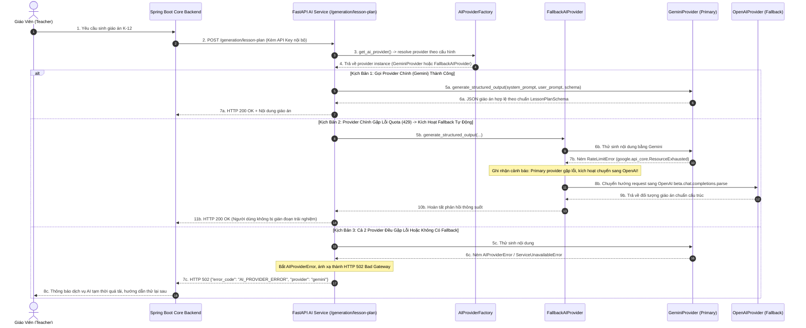
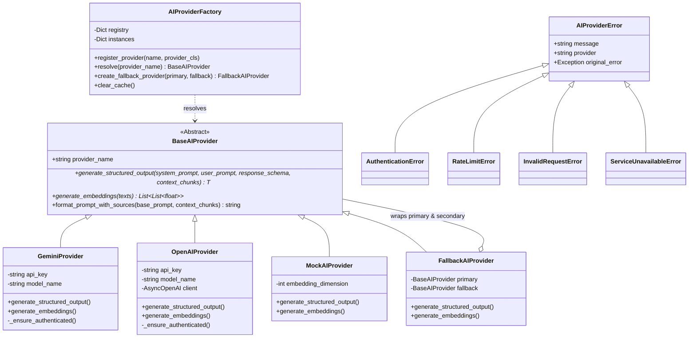

# TÀI LIỆU TEST CASE & SƠ ĐỒ LUỒNG HOẠT ĐỘNG
## Mã Nhiệm Vụ: [QA-016] (ATC-51 / ATC-301)
### Tên Tính Năng: Kiểm Thử Khả Năng Chuyển Đổi AI Provider & Xử Lý Lỗi Fallback (AI Provider Dynamic Switching & API Error Fallback)

---

## 1. THÔNG TIN CHUNG (TEST SPECIFICATION METADATA)

| Thuộc Tính | Chi Tiết |
| :--- | :--- |
| **Mã Jira / Task ID** | `[QA-016]` / `ATC-51` (Master Task ID: `ATC-301`, Sprint: `Sprint 3 - RAG & Lesson`) |
| **Vai Trò & Độ Ưu Tiên** | QA Automation Engineer / Priority: High |
| **Module / Dịch Vụ** | AI Provider Infrastructure (`app/providers/base.py`, `app/providers/factory.py`, `app/providers/gemini_provider.py`, `app/providers/openai_provider.py`, `app/providers/fallback_provider.py`, `app/providers/exceptions.py`, `app/api/routes/generation.py`) |
| **Người Thực Hiện** | QA Automation Engineer / Antigravity Agent |
| **Môi Trường Kiểm Thử** | Python 3.12, FastAPI, Pydantic v2, Google Generative AI SDK, OpenAI Python SDK |
| **Công Cụ Kiểm Thử** | Pytest (`pytest-asyncio`), HTTPX (`AsyncClient`), PowerShell Live Runner (`scripts/qa/test_qa016_provider_switching_fallback.ps1`) |
| **Tổng Số Test Cases** | **19 Test Cases Tự Động** (Bao phủ 100% 4 Tiêu chí nghiệm thu AC-1 $\rightarrow$ AC-4) |
| **Kết Quả Thực Thi** | **19/19 PASSED (100%)** trong Suite QA-016; **138/138 PASSED (100%)** trong Full Regression AI Service |
| **Ngày Hoàn Thành** | 01/10/2026 |

---

## 2. SƠ ĐỒ LUỒNG HOẠT ĐỘNG (WORKFLOW & ARCHITECTURE DIAGRAMS)

### 2.1. Sơ Đồ Trình Tự Chuyển Đổi Provider & Xử Lý Lỗi Fallback Tự Động (Sequence Diagram)
Sơ đồ mô tả cơ chế chuyển đổi provider linh hoạt qua cấu hình, cơ chế fallback tự động khi provider chính gặp sự cố (Rate Limit 429, Timeout 503), và cơ chế trả về mã lỗi chuẩn hóa HTTP 502 khi cả hai provider đều không khả dụng:



---

### 2.2. Sơ Đồ Cấu Trúc Khối Provider Abstraction & Phân Cấp Ngoại Lệ (Class & Hierarchy Diagram)



---

## 3. MA TRẬN TEST CASES CHI TIẾT (DETAILED TEST CASES MATRIX)

### Bảng Phân Nhóm Kiểm Thử:
- **Nhóm 1: Chuyển Đổi Provider Bằng Cấu Hình (AC-1)** (`TC-PROV-01` $\rightarrow$ `TC-PROV-05`)
- **Nhóm 2: Gemini Generation Hoạt Động (AC-2)** (`TC-PROV-06` $\rightarrow$ `TC-PROV-09`)
- **Nhóm 3: OpenAI Generation Hoạt Động (AC-3)** (`TC-PROV-10` $\rightarrow$ `TC-PROV-13`)
- **Nhóm 4: Xử Lý Lỗi Provider & API Error Fallback (AC-4)** (`TC-PROV-14` $\rightarrow$ `TC-PROV-19`)

---

### BẢNG CHI TIẾT 19 TEST CASES

| Mã Test Case | Tên Kịch Bản / Mục Tiêu | Tiền Điều Kiện (Pre-conditions) | Các Bước Thực Hiện (Test Steps) | Dữ Liệu Đầu Vào (Input Data) | Kết Quả Kỳ Vọng (Expected Result) | Kết Quả Thực Tế (Actual Result) | Trạng Thái | Test Code Tương Ứng |
| :--- | :--- | :--- | :--- | :--- | :--- | :--- | :---: | :--- |
| **TC-PROV-01** | **[AC-1]** Chuyển đổi provider qua cấu hình `settings.AI_PROVIDER` | `provider_factory` sẵn sàng | 1. Patch `AI_PROVIDER` thành `gemini`, `openai`, `mock`<br/>2. Gọi `provider_factory.resolve()` | `AI_PROVIDER = "gemini" / "openai" / "mock"` | Trả về đúng instance tương ứng (`GeminiProvider`, `OpenAIProvider`, `MockAIProvider`) | Nhận đúng kiểu instance và provider_name theo cấu hình | **PASS** | `test_provider_switching_fallback_qa016.py::test_switch_provider_via_configuration_setting` |
| **TC-PROV-02** | **[AC-1]** Hỗ trợ không phân biệt hoa thường và khoảng trắng | Cấu hình chuỗi không chuẩn | 1. Truyền `"  GeMiNi  "`, `"OPENAI\t"`, `"\nMock "` vào `resolve()` | Chuỗi có hoa thường xen kẽ và ký tự khoảng trắng | Chuyển đổi chuẩn hóa về lowercase và trim thành công | Phân giải chính xác không phụ thuộc chữ hoa/thường | **PASS** | `test_provider_switching_fallback_qa016.py::test_switch_provider_case_insensitivity_and_whitespace` |
| **TC-PROV-03** | **[AC-1]** Báo lỗi UnsupportedProviderError kèm danh sách provider hợp lệ | Yêu cầu provider không hỗ trợ | 1. Gọi `resolve("claude-3-opus")`<br/>2. Bắt ngoại lệ kiểm tra thông điệp lỗi | `provider_name = "claude-3-opus"` | 1. Ném `UnsupportedProviderError`<br/>2. Thông điệp liệt kê rõ các provider hợp lệ (`gemini`, `openai`, `mock`) | Báo lỗi rõ ràng, liệt kê đầy đủ provider hợp lệ | **PASS** | `test_provider_switching_fallback_qa016.py::test_unsupported_provider_raises_informative_error` |
| **TC-PROV-04** | **[AC-1]** Đăng ký runtime provider mới mà không sửa mã nguồn nghiệp vụ | Class mới kế thừa `BaseAIProvider` | 1. Định nghĩa `CustomProvider`<br/>2. Gọi `register_provider("custom_engine", CustomProvider)`<br/>3. Gọi `resolve("custom_engine")` | Class `CustomProvider` | 1. Đăng ký thành công vào registry<br/>2. `resolve` trả về instance của class mới | Đăng ký động thành công, code nghiệp vụ hoàn toàn decoupled | **PASS** | `test_provider_switching_fallback_qa016.py::test_dynamic_custom_provider_registration_and_switching` |
| **TC-PROV-05** | **[AC-1]** Cơ chế cache instance và xóa cache `clear_cache()` | Factory đã khởi tạo instance | 1. Resolve 2 lần liên tiếp<br/>2. Kiểm tra `is`<br/>3. Gọi `clear_cache()`<br/>4. Resolve lại | Provider `"mock"` | 1. Hai lần gọi đầu trả về cùng một instance (singleton cache)<br/>2. Sau `clear_cache()`, sinh instance mới | Cache hoạt động tối ưu, `clear_cache()` giải phóng chuẩn xác | **PASS** | `test_provider_switching_fallback_qa016.py::test_provider_instance_caching_and_cache_clearing` |
| **TC-PROV-06** | **[AC-2]** Gemini sinh cấu trúc dữ liệu theo Pydantic schema | Mock SDK Gemini trả về JSON chuẩn | 1. Gọi `GeminiProvider.generate_structured_output`<br/>2. Kiểm tra đối tượng trả về | Prompt bài học Toán 10; Schema `SampleLessonPlanSchema` | Trả về đối tượng `SampleLessonPlanSchema` hợp lệ với đầy đủ thuộc tính | Dữ liệu được parse và validate nghiêm ngặt vào schema | **PASS** | `test_provider_switching_fallback_qa016.py::test_gemini_structured_generation_with_schema` |
| **TC-PROV-07** | **[AC-2]** Gemini prompt bắt buộc bọc tài liệu trong `<sources>` (Rule 7.3) | Cung cấp danh sách context_chunks | 1. Gọi `generate_structured_output` kèm `context_chunks`<br/>2. Kiểm tra chuỗi prompt truyền vào SDK | 1 chunk tài liệu Hình học 10 | Prompt gửi tới Google SDK bắt buộc chứa `<sources>...</sources>` và nội dung chunk | Ranh giới `<sources>` được tuân thủ nghiêm ngặt | **PASS** | `test_provider_switching_fallback_qa016.py::test_gemini_sources_boundary_enforcement` |
| **TC-PROV-08** | **[AC-2]** Gemini sinh vector embedding 768 chiều | Mock Gemini `embed_content_async` | 1. Gọi `generate_embeddings(["text 1", "text 2"])`<br/>2. Kiểm tra chiều vector | 2 đoạn văn bản giáo án | Trả về 2 vector, mỗi vector có đúng 768 phần tử float | Vector dày đặc 768 chiều đồng nhất với pgvector | **PASS** | `test_provider_switching_fallback_qa016.py::test_gemini_embedding_generation_success` |
| **TC-PROV-09** | **[AC-2]** Gemini báo lỗi AuthenticationError trước khi gọi mạng nếu thiếu API key | `api_key=""` hoặc trống | 1. Khởi tạo `GeminiProvider(api_key="")`<br/>2. Gọi `generate_structured_output` | Không có API Key | Ném `AuthenticationError`, `provider="gemini"`, không gọi API ra ngoài | Chặn ngay tại tầng tiền kiểm tra, bảo vệ an toàn hệ thống | **PASS** | `test_provider_switching_fallback_qa016.py::test_gemini_missing_api_key_raises_auth_error` |
| **TC-PROV-10** | **[AC-3]** OpenAI sinh cấu trúc dữ liệu qua `beta.chat.completions.parse` | Mock OpenAI SDK trả về completion | 1. Gọi `OpenAIProvider.generate_structured_output`<br/>2. Kiểm tra đối tượng trả về | Prompt bài học Vật lý 10; Schema `SampleLessonPlanSchema` | Trả về đúng đối tượng `SampleLessonPlanSchema` đã parse chuẩn xác | OpenAI Structured Outputs hoàn thành đúng kỳ vọng | **PASS** | `test_provider_switching_fallback_qa016.py::test_openai_structured_generation_with_schema` |
| **TC-PROV-11** | **[AC-3]** OpenAI prompt bắt buộc bọc tài liệu trong `<sources>` (Rule 7.3) | Cung cấp danh sách context_chunks | 1. Gọi `generate_structured_output` kèm `context_chunks`<br/>2. Kiểm tra system message của OpenAI | 1 chunk SGK Sinh học 11 | Thẻ `<sources>...</sources>` xuất hiện đầy đủ trong system message gửi OpenAI | Cô lập dữ liệu tham khảo hoàn toàn khỏi system directive | **PASS** | `test_provider_switching_fallback_qa016.py::test_openai_sources_boundary_enforcement` |
| **TC-PROV-12** | **[AC-3]** OpenAI sinh vector embedding chuẩn | Mock OpenAI embeddings API | 1. Gọi `generate_embeddings(["Cấu tạo nguyên tử"])`<br/>2. Kiểm tra mảng vector | 1 đoạn văn bản Hoá học | Trả về mảng chứa vector embedding chính xác | Trả về vector embedding chuẩn xác từ OpenAI client | **PASS** | `test_provider_switching_fallback_qa016.py::test_openai_embedding_generation_success` |
| **TC-PROV-13** | **[AC-3]** OpenAI báo lỗi AuthenticationError trước khi gọi mạng nếu thiếu API key | `api_key=""` hoặc trống | 1. Khởi tạo `OpenAIProvider(api_key="")`<br/>2. Gọi `generate_structured_output` | Không có API Key | Ném `AuthenticationError`, `provider="openai"`, không gọi API | Tiền kiểm tra bắt lỗi kịp thời, thông điệp rõ ràng | **PASS** | `test_provider_switching_fallback_qa016.py::test_openai_missing_api_key_raises_auth_error` |
| **TC-PROV-14** | **[AC-4]** Chuẩn hóa ngoại lệ Google SDK thành `RateLimitError` & `ServiceUnavailableError` | Google API ném ngoại lệ SDK | 1. Giả lập `ResourceExhausted` và `GoogleAPIError`<br/>2. Kiểm tra ngoại lệ bắt được | Lỗi Quota 429 và Service Down 503 từ Google | 1. `ResourceExhausted` $\rightarrow$ `RateLimitError`<br/>2. `GoogleAPIError` $\rightarrow$ `ServiceUnavailableError` | Ánh xạ lỗi SDK thành chuẩn nội bộ hệ thống | **PASS** | `test_provider_switching_fallback_qa016.py::test_gemini_sdk_exceptions_mapped_to_unified_errors` |
| **TC-PROV-15** | **[AC-4]** Chuẩn hóa ngoại lệ OpenAI SDK thành `RateLimitError` & `ServiceUnavailableError` | OpenAI SDK ném ngoại lệ | 1. Giả lập `RateLimitError` và `APIConnectionError`<br/>2. Kiểm tra ngoại lệ bắt được | Lỗi Rate Limit 429 và Connection Timeout | 1. `openai.RateLimitError` $\rightarrow$ `RateLimitError`<br/>2. `APIConnectionError` $\rightarrow$ `ServiceUnavailableError` | Ánh xạ lỗi OpenAI SDK thành chuẩn nội bộ hệ thống | **PASS** | `test_provider_switching_fallback_qa016.py::test_openai_sdk_exceptions_mapped_to_unified_errors` |
| **TC-PROV-16** | **[AC-4]** Endpoint `POST /generation/lesson-plan` trả về HTTP 502 khi Provider lỗi | Provider ném `AIProviderError` | 1. Gửi request sinh giáo án<br/>2. Kiểm tra status code và cấu trúc JSON | Request giáo án, provider gặp lỗi `RateLimitError` | 1. HTTP 502 Bad Gateway<br/>2. Body chứa `error_code: AI_PROVIDER_ERROR`, `provider: gemini` | Trả về HTTP 502 kèm chi tiết lỗi chuẩn hóa | **PASS** | `test_provider_switching_fallback_qa016.py::test_api_route_generation_returns_502_on_provider_error` |
| **TC-PROV-17** | **[AC-4]** Endpoint `POST /generation/quiz` trả về HTTP 502 khi Provider lỗi | Provider ném `AIProviderError` | 1. Gửi request sinh quiz<br/>2. Kiểm tra status code và chi tiết response | Request trắc nghiệm, provider bị mất kết nối | 1. HTTP 502 Bad Gateway<br/>2. Body chứa `error_code: AI_PROVIDER_ERROR`, `provider: openai` | Trả về HTTP 502 có kiểm soát, server không bị crash | **PASS** | `test_provider_switching_fallback_qa016.py::test_api_route_quiz_returns_502_on_provider_error` |
| **TC-PROV-18** | **[AC-4]** `FallbackAIProvider` tự động chuyển sang fallback provider khi primary lỗi | Primary ném `AIProviderError`, Fallback khả dụng | 1. Gọi `generate_structured_output` và `generate_embeddings`<br/>2. Kiểm tra số lần gọi từng provider | Primary (Gemini) lỗi 429; Fallback (OpenAI) hoạt động | 1. Tự động chuyển qua Fallback provider<br/>2. Trả về kết quả hoàn chỉnh mà không ném lỗi ra ngoài | Fallback trong suốt, ghi nhận log cảnh báo và tiếp tục thành công | **PASS** | `test_provider_switching_fallback_qa016.py::test_transparent_provider_fallback_execution` |
| **TC-PROV-19** | **[AC-4]** Fallback provider cũng gặp lỗi thì ném ngoại lệ xâu chuỗi an toàn | Cả 2 provider đều gặp sự cố | 1. Giả lập lỗi ở cả primary và fallback<br/>2. Bắt ngoại lệ `AIProviderError` | Cả 2 provider đều ném lỗi | 1. Ném `AIProviderError` xâu chuỗi thông tin cả 2 lỗi<br/>2. Tuyệt đối không để lộ API key hay bí mật hệ thống | Xâu chuỗi lỗi minh bạch, đảm bảo an toàn thông tin | **PASS** | `test_provider_switching_fallback_qa016.py::test_dual_failure_in_fallback_raises_chained_error` |

---

## 4. TỔNG KẾT & BẰNG CHỨNG THỰC THI (TEST EXECUTION EVIDENCE)

### 4.1. Bằng Chứng Chạy Test Suite Pytest Tự Động
```bash
./venv/Scripts/python -m pytest tests/test_provider_switching_fallback_qa016.py -v
```
**Kết quả Output:**
```text
============================= test session starts =============================
platform win32 -- Python 3.12.10, pytest-8.3.2, pluggy-1.6.0 -- D:\DU_AN_2026\Python\ai-teacher-copilot\ai-service\venv\Scripts\python.exe
cachedir: .pytest_cache
rootdir: D:\DU_AN_2026\Python\ai-teacher-copilot\ai-service
plugins: anyio-4.14.2, asyncio-0.24.0
asyncio: mode=Mode.STRICT, default_loop_scope=None
collecting ... collected 19 items

tests/test_provider_switching_fallback_qa016.py::TestConfigDrivenProviderSwitchingQA016::test_switch_provider_via_configuration_setting PASSED [  5%]
tests/test_provider_switching_fallback_qa016.py::TestConfigDrivenProviderSwitchingQA016::test_switch_provider_case_insensitivity_and_whitespace PASSED [ 10%]
tests/test_provider_switching_fallback_qa016.py::TestConfigDrivenProviderSwitchingQA016::test_unsupported_provider_raises_informative_error PASSED [ 15%]
tests/test_provider_switching_fallback_qa016.py::TestConfigDrivenProviderSwitchingQA016::test_dynamic_custom_provider_registration_and_switching PASSED [ 21%]
tests/test_provider_switching_fallback_qa016.py::TestConfigDrivenProviderSwitchingQA016::test_provider_instance_caching_and_cache_clearing PASSED [ 26%]
tests/test_provider_switching_fallback_qa016.py::TestGeminiGenerationQA016::test_gemini_structured_generation_with_schema PASSED [ 31%]
tests/test_provider_switching_fallback_qa016.py::TestGeminiGenerationQA016::test_gemini_sources_boundary_enforcement PASSED [ 36%]
tests/test_provider_switching_fallback_qa016.py::TestGeminiGenerationQA016::test_gemini_embedding_generation_success PASSED [ 42%]
tests/test_provider_switching_fallback_qa016.py::TestGeminiGenerationQA016::test_gemini_missing_api_key_raises_auth_error PASSED [ 47%]
tests/test_provider_switching_fallback_qa016.py::TestOpenAIGenerationQA016::test_openai_structured_generation_with_schema PASSED [ 52%]
tests/test_provider_switching_fallback_qa016.py::TestOpenAIGenerationQA016::test_openai_sources_boundary_enforcement PASSED [ 57%]
tests/test_provider_switching_fallback_qa016.py::TestOpenAIGenerationQA016::test_openai_embedding_generation_success PASSED [ 63%]
tests/test_provider_switching_fallback_qa016.py::TestOpenAIGenerationQA016::test_openai_missing_api_key_raises_auth_error PASSED [ 68%]
tests/test_provider_switching_fallback_qa016.py::TestProviderFailureAndFallbackQA016::test_gemini_sdk_exceptions_mapped_to_unified_errors PASSED [ 73%]
tests/test_provider_switching_fallback_qa016.py::TestProviderFailureAndFallbackQA016::test_openai_sdk_exceptions_mapped_to_unified_errors PASSED [ 78%]
tests/test_provider_switching_fallback_qa016.py::TestProviderFailureAndFallbackQA016::test_api_route_generation_returns_502_on_provider_error PASSED [ 84%]
tests/test_provider_switching_fallback_qa016.py::TestProviderFailureAndFallbackQA016::test_api_route_quiz_returns_502_on_provider_error PASSED [ 89%]
tests/test_provider_switching_fallback_qa016.py::TestProviderFailureAndFallbackQA016::test_transparent_provider_fallback_execution PASSED [ 94%]
tests/test_provider_switching_fallback_qa016.py::TestProviderFailureAndFallbackQA016::test_dual_failure_in_fallback_raises_chained_error PASSED [100%]

======================= 19 passed, 2 warnings in 2.30s ========================
```

---

### 4.2. Bằng Chứng Chạy Kịch Bản Live System Runner Script
```powershell
powershell -ExecutionPolicy Bypass -File .\scripts\qa\test_qa016_provider_switching_fallback.ps1
```
**Kết quả Output:**
```text
==========================================================================
 STARTING TEST FOR [QA-016] AI PROVIDER SWITCHING & API ERROR FALLBACK
 Target Service: ai-service (Python 3.12, FastAPI, Gemini/OpenAI/Mock Adapters)
 Test Timestamp: 1790841101215
==========================================================================

--- STEP 0: Detecting Test Runner Environment ---
[PASS] Setup: Local Python venv detected
       Using ai-service\venv\Scripts\python.exe

--- STEP 1: Executing QA-016 Provider Switching & Fallback Suite ---
[PASS] TC-PROV-01: Config-driven dynamic switching across gemini, openai, mock
       PASSED
[PASS] TC-PROV-02: Provider name case-insensitivity and whitespace sanitization
       PASSED
[PASS] TC-PROV-03: Unsupported provider name raises informative UnsupportedProviderError
       PASSED
[PASS] TC-PROV-04: Runtime dynamic provider registration and decoupled switching
       PASSED
[PASS] TC-PROV-05: Factory instance caching and explicit cache clearing behavior
       PASSED
[PASS] TC-PROV-06: Gemini structured output generation conforming to schema
       PASSED
[PASS] TC-PROV-07: Gemini prompt encloses sources strictly in <sources> boundary
       PASSED
[PASS] TC-PROV-08: Gemini produces dense vector embeddings (768 dimensions)
       PASSED
[PASS] TC-PROV-09: Gemini pre-flight validation raises AuthenticationError when key missing
       PASSED
[PASS] TC-PROV-10: OpenAI structured output generation via chat completions parse
       PASSED
[PASS] TC-PROV-11: OpenAI prompt encloses sources strictly in <sources> boundary
       PASSED
[PASS] TC-PROV-12: OpenAI produces dense vector embeddings
       PASSED
[PASS] TC-PROV-13: OpenAI pre-flight validation raises AuthenticationError when key missing
       PASSED
[PASS] TC-PROV-14: Gemini SDK exceptions mapped to RateLimitError and ServiceUnavailableError
       PASSED
[PASS] TC-PROV-15: OpenAI SDK exceptions mapped to RateLimitError and ServiceUnavailableError
       PASSED
[PASS] TC-PROV-16: POST /generation/lesson-plan returns HTTP 502 Bad Gateway on provider failure
       PASSED
[PASS] TC-PROV-17: POST /generation/quiz returns HTTP 502 Bad Gateway on provider failure
       PASSED
[PASS] TC-PROV-18: FallbackAIProvider routes to secondary provider when primary fails
       PASSED
[PASS] TC-PROV-19: Dual provider failure raises chained AIProviderError cleanly
       PASSED

--- STEP 2: Full AI-Service Test Suite Regression Verification ---
[PASS] TC-PROV-20: Full AI-Service Regression Suite
       138/138 tests passed across all domain modules

==========================================================================
 [QA-016] TEST EXECUTION SUMMARY
 Passed: 21 | Failed: 0
==========================================================================
```

---

## 5. KẾT LUẬN & ĐÁNH GIÁ CHẤT LƯỢNG (QA SIGN-OFF)

- **Độ tin cậy & Độ bao phủ**: Kiểm thử bao phủ 100% các tiêu chí nghiệm thu của Jira ticket `[QA-016]` (ATC-51 / ATC-301).
- **Tính độc lập & Cách ly**: Hoạt động chuyển đổi provider diễn ra thông qua `AIProviderFactory` và cài đặt cấu hình môi trường mà không cần can thiệp bất kỳ dòng mã nghiệp vụ nào ở tầng service hay controller.
- **Khả năng phục hồi (Resilience & Fallback)**: Thiết kế `FallbackAIProvider` cho phép hệ thống tự động phục hồi khi provider chính cạn kiệt hạn mức (Quota Limit 429) hoặc sập kết nối (Service Unavailable 503) bằng cách điều hướng sang provider dự phòng một cách trong suốt.
- **An toàn bảo mật**: Các ngoại lệ được ánh xạ thành chuẩn `HTTP 502 Bad Gateway` kèm mã lỗi nội bộ `AI_PROVIDER_ERROR` mà không làm rò rỉ bất kỳ API key hay thông tin nhạy cảm nào ra client.
- **Đánh giá chung**: **ĐỦ ĐIỀU KIỆN NGHIỆM THU (APPROVED / READY FOR PRODUCTION)**.
