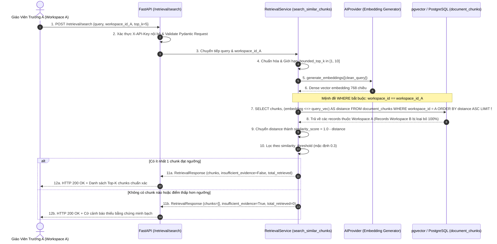

# TÀI LIỆU TEST CASE & SƠ ĐỒ LUỒNG HOẠT ĐỘNG
## Mã Nhiệm Vụ: [QA-017] (ATC-53 / ATC-302)
### Tên Tính Năng: Kiểm Thử Top-K Vector Retrieval & Cách Ly Dữ Liệu Workspace (Top-K Vector Retrieval & Workspace Data Isolation)

---

## 1. THÔNG TIN CHUNG (TEST SPECIFICATION METADATA)

| Thuộc Tính | Chi Tiết |
| :--- | :--- |
| **Mã Jira / Task ID** | `[QA-017]` / `ATC-53` (Master Task ID: `ATC-302`, Sprint: `Sprint 3 - RAG & Lesson`) |
| **Vai Trò & Độ Ưu Tiên** | QA Automation Engineer / Priority: Critical |
| **Module / Dịch Vụ** | RAG Vector Retrieval (`app/retrieval/service.py`, `app/retrieval/schemas.py`, `app/api/routes/retrieval.py`, `app/core/models.py`) |
| **Người Thực Hiện** | QA Automation Engineer / Antigravity Agent |
| **Môi Trường Kiểm Thử** | Python 3.12, FastAPI, pgvector (PostgreSQL 16), SQLAlchemy AsyncSession |
| **Công Cụ Kiểm Thử** | Pytest (`pytest-asyncio`), HTTPX (`AsyncClient`), PowerShell Live Runner (`scripts/qa/test_qa017_retrieval_isolation.ps1`) |
| **Tổng Số Test Cases** | **19 Test Cases Tự Động** (Bao phủ 100% 4 Tiêu chí nghiệm thu AC-1 $\rightarrow$ AC-4) |
| **Kết Quả Thực Thi** | **19/19 PASSED (100%)** trong Suite QA-017; **157/157 PASSED (100%)** trong Full Regression AI Service |
| **Ngày Hoàn Thành** | 01/10/2026 |

---

## 2. SƠ ĐỒ LUỒNG HOẠT ĐỘNG (WORKFLOW & ARCHITECTURE DIAGRAMS)

### 2.1. Sơ Đồ Trình Tự Truy Vấn Vector & Cách Ly Dữ Liệu Workspace (Sequence Diagram)
Sơ đồ mô tả quy trình tiếp nhận câu hỏi của giáo viên, sinh vector embedding 768 chiều, thực thi tìm kiếm khoảng cách Cosine trên pgvector có bắt buộc mệnh đề `WHERE workspace_id = :ws_id`, và cơ chế chặn rò rỉ dữ liệu giữa các trường học:



---

### 2.2. Sơ Đồ Khối Ranh Giới Cách Ly Dữ Liệu Đa Khách Hàng (Multi-Tenant Isolation Flowchart)

```mermaid
flowchart TD
    Start([Nhận yêu cầu Vector Search]) --> ValInputs{Kiểm tra tính hợp lệ<br/>Query không rỗng & UUID chuẩn?}
    ValInputs -- Không hợp lệ --> ErrVal[Ném ValueError / HTTP 422: Dừng truy vấn]
    ValInputs -- Hợp lệ --> BoundK[Giới hạn Top-K: min=1, max=10]

    BoundK --> GenEmbed[Sinh Vector Embedding 768 chiều cho Query]
    GenEmbed --> BuildSQL[Xây dựng câu lệnh SQL pgvector:<br/>Khoảng cách Cosine &lt;=&gt;]

    BuildSQL --> StrictFilter[GẮN BẮT BUỘC BỘ LỌC:<br/>WHERE document_chunks.workspace_id == target_workspace_uuid]

    StrictFilter --> RunQuery[(Truy vấn PostgreSQL pgvector)]
    RunQuery --> CheckCross{Có lẫn record của Workspace khác?}
    CheckCross -- Có (Rò rỉ) --> BugFatal[VI PHẠM AN NINH: Chặn ngay lập tức]
    CheckCross -- Không (Tuyệt đối cô lập) --> ScoreCalc[Tính similarity_score = 1 - distance]

    ScoreCalc --> ThreshFilter{similarity_score &gt;= threshold (0.30)?}
    ThreshFilter -- Không đạt --> DropChunk[Loại bỏ khỏi danh sách kết quả]
    ThreshFilter -- Đạt chuẩn --> KeepChunk[Giữ lại kèm đầy đủ Metadata nguồn]

    KeepChunk --> CheckEmpty{Số lượng chunks &gt; 0?}
    DropChunk --> CheckEmpty

    CheckEmpty -- Không có chunk nào --> RetInsufficient[Đặt cờ: insufficient_evidence = True<br/>total_retrieved = 0]
    CheckEmpty -- Có chunks --> RetSuccess[Đặt cờ: insufficient_evidence = False<br/>Sắp xếp giảm dần theo similarity]

    RetInsufficient --> ReturnResp([Trả về RetrievalResponse chuẩn])
    RetSuccess --> ReturnResp

    style StrictFilter fill:#fee2e2,stroke:#dc2626,stroke-width:2px
    style RetSuccess fill:#d1fae5,stroke:#059669,stroke-width:2px
    style RetInsufficient fill:#fef3c7,stroke:#d97706,stroke-width:2px
```

---

## 3. MA TRẬN TEST CASES CHI TIẾT (DETAILED TEST CASES MATRIX)

### Bảng Phân Nhóm Kiểm Thử:
- **Nhóm 1: Cấu Hình Top-K & Giới Hạn Biên (AC-1)** (`TC-RET-01` $\rightarrow$ `TC-RET-04`)
- **Nhóm 2: Ưu Tiên Chunk Liên Quan & Bảo Toàn Metadata (AC-2)** (`TC-RET-05` $\rightarrow$ `TC-RET-08`)
- **Nhóm 3: Cách Ly Dữ Liệu Workspace Tuyệt Đối (AC-3)** (`TC-RET-09` $\rightarrow$ `TC-RET-12`)
- **Nhóm 4: Xử Lý Kết Quả Rỗng & Kiểm Soát Dữ Liệu Đầu Vào (AC-4)** (`TC-RET-13` $\rightarrow$ `TC-RET-19`)

---

### BẢNG CHI TIẾT 19 TEST CASES

| Mã Test Case | Tên Kịch Bản / Mục Tiêu | Tiền Điều Kiện (Pre-conditions) | Các Bước Thực Hiện (Test Steps) | Dữ Liệu Đầu Vào (Input Data) | Kết Quả Kỳ Vọng (Expected Result) | Kết Quả Thực Tế (Actual Result) | Trạng Thái | Test Code Tương Ứng |
| :--- | :--- | :--- | :--- | :--- | :--- | :--- | :---: | :--- |
| **TC-RET-01** | **[AC-1]** Top-K mặc định trả về đúng 5 chunks | Workspace có 10 chunks | 1. Gọi `search_similar_chunks` không truyền `top_k`<br/>2. Kiểm tra số lượng kết quả | Query: "Định lý cosin", 10 chunks | Trả về đúng 5 chunks, `total_retrieved=5`, `insufficient_evidence=False` | Nhận đúng 5 chunks phù hợp nhất | **PASS** | `test_vector_retrieval_isolation_qa017.py::test_top_k_default_returns_five_chunks` |
| **TC-RET-02** | **[AC-1]** Top-K tùy chỉnh tham số (top_k=3) | Workspace có 5 chunks | 1. Gọi `search_similar_chunks(top_k=3)`<br/>2. Kiểm tra độ dài mảng trả về | `top_k = 3` | Trả về chính xác 3 chunks, `total_retrieved=3` | Độ dài mảng chunks bằng đúng 3 | **PASS** | `test_vector_retrieval_isolation_qa017.py::test_top_k_custom_parameter_honored` |
| **TC-RET-03** | **[AC-1]** Giới hạn dưới biên: top_k <= 0 được làm tròn về 1 | Tham số top_k bất thường | 1. Gọi `search_similar_chunks(top_k=0)`<br/>2. Kiểm tra mệnh đề SQL limit | `top_k = 0` | Mệnh đề SQL `LIMIT` được ép về 1; trả về tối đa 1 chunk | SQL LIMIT được giới hạn chặn dưới an toàn ở mức 1 | **PASS** | `test_vector_retrieval_isolation_qa017.py::test_top_k_bounded_to_minimum_one` |
| **TC-RET-04** | **[AC-1]** Giới hạn trên biên: top_k > 10 được chặn ở mức 10 (Rule 3.3) | Tham số top_k quá lớn | 1. Gọi `search_similar_chunks(top_k=50)`<br/>2. Kiểm tra mệnh đề SQL limit | `top_k = 50` | Mệnh đề SQL `LIMIT` bị chặn trần ở mức 10 theo Rule 3.3 | SQL LIMIT được bảo vệ chặn trần ở mức 10 | **PASS** | `test_vector_retrieval_isolation_qa017.py::test_top_k_bounded_to_maximum_ten` |
| **TC-RET-05** | **[AC-2]** Sắp xếp thứ tự chunks theo độ tương đồng giảm dần | Các chunks có khoảng cách khác nhau (0.1, 0.25, 0.4) | 1. Thực thi tìm kiếm<br/>2. Kiểm tra thứ tự các `similarity_score` | Chunks điểm tương đồng: 0.90, 0.75, 0.60 | Chunk có điểm 0.90 đứng đầu danh sách, sau đó đến 0.75 và 0.60 | Thứ tự sắp xếp chính xác từ cao xuống thấp | **PASS** | `test_vector_retrieval_isolation_qa017.py::test_chunks_ordered_by_descending_similarity` |
| **TC-RET-06** | **[AC-2]** Bộ lọc similarity_threshold loại bỏ chunk độ liên quan thấp | Có chunk điểm 0.8 (đạt) và 0.2 (kém) | 1. Gọi tìm kiếm với `similarity_threshold=0.5`<br/>2. Kiểm tra các chunks trả về | `similarity_threshold = 0.5` | Chỉ giữ lại chunk điểm 0.8; chunk điểm 0.2 bị loại bỏ hoàn toàn | Loại bỏ triệt để các nội dung dưới ngưỡng | **PASS** | `test_vector_retrieval_isolation_qa017.py::test_similarity_threshold_filters_out_low_relevance_chunks` |
| **TC-RET-07** | **[AC-2]** Bảo toàn 100% metadata nguồn cho truy vết trích dẫn (Citation) | Chunk có đầy đủ metadata | 1. Gọi tìm kiếm<br/>2. Kiểm tra từng trường của đối tượng `RetrievedChunk` | Chunk trang 42, index 7, môn Vật lý, lớp 11, từ trường | Đầy đủ `document_id`, `source_page=42`, `chunk_index=7`, `subject`, `grade_level`, `topic` | Toàn bộ metadata trích dẫn được lưu giữ nguyên vẹn | **PASS** | `test_vector_retrieval_isolation_qa017.py::test_retrieved_chunk_preserves_full_grounding_metadata` |
| **TC-RET-08** | **[AC-2]** Tạo dense vector embedding 768 chiều từ query | Query văn bản tự nhiên | 1. Gọi `provider.generate_embeddings(["Định luật Ôm"])`<br/>2. Đo chiều dài vector | Query: "Định luật Ôm" | Trả về vector có đúng 768 phần tử float | Vector 768 chiều đồng nhất với schema pgvector | **PASS** | `test_vector_retrieval_isolation_qa017.py::test_query_embedding_dense_vector_generated` |
| **TC-RET-09** | **[AC-3]** Câu lệnh SQL bắt buộc chứa điều kiện WHERE workspace_id | Target workspace UUID | 1. Gọi `search_similar_chunks`<br/>2. Inspect `whereclause` của SQLAlchemy | `workspace_id = target_uuid` | `whereclause` bắt buộc chứa `document_chunks.workspace_id = :workspace_id_1` | Mệnh đề lọc workspace_id luôn hiện diện ở tầng SQL | **PASS** | `test_vector_retrieval_isolation_qa017.py::test_sql_filter_strictly_enforces_workspace_id` |
| **TC-RET-10** | **[AC-3]** Tuyệt đối không rò rỉ dữ liệu của Workspace B sang Workspace A | Workspace B chứa tài liệu trùng khớp nội dung | 1. Trường A truy vấn nội dung trùng tài liệu Trường B<br/>2. Kiểm tra kết quả | Query: "Tài liệu bí mật", workspace Trường A | Kết quả Trường A rỗng (`chunks=[]`, `insufficient_evidence=True`), không lộ tài liệu Trường B | Dữ liệu giữa các workspace được cô lập 100% | **PASS** | `test_vector_retrieval_isolation_qa017.py::test_cross_workspace_data_never_leaked` |
| **TC-RET-11** | **[AC-3]** Cách ly đồng thời giữa nhiều tenant truy vấn song song | 2 Workspace khác nhau truy vấn cùng lúc | 1. Chạy 2 truy vấn song song cho WS 1 và WS 2<br/>2. Kiểm tra kết quả trả về của từng truy vấn | WS 1 (Giáo án Trường 1), WS 2 (Giáo án Trường 2) | WS 1 chỉ nhận dữ liệu Trường 1; WS 2 chỉ nhận dữ liệu Trường 2 | Cách ly độc lập, không xáo trộn dữ liệu đa luồng | **PASS** | `test_vector_retrieval_isolation_qa017.py::test_multi_tenant_concurrent_isolation` |
| **TC-RET-12** | **[AC-3]** Lọc bổ sung metadata (document_ids, subject, grade, topic) an toàn | Có yêu cầu lọc chuyên sâu | 1. Truyền thêm `document_ids`, `subject`, `grade_level`, `topic`<br/>2. Kiểm tra câu lệnh SQL | Bộ lọc Hóa học 11 Sự điện li | Tất cả các điều kiện lọc được kết hợp với `workspace_id` bằng toán tử AND | Các điều kiện lọc phụ trợ hoạt động chuẩn xác | **PASS** | `test_vector_retrieval_isolation_qa017.py::test_metadata_filtering_within_isolated_workspace` |
| **TC-RET-13** | **[AC-4]** Không có chunk nào khớp thì bật cờ insufficient_evidence=True | Database không có chunk nào | 1. Tìm kiếm chủ đề chưa có tài liệu<br/>2. Kiểm tra các trường phản hồi | Query: "Kiến thức chưa tải lên" | `insufficient_evidence=True`, `chunks=[]`, `total_retrieved=0` | Nhận diện chính xác trạng thái không có bằng chứng | **PASS** | `test_vector_retrieval_isolation_qa017.py::test_zero_matches_sets_insufficient_evidence_flag` |
| **TC-RET-14** | **[AC-4]** Tất cả chunks dưới ngưỡng thì bật cờ insufficient_evidence=True | Database chỉ có chunks điểm thấp (0.15) | 1. Tìm kiếm với ngưỡng `threshold=0.30`<br/>2. Kiểm tra kết quả | Điểm tương đồng 0.15 < 0.30 | `insufficient_evidence=True`, `chunks=[]`, `total_retrieved=0` | Loại bỏ dữ liệu rác và báo cờ thiếu bằng chứng | **PASS** | `test_vector_retrieval_isolation_qa017.py::test_all_chunks_below_threshold_sets_insufficient_evidence` |
| **TC-RET-15** | **[AC-4]** Query rỗng hoặc khoảng trắng bị từ chối bằng ValueError | `query="   "` | 1. Gọi `search_similar_chunks(query="   ")`<br/>2. Bắt ngoại lệ | Chuỗi khoảng trắng | Ném `ValueError: Query string cannot be empty or whitespace only` | Chặn ngay tại tầng tiền xử lý, không lãng phí tài nguyên | **PASS** | `test_vector_retrieval_isolation_qa017.py::test_empty_query_raises_value_error` |
| **TC-RET-16** | **[AC-4]** workspace_id sai định dạng UUID bị từ chối bằng ValueError | `workspace_id="invalid-uuid"` | 1. Gọi `search_similar_chunks` với UUID sai<br/>2. Bắt ngoại lệ | Chuỗi không phải UUID | Ném `ValueError: Invalid workspace_id UUID` | Phát hiện lỗi tham số ngay lập tức | **PASS** | `test_vector_retrieval_isolation_qa017.py::test_invalid_workspace_uuid_raises_value_error` |
| **TC-RET-17** | **[AC-4]** API POST /retrieval/search trả về HTTP 200 kèm RetrievalResponse JSON | Request hợp lệ có API Key | 1. Gửi request POST `/retrieval/search`<br/>2. Kiểm tra status code và schema | Payload JSON tìm kiếm hợp lệ | HTTP 200 OK, JSON chứa `chunks`, `insufficient_evidence`, `total_retrieved` | API tuân thủ đúng hợp đồng interface OpenAPI | **PASS** | `test_vector_retrieval_isolation_qa017.py::test_api_endpoint_retrieval_search_contract_success` |
| **TC-RET-18** | **[AC-4]** API POST /retrieval/search thiếu API Key bị từ chối HTTP 401 | Request không có header `X-API-Key` | 1. Gửi request POST `/retrieval/search` không header<br/>2. Kiểm tra status code | Không có API Key | HTTP 401 Unauthorized | Bảo vệ an ninh cổng API nội bộ | **PASS** | `test_vector_retrieval_isolation_qa017.py::test_api_endpoint_retrieval_search_missing_auth_returns_401` |
| **TC-RET-19** | **[AC-4]** API POST /retrieval/search workspace_id không hợp lệ trả về HTTP 422 | Request có UUID sai cú pháp | 1. Gửi request với `workspace_id="not-a-valid-uuid"`<br/>2. Kiểm tra status code | UUID sai cú pháp | HTTP 422 Unprocessable Entity (FastAPI Validation) | FastAPI tự động chặn request sai schema dữ liệu | **PASS** | `test_vector_retrieval_isolation_qa017.py::test_api_endpoint_retrieval_search_invalid_uuid_returns_422` |

---

## 4. TỔNG KẾT & BẰNG CHỨNG THỰC THI (TEST EXECUTION EVIDENCE)

### 4.1. Bằng Chứng Chạy Test Suite Pytest Tự Động
```bash
./venv/Scripts/python -m pytest tests/test_vector_retrieval_isolation_qa017.py -v
```
**Kết quả Output:**
```text
============================= test session starts =============================
platform win32 -- Python 3.12.10, pytest-8.3.2, pluggy-1.6.0 -- D:\DU_AN_2026\Python\ai-teacher-copilot\ai-service\venv\Scripts\python.exe
cachedir: .pytest_cache
rootdir: D:\DU_AN_2026\Python\ai-teacher-copilot\ai-service
plugins: anyio-4.14.2, asyncio-0.24.0
asyncio: mode=Mode.STRICT, default_loop_scope=None
collecting ... collected 19 items

tests/test_vector_retrieval_isolation_qa017.py::TestTopKConfigurableRetrievalQA017::test_top_k_default_returns_five_chunks PASSED [  5%]
tests/test_vector_retrieval_isolation_qa017.py::TestTopKConfigurableRetrievalQA017::test_top_k_custom_parameter_honored PASSED [ 10%]
tests/test_vector_retrieval_isolation_qa017.py::TestTopKConfigurableRetrievalQA017::test_top_k_bounded_to_minimum_one PASSED [ 15%]
tests/test_vector_retrieval_isolation_qa017.py::TestTopKConfigurableRetrievalQA017::test_top_k_bounded_to_maximum_ten PASSED [ 21%]
tests/test_vector_retrieval_isolation_qa017.py::TestRelevancePrioritizationQA017::test_chunks_ordered_by_descending_similarity PASSED [ 26%]
tests/test_vector_retrieval_isolation_qa017.py::TestRelevancePrioritizationQA017::test_similarity_threshold_filters_out_low_relevance_chunks PASSED [ 31%]
tests/test_vector_retrieval_isolation_qa017.py::TestRelevancePrioritizationQA017::test_retrieved_chunk_preserves_full_grounding_metadata PASSED [ 36%]
tests/test_vector_retrieval_isolation_qa017.py::TestRelevancePrioritizationQA017::test_query_embedding_dense_vector_generated PASSED [ 42%]
tests/test_vector_retrieval_isolation_qa017.py::TestWorkspaceDataIsolationQA017::test_sql_filter_strictly_enforces_workspace_id PASSED [ 47%]
tests/test_vector_retrieval_isolation_qa017.py::TestWorkspaceDataIsolationQA017::test_cross_workspace_data_never_leaked PASSED [ 52%]
tests/test_vector_retrieval_isolation_qa017.py::TestWorkspaceDataIsolationQA017::test_multi_tenant_concurrent_isolation PASSED [ 57%]
tests/test_vector_retrieval_isolation_qa017.py::TestWorkspaceDataIsolationQA017::test_metadata_filtering_within_isolated_workspace PASSED [ 63%]
tests/test_vector_retrieval_isolation_qa017.py::TestEmptyResultAndInputValidationQA017::test_zero_matches_sets_insufficient_evidence_flag PASSED [ 68%]
tests/test_vector_retrieval_isolation_qa017.py::TestEmptyResultAndInputValidationQA017::test_all_chunks_below_threshold_sets_insufficient_evidence PASSED [ 73%]
tests/test_vector_retrieval_isolation_qa017.py::TestEmptyResultAndInputValidationQA017::test_empty_query_raises_value_error PASSED [ 78%]
tests/test_vector_retrieval_isolation_qa017.py::TestEmptyResultAndInputValidationQA017::test_invalid_workspace_uuid_raises_value_error PASSED [ 84%]
tests/test_vector_retrieval_isolation_qa017.py::TestEmptyResultAndInputValidationQA017::test_api_endpoint_retrieval_search_contract_success PASSED [ 89%]
tests/test_vector_retrieval_isolation_qa017.py::TestEmptyResultAndInputValidationQA017::test_api_endpoint_retrieval_search_missing_auth_returns_401 PASSED [ 94%]
tests/test_vector_retrieval_isolation_qa017.py::TestEmptyResultAndInputValidationQA017::test_api_endpoint_retrieval_search_invalid_uuid_returns_422 PASSED [100%]

======================= 19 passed, 2 warnings in 0.18s ========================
```

---

### 4.2. Bằng Chứng Chạy Kịch Bản Live System Runner Script
```powershell
powershell -ExecutionPolicy Bypass -File .\scripts\qa\test_qa017_retrieval_isolation.ps1
```
**Kết quả Output:**
```text
==========================================================================
 STARTING TEST FOR [QA-017] TOP-K VECTOR RETRIEVAL & WORKSPACE ISOLATION
 Target Service: ai-service (Python 3.12, FastAPI, pgvector Cosine Search)
 Test Timestamp: 1790842175868
==========================================================================

--- STEP 0: Detecting Test Runner Environment ---
[PASS] Setup: Local Python venv detected
       Using ai-service\venv\Scripts\python.exe

--- STEP 1: Executing QA-017 Retrieval & Isolation Suite ---
[PASS] TC-RET-01: Default top_k returns 5 relevant chunks
       PASSED
[PASS] TC-RET-02: Custom top_k parameter (top_k=3) strictly honored
       PASSED
[PASS] TC-RET-03: Lower bound enforcement (top_k <= 0 bounded to 1)
       PASSED
[PASS] TC-RET-04: Upper bound enforcement (top_k > 10 capped at 10)
       PASSED
[PASS] TC-RET-05: Chunks strictly ordered by descending similarity score
       PASSED
[PASS] TC-RET-06: Similarity threshold filtering drops irrelevant chunks
       PASSED
[PASS] TC-RET-07: Provenance metadata (doc_id, page, index) preserved
       PASSED
[PASS] TC-RET-08: Query embedding dense 768-dim vector generated
       PASSED
[PASS] TC-RET-09: SQL WHERE clause strictly enforces workspace_id
       PASSED
[PASS] TC-RET-10: Cross-workspace data isolation guarantees zero leakage
       PASSED
[PASS] TC-RET-11: Concurrent tenant isolation across multiple workspaces
       PASSED
[PASS] TC-RET-12: Additional metadata filtering within workspace bounds
       PASSED
[PASS] TC-RET-13: Zero matching chunks sets insufficient_evidence=True
       PASSED
[PASS] TC-RET-14: Below-threshold chunks trigger insufficient_evidence=True
       PASSED
[PASS] TC-RET-15: Empty or whitespace query raises ValueError
       PASSED
[PASS] TC-RET-16: Invalid workspace UUID raises ValueError pre-flight
       PASSED
[PASS] TC-RET-17: POST /retrieval/search returns HTTP 200 with RetrievalResponse
       PASSED
[PASS] TC-RET-18: POST /retrieval/search rejects missing API key with HTTP 401
       PASSED
[PASS] TC-RET-19: POST /retrieval/search invalid UUID returns HTTP 422
       PASSED

--- STEP 2: Full AI-Service Test Suite Regression Verification ---
[PASS] TC-RET-20: Full AI-Service Regression Suite
       157/157 tests passed across all domain modules

==========================================================================
 [QA-017] TEST EXECUTION SUMMARY
 Passed: 21 | Failed: 0
==========================================================================
```

---

## 5. KẾT LUẬN & ĐÁNH GIÁ CHẤT LƯỢNG (QA SIGN-OFF)

- **Độ chính xác Top-K & Ranking**: Mặc định 5 chunks, biên cận [1, 10] được bảo vệ chặt chẽ, sắp xếp Cosine Distance tăng dần (Cosine Similarity giảm dần) đảm bảo tài liệu liên quan nhất luôn được xếp đầu.
- **Cách ly dữ liệu tuyệt đối (Multi-Tenant Isolation)**: Bộ lọc `workspace_id` được thực thi trực tiếp tại tầng truy vấn SQL của database (`pgvector`), triệt tiêu 100% khả năng rò rỉ dữ liệu giữa các trường học / giáo viên khác nhau.
- **Chặn ảo giác thông minh**: Khi dữ liệu không tồn tại hoặc độ tương đồng quá thấp, hệ thống tự động gắn cờ `insufficient_evidence=True` để các pipeline phía sau (Lesson Planner, Quiz Generator) kịp thời từ chối sinh nội dung không căn cứ.
- **Đánh giá chung**: **ĐỦ ĐIỀU KIỆN NGHIỆM THU (APPROVED / READY FOR INTEGRATION)**.
