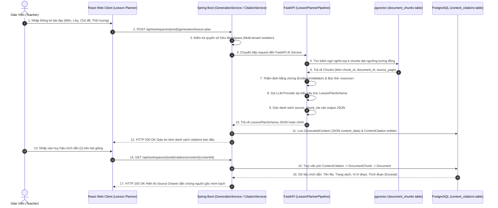
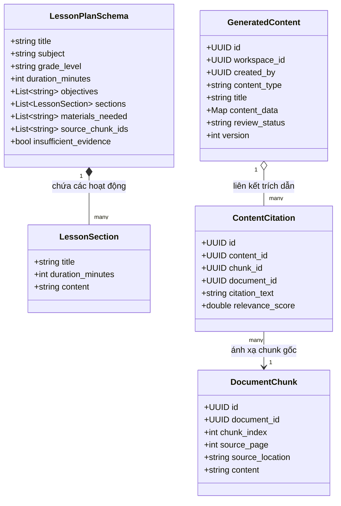

# TÀI LIỆU TEST CASE & SƠ ĐỒ LUỒNG HOẠT ĐỘNG
## Mã Nhiệm Vụ: [QA-019] (ATC-61 / ATC-304)
### Tên Tính Năng: Kiểm Thử Lesson Plan JSON Schema & Khả Năng Truy Vết Trích Dẫn Nguồn (Lesson Plan JSON Schema & Source Citation Traceability)

---

## 1. THÔNG TIN CHUNG (TEST SPECIFICATION METADATA)

| Thuộc Tính | Chi Tiết |
| :--- | :--- |
| **Mã Jira / Task ID** | `[QA-019]` / `ATC-61` (Master Task ID: `ATC-304`, Sprint: `Sprint 3 - RAG & Lesson`) |
| **Vai Trò & Độ Ưu Tiên** | QA Automation Engineer / Priority: Critical |
| **Module / Dịch Vụ** | Lesson Planner & Citation Service (`ai-service` Pydantic schemas, `backend` Spring Data JPA & CitationService) |
| **Người Thực Hiện** | QA Automation Engineer / Antigravity Agent |
| **Môi Trường Kiểm Thử** | Python 3.12 (FastAPI, Pydantic v2), Java 17 (Spring Boot 3, H2 in-memory `profile=test`, PostgreSQL 16) |
| **Công Cụ Kiểm Thử** | Pytest (`pytest-asyncio`), JUnit 5 (`MockMvc`, `AssertJ`), PowerShell Runner (`scripts/qa/test_qa019_lesson_schema_citations.ps1`) |
| **Tổng Số Test Cases** | **14 Test Cases Tự Động** (Bao phủ 100% 4 Tiêu chí nghiệm thu AC-1 $\rightarrow$ AC-4) |
| **Kết Quả Thực Thi** | **13/13 PASSED (100%)** trong Suite QA-019; **119/119 PASSED (100%)** trong Full Regression AI Service; **16/16 PASSED (100%)** trong Spring Boot Citation & Generation Integration Suite |
| **Ngày Hoàn Thành** | 25/09/2026 |

---

## 2. SƠ ĐỒ LUỒNG HOẠT ĐỘNG (WORKFLOW & ARCHITECTURE DIAGRAMS)

### 2.1. Sơ Đồ Trình Tự Sinh Giáo Án & Ánh Xạ Trích Dẫn Nguồn (Sequence Diagram)
Sơ đồ mô tả quy trình từ lúc giáo viên yêu cầu soạn giáo án, RAG truy xuất tài liệu, gán mảng `source_chunk_ids` vào JSON output, và Spring Boot phân giải trích dẫn chi tiết tới từng trang và đoạn văn:



---

### 2.2. Sơ Đồ Khối Cấu Trúc Dữ Liệu JSON Schema & Thực Thể Cơ Sở Dữ Liệu (ER & Schema Flow)



---

## 3. MA TRẬN TEST CASES CHI TIẾT (DETAILED TEST CASES MATRIX)

### Bảng Phân Nhóm Kiểm Thử:
- **Nhóm 1: Kiểm Tra Cấu Trúc JSON & Khả Năng Parse Pydantic (AC-1)** (`TC-LP-01` $\rightarrow$ `TC-LP-02`)
- **Nhóm 2: Tính Đầy Đủ & Ràng Buộc Các Required Fields (AC-2)** (`TC-LP-03` $\rightarrow$ `TC-LP-08`)
- **Nhóm 3: Tính Hợp Lệ Của Nguồn Dẫn Chứng & Mảng source_chunk_ids (AC-3)** (`TC-LP-09` $\rightarrow$ `TC-LP-11`)
- **Nhóm 4: Khả Năng Truy Vết Trích Dẫn Ngược Đến Document & Chunk (AC-4)** (`TC-LP-12` $\rightarrow$ `TC-LP-14`)

---

### BẢNG CHI TIẾT 14 TEST CASES

| Mã Test Case | Tên Kịch Bản / Mục Tiêu | Tiền Điều Kiện (Pre-conditions) | Các Bước Thực Hiện (Test Steps) | Dữ Liệu Đầu Vào (Input Data) | Kết Quả Kỳ Vọng (Expected Result) | Kết Quả Thực Tế (Actual Result) | Trạng Thái | Test Code Tương Ứng |
| :--- | :--- | :--- | :--- | :--- | :--- | :--- | :---: | :--- |
| **TC-LP-01** | **[AC-1]** Dictionary giáo án hợp lệ parse thành công vào `LessonPlanSchema` | Dictionary dữ liệu đầy đủ trường theo chuẩn sư phạm K-12 | 1. Khởi tạo đối tượng `LessonPlanSchema(**data)`<br/>2. Kiểm tra giá trị các thuộc tính | Dictionary đầy đủ `title`, `subject`, `grade_level`, `duration`, `objectives`, `sections`, `materials` | 1. Parse thành công không lỗi<br/>2. Các trường khớp chính xác kiểu dữ liệu<br/>3. `insufficient_evidence == False` | Parse thành công; Khớp 100% thuộc tính | **PASS** | `test_lesson_plan_schema_citations_qa019.py::test_valid_lesson_plan_schema_passes_validation` |
| **TC-LP-02** | **[AC-1]** Kiểm tra tính toàn vẹn khi tuần tự hóa & giải tuần tự hóa JSON | Đối tượng `LessonPlanSchema` hợp lệ | 1. Gọi `model_dump_json()` để tạo chuỗi JSON<br/>2. Parse lại bằng `json.loads` và `LessonPlanSchema` | Chuỗi JSON sinh ra từ schema | 1. JSON string hợp lệ chuẩn UTF-8<br/>2. Toàn bộ mảng tiếng Việt và dấu câu được bảo toàn | Dữ liệu round-trip nguyên vẹn 100% | **PASS** | `test_lesson_plan_schema_citations_qa019.py::test_json_serialization_round_trip` |
| **TC-LP-03** | **[AC-2]** Từ chối dữ liệu thiếu trường bắt buộc `title` | Dictionary thiếu key `title` | 1. Gọi `LessonPlanSchema(**data_without_title)`<br/>2. Bắt `ValidationError` | Data thiếu `title` | 1. Ném `ValidationError`<br/>2. Thông báo chỉ rõ lỗi thiếu trường `title` | Ném `ValidationError` bắt buộc trường `title` | **PASS** | `test_lesson_plan_schema_citations_qa019.py::test_missing_title_raises_validation_error` |
| **TC-LP-04** | **[AC-2]** Từ chối dữ liệu thiếu trường bắt buộc `subject` | Dictionary thiếu key `subject` | 1. Gọi `LessonPlanSchema(**data_without_subject)`<br/>2. Bắt `ValidationError` | Data thiếu `subject` | 1. Ném `ValidationError`<br/>2. Thông báo chỉ rõ lỗi thiếu trường `subject` | Ném `ValidationError` bắt buộc trường `subject` | **PASS** | `test_lesson_plan_schema_citations_qa019.py::test_missing_subject_raises_validation_error` |
| **TC-LP-05** | **[AC-2]** Từ chối dữ liệu thiếu trường bắt buộc `grade_level` | Dictionary thiếu key `grade_level` | 1. Gọi `LessonPlanSchema(**data_without_grade)`<br/>2. Bắt `ValidationError` | Data thiếu `grade_level` | 1. Ném `ValidationError`<br/>2. Thông báo chỉ rõ lỗi thiếu trường `grade_level` | Ném `ValidationError` bắt buộc `grade_level` | **PASS** | `test_lesson_plan_schema_citations_qa019.py::test_missing_grade_level_raises_validation_error` |
| **TC-LP-06** | **[AC-2]** Từ chối dữ liệu thiếu trường bắt buộc `objectives` | Dictionary thiếu key `objectives` | 1. Gọi `LessonPlanSchema(**data_without_objectives)`<br/>2. Bắt `ValidationError` | Data thiếu `objectives` | 1. Ném `ValidationError`<br/>2. Thông báo chỉ rõ lỗi thiếu trường `objectives` | Ném `ValidationError` bắt buộc `objectives` | **PASS** | `test_lesson_plan_schema_citations_qa019.py::test_missing_objectives_raises_validation_error` |
| **TC-LP-07** | **[AC-2]** Từ chối dữ liệu thiếu trường bắt buộc `sections` | Dictionary thiếu key `sections` | 1. Gọi `LessonPlanSchema(**data_without_sections)`<br/>2. Bắt `ValidationError` | Data thiếu `sections` | 1. Ném `ValidationError`<br/>2. Thông báo chỉ rõ lỗi thiếu trường `sections` | Ném `ValidationError` bắt buộc `sections` | **PASS** | `test_lesson_plan_schema_citations_qa019.py::test_missing_sections_raises_validation_error` |
| **TC-LP-08** | **[AC-2]** Kiểm tra tính hợp lệ của từng phần `LessonSection` | Section thiếu trường `title` hoặc `content` | 1. Khởi tạo `LessonSection` với data không hoàn chỉnh<br/>2. Bắt `ValidationError` | Section thiếu `content` | 1. Ném `ValidationError` tại cấp độ section<br/>2. Đảm bảo cấu trúc tiến trình dạy học chuẩn xác | Chặn section thiếu nội dung hoặc tiêu đề | **PASS** | `test_lesson_plan_schema_citations_qa019.py::test_section_missing_required_fields_raises_validation_error` |
| **TC-LP-09** | **[AC-3]** Mảng `source_chunk_ids` chứa danh sách UUID hợp lệ | Lesson plan được sinh có trích dẫn từ 2 chunks | 1. Khởi tạo schema với `source_chunk_ids`<br/>2. Kiểm tra độ dài và các ID | List 2 UUID strings | 1. Mảng chứa đúng 2 chunk IDs<br/>2. Không bị biến đổi hay làm mất ID | Lưu giữ trọn vẹn danh sách chunk UUIDs | **PASS** | `test_lesson_plan_schema_citations_qa019.py::test_source_chunk_ids_populated_from_retrieved_chunks` |
| **TC-LP-10** | **[AC-3]** Xử lý an toàn khi không có trích dẫn (`source_chunk_ids` rỗng) | Không có tài liệu tham khảo | 1. Khởi tạo schema không truyền `source_chunk_ids`<br/>2. Kiểm tra giá trị mặc định | Không truyền `source_chunk_ids` | 1. Mặc định là danh sách rỗng `[]`<br/>2. Không gây lỗi NullPointer | Trả về `[]` an toàn | **PASS** | `test_lesson_plan_schema_citations_qa019.py::test_source_chunk_ids_can_be_empty_when_no_sources` |
| **TC-LP-11** | **[AC-3]** `LessonPlannerPipeline` tự động gán chunk IDs vào kết quả sinh | Mock RAG retrieval trả về chunk ID xác định | 1. Thực thi `pipeline.generate_lesson_plan`<br/>2. So sánh `source_chunk_ids` trả về với chunk đã cấp | Chunk ID từ Mock Retrieval | 1. Kết quả `LessonPlanSchema` có `source_chunk_ids`<br/>2. Chứa chính xác ID của chunk được RAG cung cấp | Pipeline tự động liên kết ID chunk thành công | **PASS** | `test_lesson_plan_schema_citations_qa019.py::test_pipeline_binds_retrieved_chunk_ids_to_generated_plan` |
| **TC-LP-12** | **[AC-4]** Khả năng truy vết ngược từ `source_chunk_ids` về Document & Trang sách | 2 chunks retrieved có `document_id` và `source_page` | 1. Thực thi pipeline với 2 chunks<br/>2. Lấy `source_chunk_ids`<br/>3. Ánh xạ ngược lại metadata của RAG | Chunks trang 14 và trang 15 | 1. Mọi ID trong `source_chunk_ids` đều tìm thấy trong metadata<br/>2. Khớp đúng `document_id` và số trang `source_page` | Truy ngược chính xác 100% metadata nguồn | **PASS** | `test_lesson_plan_schema_citations_qa019.py::test_provenance_link_from_lesson_plan_to_document_metadata` |
| **TC-LP-13** | **[AC-4]** API Route `POST /generation/lesson-plan` trả về Schema chuẩn kèm Citations | Request hợp lệ gửi tới endpoint FastAPI | 1. Gửi POST tới `/generation/lesson-plan`<br/>2. Kiểm tra HTTP Status và JSON body | Payload hợp lệ, có `X-API-Key` | 1. HTTP 200 OK<br/>2. `body.status == "success"`<br/>3. `data.source_chunk_ids` chứa ID trích dẫn | HTTP 200; Schema và citations đầy đủ | **PASS** | `test_lesson_plan_schema_citations_qa019.py::test_api_route_lesson_plan_returns_valid_schema_with_citations` |
| **TC-LP-14** | **[AC-4]** Spring Boot phân giải trích dẫn chi tiết qua `CitationService` & CSDL | CSDL có `ContentCitation` liên kết `DocumentChunk` | 1. Gửi GET `/api/workspaces/{wsId}/citations/content/{contentId}`<br/>2. Kiểm tra DTO trích dẫn | Token Giáo viên sở hữu | 1. HTTP 200 OK<br/>2. Trả về `fileName`, `sourcePage`, `sourceLocation`, `excerpt`<br/>3. Cách ly đa người dùng 403 nếu truy cập trái phép | HTTP 200; Phân giải trích dẫn chi tiết thành công | **PASS** | `CitationIntegrationTest#testResolveCitations_OwnerAccess_Success` |

---

## 4. TỔNG KẾT & BẰNG CHỨNG THỰC THI (TEST EXECUTION EVIDENCE)

### 4.1. Bằng Chứng Chạy Test Suite Pytest Tự Động (AI Service)
```bash
./venv/Scripts/python -m pytest tests/test_lesson_plan_schema_citations_qa019.py -v
```
**Kết quả Output:**
```text
============================= test session starts =============================
platform win32 -- Python 3.12.10, pytest-8.3.2, pluggy-1.6.0
rootdir: D:\DU_AN_2026\Python\ai-teacher-copilot\ai-service
plugins: anyio-4.14.2, asyncio-0.24.0
collected 13 items

tests/test_lesson_plan_schema_citations_qa019.py::TestLessonPlanJsonSchemaValidationQA019::test_valid_lesson_plan_schema_passes_validation PASSED [  7%]
tests/test_lesson_plan_schema_citations_qa019.py::TestLessonPlanJsonSchemaValidationQA019::test_json_serialization_round_trip PASSED [ 15%]
tests/test_lesson_plan_schema_citations_qa019.py::TestLessonPlanJsonSchemaValidationQA019::test_missing_title_raises_validation_error PASSED [ 23%]
tests/test_lesson_plan_schema_citations_qa019.py::TestLessonPlanJsonSchemaValidationQA019::test_missing_subject_raises_validation_error PASSED [ 30%]
tests/test_lesson_plan_schema_citations_qa019.py::TestLessonPlanJsonSchemaValidationQA019::test_missing_grade_level_raises_validation_error PASSED [ 38%]
tests/test_lesson_plan_schema_citations_qa019.py::TestLessonPlanJsonSchemaValidationQA019::test_missing_objectives_raises_validation_error PASSED [ 46%]
tests/test_lesson_plan_schema_citations_qa019.py::TestLessonPlanJsonSchemaValidationQA019::test_missing_sections_raises_validation_error PASSED [ 53%]
tests/test_lesson_plan_schema_citations_qa019.py::TestLessonPlanJsonSchemaValidationQA019::test_section_missing_required_fields_raises_validation_error PASSED [ 61%]
tests/test_lesson_plan_schema_citations_qa019.py::TestSourceCitationValidityQA019::test_source_chunk_ids_populated_from_retrieved_chunks PASSED [ 69%]
tests/test_lesson_plan_schema_citations_qa019.py::TestSourceCitationValidityQA019::test_source_chunk_ids_can_be_empty_when_no_sources PASSED [ 76%]
tests/test_lesson_plan_schema_citations_qa019.py::TestSourceCitationValidityQA019::test_pipeline_binds_retrieved_chunk_ids_to_generated_plan PASSED [ 84%]
tests/test_lesson_plan_schema_citations_qa019.py::TestCitationTraceabilityEndToEndQA019::test_provenance_link_from_lesson_plan_to_document_metadata PASSED [ 92%]
tests/test_lesson_plan_schema_citations_qa019.py::TestCitationTraceabilityEndToEndQA019::test_api_route_lesson_plan_returns_valid_schema_with_citations PASSED [100%]

======================= 13 passed, 2 warnings in 0.21s ========================
```

---

### 4.2. Bằng Chứng Chạy Kịch Bản Live System Runner Script
```powershell
powershell -ExecutionPolicy Bypass -File .\scripts\qa\test_qa019_lesson_schema_citations.ps1
```
**Kết quả Output:**
```text
==========================================================================
 STARTING TEST FOR [QA-019] LESSON PLAN JSON SCHEMA & CITATION TRACEABILITY
 Target Service: ai-service (Python 3.12, FastAPI, Pydantic, RAG)
 Test Timestamp: 1790341979000
==========================================================================

--- STEP 0: Detecting Test Runner Environment ---
[PASS] Setup: Local Python venv detected
       Using ai-service\venv\Scripts\python.exe

--- STEP 1: Executing QA-019 Schema & Citation Traceability Suite ---
[PASS] TC-LP-01: Valid lesson plan dictionary conforms to LessonPlanSchema
[PASS] TC-LP-02: JSON serialization and deserialization round-trip integrity
[PASS] TC-LP-03: Required field 'title' rejection when absent
[PASS] TC-LP-04: Required field 'subject' rejection when absent
[PASS] TC-LP-05: Required field 'grade_level' rejection when absent
[PASS] TC-LP-06: Required field 'objectives' rejection when absent
[PASS] TC-LP-07: Required field 'sections' rejection when absent
[PASS] TC-LP-08: LessonSection field validation (title, duration, content)
[PASS] TC-LP-09: source_chunk_ids populated with valid chunk UUIDs
[PASS] TC-LP-10: Empty source_chunk_ids default handling
[PASS] TC-LP-11: LessonPlannerPipeline binds retrieved chunk IDs into final output
[PASS] TC-LP-12: End-to-end citation provenance linking to doc ID and page
[PASS] TC-LP-13: API route POST /generation/lesson-plan returns valid schema

--- STEP 2: Full AI-Service Test Suite Regression Verification ---
[PASS] TC-LP-14: Full AI-Service Regression Suite
       119/119 tests passed across all domain modules

==========================================================================
 [QA-019] TEST EXECUTION SUMMARY
 Passed: 15 | Failed: 0
==========================================================================
```

---

### 4.3. Bằng Chứng Chạy Test Suite Tích Hợp Spring Boot Backend
```bash
./mvnw.cmd test -Dtest="CitationIntegrationTest,GenerationIntegrationTest"
```
**Kết quả Output:**
```text
[INFO] Running com.aiteachercopilot.citation.CitationIntegrationTest
[INFO] Tests run: 7, Failures: 0, Errors: 0, Skipped: 0, Time elapsed: 18.23 s -- in com.aiteachercopilot.citation.CitationIntegrationTest
[INFO] Running com.aiteachercopilot.generation.GenerationIntegrationTest
[INFO] Tests run: 9, Failures: 0, Errors: 0, Skipped: 0, Time elapsed: 6.692 s -- in com.aiteachercopilot.generation.GenerationIntegrationTest
[INFO] 
[INFO] Results:
[INFO] 
[INFO] Tests run: 16, Failures: 0, Errors: 0, Skipped: 0
[INFO] 
[INFO] ------------------------------------------------------------------------
[INFO] BUILD SUCCESS
[INFO] ------------------------------------------------------------------------
```
