# AI Teacher Copilot for K-12 Teachers

**Curriculum-Grounded AI Teaching Assistant**

> AI Teacher Copilot is a specialized AI assistant for K-12 teachers, with an initial focus on lower and upper secondary education (THCS/THPT). The system supports teachers in creating teaching materials grounded in teacher-provided documents, with structured outputs, source references, teacher review, history, and document export.

**Project status:** Confirmed — Official Source of Truth & Active Implementation

## 1. Project Overview

AI Teacher Copilot is designed as a **controlled teaching-material creation system**, not as a general educational chatbot.

The core value is the controlled workflow:

```text
Teacher
   ↓
Select subject / grade / topic
   ↓
Select or upload teaching materials
   ↓
Knowledge Base
   ↓
RAG Retrieval
   ↓
LLM
   ↓
Structured Output + Citation
   ↓
Teacher Review / Edit / Regenerate
   ↓
Save / History
   ↓
Export
```

The system is intended to answer three important questions:

1. What source material was used?
2. Is the generated content appropriate for the selected teaching context?
3. Has the teacher reviewed the generated content before using or exporting it?

## 2. Problem Statement

Teachers spend significant time on repetitive teaching-material tasks such as:

- Preparing lesson plans
- Creating quizzes and test questions
- Designing assessment rubrics
- Preparing slide outlines
- Reviewing and adapting teaching materials for different classes

General-purpose AI tools can accelerate writing, but they may not be grounded in the teacher's specific source materials, may produce inaccurate or inappropriate content, and do not provide a specialized workflow for source management, review, history, and export.

AI Teacher Copilot addresses this problem through:

- Document-grounded generation
- Structured output
- Source citation
- Teacher-in-the-loop review
- Content history
- Word/PDF export
- AI quality evaluation

## 3. Product Positioning

AI Teacher Copilot is positioned as a:

> **Curriculum-Grounded AI Teaching Assistant**

It is not intended to replace the teacher or autonomously make educational decisions.

The teacher remains the final decision-maker. AI output is treated as a draft/recommendation that must be reviewed before practical use.

## 4. Product Vision

The long-term product vision includes the following capabilities.

### Core Infrastructure & Knowledge Base

- Authentication & User Management
- Teacher Workspace
- Document Upload & Knowledge Base
- Document Processing
- RAG Retrieval & Orchestration

### AI Content Generation

- AI Lesson Planner
- Quiz Generator with Bloom Taxonomy tagging
- Rubric Generator
- Slide Outline Generator

### Review, Management & Export

- AI Output Review
- Edit / Regenerate
- Document History
- Citation / Source Reference
- Word/PDF Export

### Supporting Capabilities

- Prompt/Template Library
- Analytics / KPI Dashboard

## 5. Six-Month Delivery Scope

The current proposed scope is designed for a **solo developer working for a maximum of six months**.

### Must-have

- Authentication
- Teacher Workspace
- Document Upload / Knowledge Base
- Document Processing
- RAG
- AI Lesson Planner
- Quiz Generator
- Bloom Taxonomy tagging as part of Quiz Generation
- Review / Edit / Regenerate
- Document History
- Citation
- Word/PDF Export

### Should-have

- Rubric Generator
- Internal Prompt/Template Library without an administration UI

### Deferred / Cut

- Slide Outline Generator
- Full Analytics/KPI Dashboard
- Standalone Bloom Taxonomy Question Generator

The delivery strategy prioritizes a complete end-to-end vertical loop instead of implementing many incomplete content types:

```text
Upload
  ↓
RAG
  ↓
Generate
  ↓
Review
  ↓
Save
  ↓
Export
```

The final scope is still subject to mentor confirmation.

## 6. Development Methodology

The project uses:

> **Agile – Iterative/Incremental Development**

The project is divided into phases and sprints. Each sprint includes:

```text
Planning
   ↓
Implementation
   ↓
Testing
   ↓
Review
   ↓
Next Sprint
```

AI/RAG components follow an iterative experimentation and evaluation approach, especially for:

- Prompt engineering
- Retrieval strategy
- Structured output
- AI quality evaluation

## 7. High-Level Architecture

```text
                    Teacher
                       │
                       ▼
                React Frontend
                       │
                    HTTPS
                       │
                       ▼
              Java Spring Boot
                 Core Backend
                       │
          ┌────────────┼─────────────┐
          ▼            ▼             ▼
   PostgreSQL      MinIO          FastAPI
   + pgvector    File Storage    AI Service
                                    │
                    ┌───────────────┼──────────────┐
                    ▼               ▼              ▼
               Document         Retrieval         LLM
               Processing          / RAG
```

### React

Responsible for:

- Teacher Workspace
- Document upload
- Content generation forms
- Review and editing
- History
- Export interactions

### Spring Boot

Responsible for:

- Authentication
- User and workspace management
- Business logic
- Permissions
- Document metadata
- Content history
- Review state
- Main REST API
- Communication with the AI Service

### FastAPI

Responsible for:

- Document processing
- Parsing
- Chunking
- Embedding
- Retrieval
- RAG orchestration
- LLM integration
- Structured output
- AI evaluation

### PostgreSQL + pgvector

Responsible for:

- Relational business data
- Metadata
- Document chunks
- Vector embeddings

### MinIO

Responsible for:

- Original uploaded documents
- Generated/exported files

### LLM Provider

OpenAI or Gemini is used for:

- Content generation
- Embedding, depending on the selected implementation

## 8. RAG Pipeline

The proposed RAG pipeline is:

```text
Document Upload
      ↓
Parsing
      ↓
Chunking
      ↓
Embedding
      ↓
Vector Storage
      ↓
Metadata Filtering
      ↓
Vector Retrieval (Baseline)
      ↓
Prompt Orchestration
      ↓
Structured Output
      ↓
Citation
      ↓
Teacher Review
```

### Retrieval strategy

The baseline uses metadata-filtered semantic/vector retrieval.

If evaluation shows that the baseline is insufficient, the system may evaluate:

- Full-text search
- Hybrid retrieval
- RRF
- Reranking

These are **not mandatory MVP requirements**.

The project follows:

> Baseline → Evaluate → Improve only when evidence shows improvement is needed.

## 9. RAG Data Provenance

Each indexed chunk should retain sufficient metadata for isolation and traceability, including:

- Workspace
- Document / version
- Subject
- Grade
- Topic
- Source location

Detailed schema definitions will be finalized in the Database documentation.

This allows the system to:

- Prevent cross-workspace retrieval
- Trace citations back to the correct document/version
- Support future re-indexing

## 10. AI Generation Rules

Each major content type has its own output schema.

### Lesson Planner

May contain:

- Learning objectives
- Teaching materials
- Lesson introduction
- Learning activities
- Assessment
- Homework
- References

### Quiz Generator

May contain:

- Questions
- Answer choices
- Correct answers
- Explanations
- Difficulty
- Bloom Taxonomy tags
- Source references

### Rubric Generator

Implemented only if included in the approved delivery scope.

The AI pipeline should:

- Follow the defined structured schema
- Return source identifiers/citations
- Treat uploaded documents as untrusted data
- Never allow document content to override system/developer instructions
- Return an `insufficient_evidence` state when available evidence is insufficient

## 11. Teacher-in-the-Loop

AI-generated content is always treated as a draft/recommendation.

The teacher remains the final decision-maker.

The intended workflow is:

```text
AI Draft
   ↓
Teacher Review
   ↓
Edit / Regenerate
   ↓
Save
   ↓
Export
```

The MVP does not:

- Automatically send generated material to students
- Automatically grade students
- Require student personal data

## 12. Security & Privacy

### Security principles

- Authentication is required
- Workspace isolation is required
- Uploaded files are accessible only to authorized users
- FastAPI is internal-only
- API keys and secrets are never exposed to the frontend
- Secrets are stored through environment/secrets configuration
- Uploaded documents are treated as untrusted data

### Prompt Injection Protection

Uploaded PDF/DOCX content must be treated as **data**, not system/developer instructions.

Document content must not be allowed to:

- Override system instructions
- Change application behavior
- Request system prompt disclosure
- Access another workspace
- Trigger unauthorized actions

### Privacy

> **Student PII is out of scope for the MVP.**

The MVP focuses on:

- Teachers
- Teaching materials
- Generated teaching content

It does not require:

- Student names
- Student IDs
- Grades
- Attendance records
- Other student personal data

## 13. Data & Knowledge Sources

For prototype/demo purposes, preferred knowledge sources are:

1. Self-authored materials
2. Aggregated/compiled materials
3. Open resources
4. Materials with explicit usage rights
5. Teacher-provided materials with appropriate permission

The initial demo corpus is expected to focus on approximately **1–2 subjects/classes**.

The final knowledge-source strategy remains subject to mentor confirmation.

## 14. AI Quality Evaluation

The MVP uses a lightweight evaluation approach.

Initial evaluation may include:

- Groundedness
- Citation Coverage
- Citation Relevance
- Acceptance Rate
- Edit Rate
- Retrieval Quality
- Average Output Rating

A small manually reviewed evaluation set of approximately **20–30 generated outputs** may be used.

Important principle:

> Citation presence does not guarantee citation correctness or claim correctness.

The MVP does not require a complex automated AI evaluator.

## 15. Six-Month Roadmap

| Phase | Duration | Main Goal |
|---|---:|---|
| 1. Discovery & Requirements | 2 weeks | Problem, requirements, user stories, initial backlog |
| 2. Architecture & UI/UX | 2 weeks | Architecture, ERD, API contract, wireframes |
| 3. Foundation | 3 weeks | Auth, Workspace, project skeleton, Docker |
| 4. Document Knowledge Base | 3 weeks | Upload, parsing, chunking, embedding, pgvector |
| 5. RAG + Lesson Planner | 4 weeks | Retrieval, generation, citation, review |
| 6. Content Generation | 5 weeks | Quiz + optional Rubric |
| 7. Testing & Hardening | 3 weeks | Functional tests, RAG evaluation, fixes |
| 8. Deployment & Handover | 2 weeks | Production/demo deployment and documentation |

Total:

> **24 weeks**

The highest technical risk is concentrated in:

- RAG
- Retrieval quality
- Structured AI output
- AI evaluation

## 16. Risk Management

### High Risks

**Scope**
- Too many content-generation capabilities for one developer.

**Data**
- Copyright and availability of teaching materials.

**Security / AI Safety**
- Prompt injection or malicious instructions in uploaded documents.

### Medium Risks

**Technical**
- Maintaining Spring Boot + FastAPI for one developer.

**Cost / Technical**
- LLM API cost and latency during development.

**AI Quality**
- Evaluating groundedness and citation quality.

**Process**
- Documentation effort reducing development time.

### Risk Strategy

The main principle is:

> Protect the core vertical loop first, then expand only when the baseline is stable.

If maintaining two backend services threatens the six-month deadline, the architecture may be simplified through a controlled change decision.

## 17. Business Value & KPIs

The project does not claim a fixed percentage of time saved before collecting evidence.

The main evaluation metrics include:

### Business Outcome

- Average Preparation Time
- Time Saved
- Active Teachers
- Number of Generated Materials
- Feature Usage

### AI / Product Quality

- Acceptance Rate
- Edit Rate
- Regeneration Rate
- Average Output Rating
- Retrieval Quality
- Groundedness
- Citation Coverage

## 18. Proposed Repository Structure

```text
ai-teacher-copilot/
│
├── docs/
│   ├── 01_Requirements_and_Planning/
│   │   ├── 1.Proposal/
│   │   └── 7.Project_Plan/
│   │
│   ├── 02_Agile_Management/
│   │   ├── 6.User_Story/
│   │   ├── 8.Product_Backlog/
│   │   └── 5.Sprint_Backlog/
│   │
│   ├── 03_Development_and_Data/
│   │   └── 3.Database/
│   │
│   └── 04_Testing_and_QA/
│       ├── 2.Test_Plan/
│       └── 4.Test_Case/
│
├── frontend/          # React
├── backend/           # Spring Boot
├── ai-service/        # FastAPI + RAG + LLM
├── infrastructure/    # PostgreSQL / pgvector / MinIO / Docker
├── scripts/            # Automation / evaluation
├── .github/            # CI/CD
│
├── docker-compose.yml
├── .env.example
├── .gitignore
├── README.md
└── LICENSE
```

## 19. Documentation Structure

The project uses four main documentation groups.

### 01 — Requirements & Planning

- Proposal
- Project Plan

### 02 — Agile Management

- User Story
- Product Backlog
- Sprint Backlog

### 03 — Development & Data

- Database

### 04 — Testing & QA

- Test Plan
- Test Case

Detailed artifacts such as Use Case, Activity Diagram, Sequence Diagram, Deployment Diagram, Traceability Matrix, detailed API specifications, and detailed test cases will be created after the corresponding scope is confirmed.

## 20. Development Principles

### 1. Vertical Slice First

Build a complete workflow before expanding the number of features:

```text
Upload
  ↓
RAG
  ↓
Generate
  ↓
Review
  ↓
Save
  ↓
Export
```

### 2. Evidence Before Optimization

Do not introduce advanced retrieval or AI infrastructure without evaluation evidence.

```text
Baseline
   ↓
Evaluate
   ↓
Identify bottleneck
   ↓
Optimize
   ↓
Evaluate again
```

### 3. Human-in-the-Loop

AI creates recommendations. The teacher makes the final decision.

### 4. Scope Discipline

Must-have features are protected first.

Should-have features are implemented only when the core product is stable.

Deferred features should not threaten the six-month deadline.

### 5. Security by Design

Uploaded documents are untrusted input.

Secrets are never exposed to the frontend.

Workspace isolation is enforced.

## 21. Local Development & Running the Project

### Prerequisites

Expected development tools:

- Java 17+
- Node.js 20+
- Python 3.12+
- Docker & Docker Compose

### Run the project (Phase 1 - Infrastructure)

The project consists of 4 main components. Follow these steps to run them locally:

**1. Infrastructure (PostgreSQL + pgvector & MinIO)**
Run Docker Compose from the root directory to start the database and object storage:
```bash
docker-compose up -d
```

**2. Frontend (React + Vite)**
Open a new terminal, navigate to `frontend`, install dependencies and run:
```bash
cd frontend
npm install
npm run dev
```
Access the UI at `http://localhost:5173`

**3. Backend (Spring Boot)**
Open a new terminal, navigate to `backend`, and use the Maven wrapper to run:
```bash
cd backend
.\mvnw.cmd spring-boot:run
```
The backend will run on `http://localhost:8080`. Flyway will automatically create the database tables.

**4. AI Service (FastAPI)**
Open a new terminal, navigate to `ai-service`, set up the Python virtual environment, install requirements, and run Uvicorn:
```bash
cd ai-service
python -m venv venv
.\venv\Scripts\python.exe -m pip install -r requirements.txt
.\venv\Scripts\uvicorn.exe app.main:app --host 0.0.0.0 --port 8000 --reload
```
The AI Service will run on `http://localhost:8000`.

## 22. Environment Variables

Secrets must not be committed to Git.

Use:

```text
.env
```

for local development and:

```text
.env.example
```

as the configuration template.

Typical configuration categories include:

```text
DATABASE
MINIO
JWT
AI_PROVIDER
AI_API_KEYS
AI_SERVICE_URL
```

## 23. Testing Strategy

Testing is performed at multiple levels.

### Backend

- Unit tests
- API tests
- Business logic tests

### AI Service

- Document processing tests
- Retrieval tests
- Structured output tests
- RAG evaluation

### Frontend

- Component tests
- Form/workflow tests
- Integration tests

### End-to-End

Core workflow:

```text
Login
 ↓
Upload document
 ↓
Generate content
 ↓
Review
 ↓
Edit / Regenerate
 ↓
Save
 ↓
Export
```

## 24. Deployment

Development uses:

> **Docker Compose**

The production/demo target is:

> **An approved VPS or cloud environment**

Deployment details such as:

- HTTPS
- Domain
- Secrets
- Backup
- Logging
- Monitoring

will be defined during the deployment phase.

## 25. Current Project Status

| Area | Status |
|---|---|
| Product Idea | Confirmed |
| Product Vision | Confirmed |
| Six-Month Scope | Confirmed (MVP Boundaries Locked) |
| Architecture | Confirmed (3-Tier Monorepo) |
| ERD | Confirmed |
| Data Sources | Confirmed (PDF/DOCX/TXT) |
| Deployment Environment | Confirmed (Docker Compose & VPS) |
| Technology Stack | Confirmed (Spring Boot 3 + FastAPI + React 18) |
| Development Methodology | Agile / Iterative (6 Sprints x 4 Weeks) |
| Implementation | In Active Progress |

## 26. Mentor Decisions Required

Before implementation starts, the following decisions should be confirmed:

1. Is the proposed six-month scope acceptable?
2. Should Spring Boot + FastAPI remain two separate services?
3. What teaching-material sources can be used for the RAG demo?
4. What level of documentation is expected?
5. Is there an approved OpenAI/Gemini API budget or API key?
6. Are there deployment environment constraints?

## 27. Project Principle

The project should not be judged by how many AI features it contains.

The primary success criterion is:

> **Can one teacher use the system to create grounded, structured, reviewable teaching material from authorized source documents through a reliable end-to-end workflow?**

The project will prioritize:

**Source → Evidence → Generation → Review → Traceability → Export**

over adding unnecessary technical complexity.

## License

Project-specific licensing to be defined according to the organization's or mentor's requirements.

## Technology Stack

### Frontend

| Technology | Purpose |
|---|---|
| React | Teacher Workspace, forms, document management, content review |
| JavaScript / TypeScript | Frontend development |
| HTML / CSS | User interface |
| REST API | Frontend ↔ Backend communication |

### Core Backend

| Technology | Purpose |
|---|---|
| Java | Main backend language |
| Spring Boot | Authentication, workspace, business logic, permissions, metadata, history, main REST API |
| Spring Security | Authentication and authorization |
| JWT | Stateless authentication |
| Spring Data JPA | Relational data access |
| PostgreSQL | Business data and application metadata |

### AI Service

| Technology | Purpose |
|---|---|
| Python | AI/RAG service implementation |
| FastAPI | Internal AI service API |
| RAG | Grounded document retrieval and generation |
| Embedding Model | Convert document chunks and queries into vectors |
| LLM | Structured content generation |
| OpenAI / Gemini | External AI provider |
| Structured Output / JSON Schema | Consistent AI output per content type |
| pgvector | Vector similarity search inside PostgreSQL |

### Storage & Infrastructure

| Technology | Purpose |
|---|---|
| MinIO | Original documents and exported files |
| Docker | Containerization |
| Docker Compose | Local development and deployment orchestration |
| Git | Version control |
| GitHub | Repository, issues, project management and CI/CD |

### AI Quality & Evaluation

| Technology / Approach | Purpose |
|---|---|
| Rule-based / heuristic evaluation | Initial groundedness checks |
| Retrieval evaluation | Evaluate relevance of retrieved chunks |
| Citation evaluation | Check citation presence and relevance |
| Manual evaluation set | Approximately 20–30 sample outputs for initial evaluation |

> Advanced technologies such as Kafka, Redis, RabbitMQ, Kubernetes, fine-tuning, multi-agent systems and open web search are not part of the baseline MVP.

## System Overview

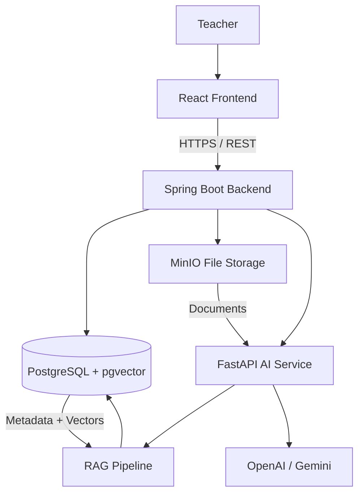

## System Context

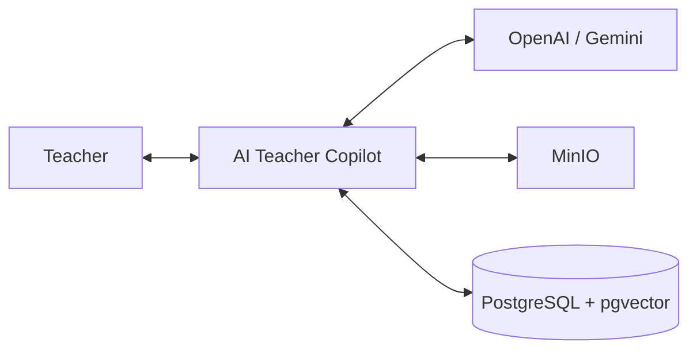

## High-Level Architecture

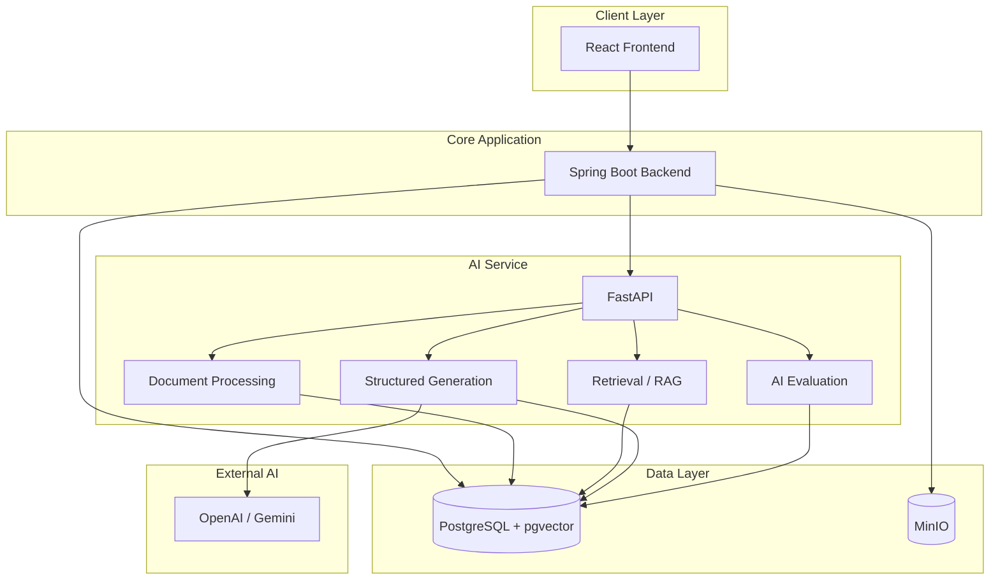

## RAG Pipeline

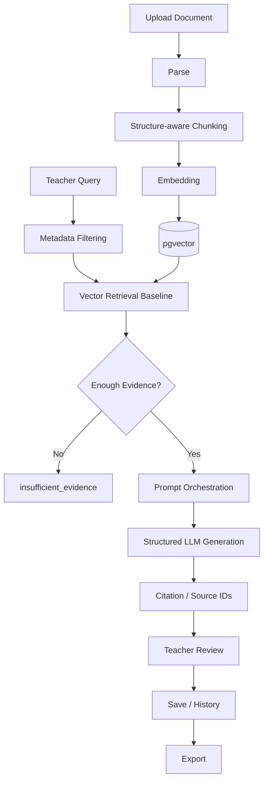

## Document Ingestion Flow

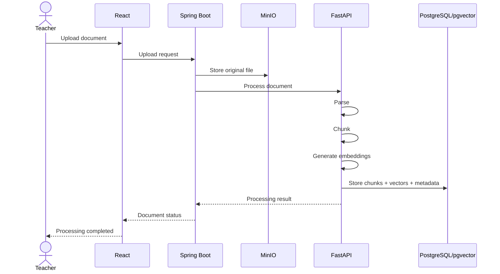

## Content Generation Flow

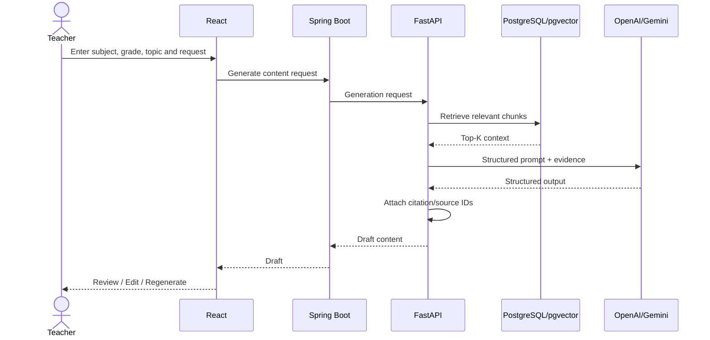

## Business Process — Current vs Proposed

### Current Process

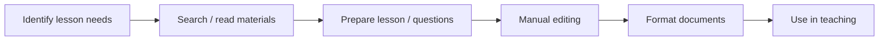

### Proposed Process

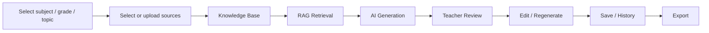

## Repository Architecture

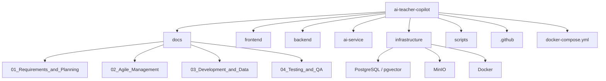

## Core End-to-End Workflow

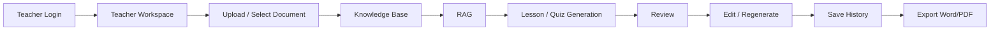

## Project Priorities

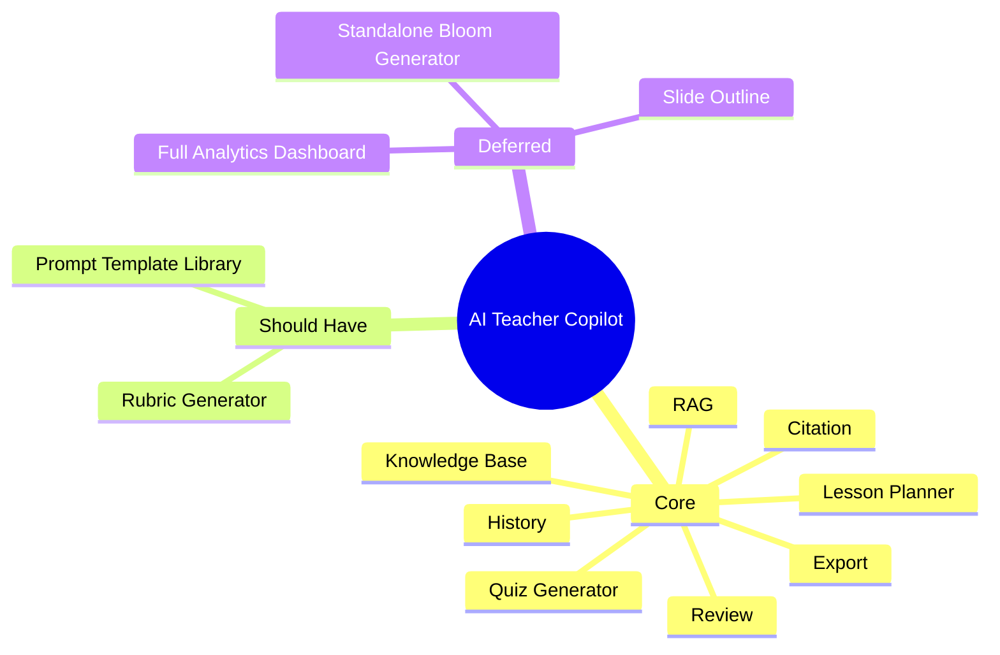

## GitHub Rendering

This README is designed for **GitHub Markdown**. GitHub supports rendering Mermaid diagrams inside fenced `mermaid` code blocks, so the main system architecture, RAG pipeline, business process and sequence diagrams can be viewed directly from the repository's `README.md`.

Recommended repository entry points:

- **README.md** — project overview, technology stack and architecture diagrams
- **docs/** — requirements, planning, Agile artifacts, database and QA documents
- **frontend/** — React application
- **backend/** — Spring Boot application
- **ai-service/** — FastAPI, RAG and LLM integration
- **infrastructure/** — PostgreSQL, pgvector, MinIO and Docker configuration
- **scripts/** — setup, ingestion, evaluation and deployment utilities
- **.github/** — CI/CD configuration

## Suggested Git Workflow

```text
Issue
  ↓
Feature Branch
  ↓
Implementation
  ↓
Test
  ↓
Pull Request
  ↓
Review / Self-review
  ↓
Merge to main
```

Example branches:

```text
main
 ├── feature/auth
 ├── feature/document-upload
 ├── feature/rag-retrieval
 ├── feature/lesson-planner
 └── feature/quiz-generator
```

## GitHub Project Tracking

For the solo-developer workflow, GitHub can be used as the central project workspace:

- **Issues** — bugs, requirements and technical tasks
- **Projects** — Product Backlog and Sprint tracking
- **Pull Requests** — change review and history
- **Actions** — automated build and test checks
- **Releases** — versioned demo/production releases
